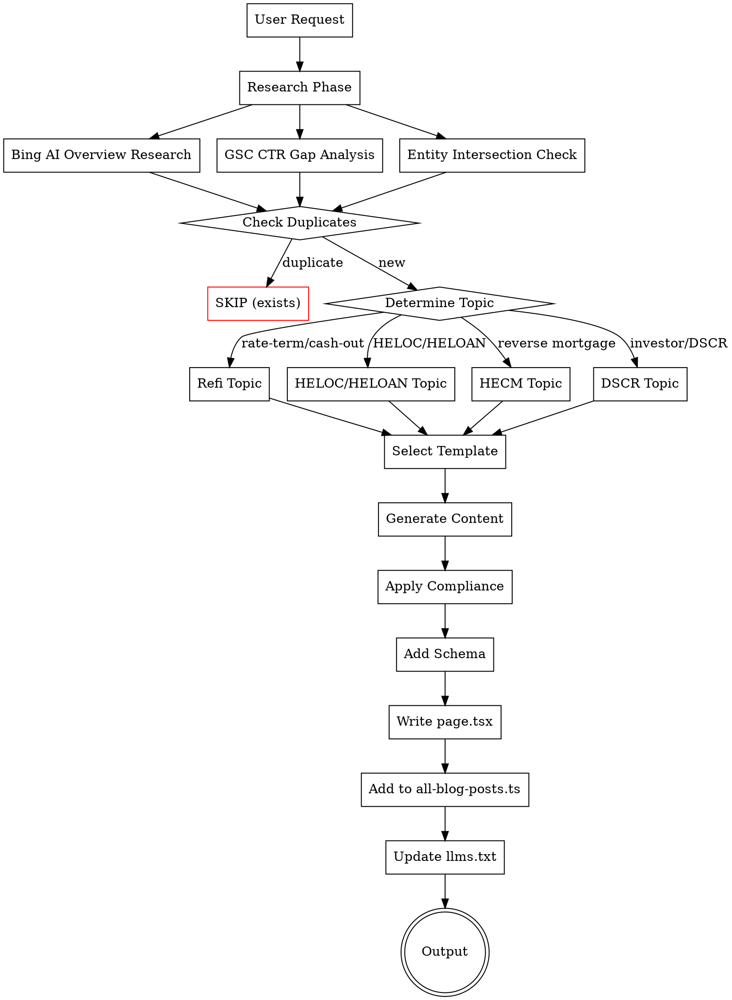
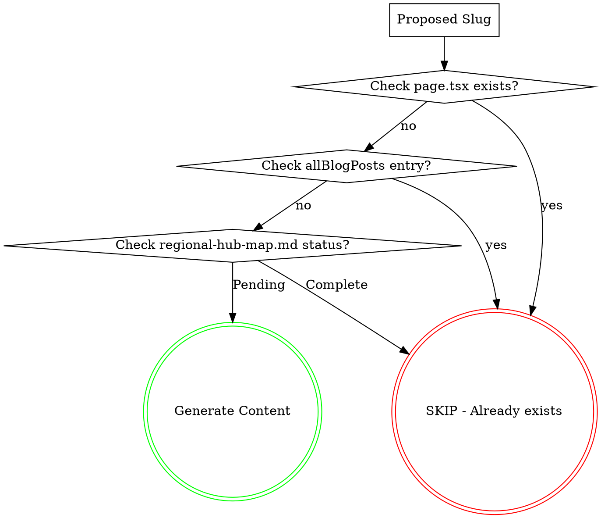

# Mortgage Blog Generator — Qualification-Aware Governance Model

Generate, refresh, classify, prune, and consolidate SEO/GEO/AIO/AEO-optimized mortgage content for mothebroker.com across four core topics:

- **Topic 1: Refinance** — Rate-and-term refinance + cash-out refinance (all homeowners)
- **Topic 2: HELOC / HELOAN** — Home equity lines of credit + home equity loans (all homeowners)
- **Topic 3: HECM** — Reverse mortgages for seniors 62+ (Home Equity Conversion Mortgage)
- **Topic 4: DSCR** — Debt service coverage ratio investor loans (real estate investors)

> **Wholesale broker education** (broker vs bank, wholesale vs retail, lender-network advantage) is **supplemental/filler content** — generate only when opportunity data specifically indicates demand. It is NOT a core topic.

> This skill is a governance workflow, not just a writing prompt. The default action is to classify the intent and decide whether to `generate`, `refresh`, `keep`, `noindex`, or `redirect`.

## Runtime Source of Truth (Read First)

Before writing ANY equity, DSCR, refinance, or funnel page, inspect these files:

- `lib/leadQualification.ts` — current ranges, licensed states, and qualification statuses
- `components/QualificationCallout.tsx` — approved early-page qualification copy and referral framing
- `components/seo/RefinanceCityTemplate.tsx` — approved 16-page refinance-city architecture
- `lib/site.ts` — canonical phone, NMLS/site constants, contact URLs
- `next-sitemap.config.js` — thin/suppressed routes and noindex exclusions
- `reports/opportunity-queue.json` — scored opportunities and cannibalization alerts
- `reports/*ctr-prune*` or `npm run seo:ctr-prune` — prune/noindex/redirect candidates when available
- `references/qualification-funnel-governance.md` — page-family model, approved refinance-city exception, refresh-first rules

**If repo truth conflicts with any older example in this skill or its references, the runtime files above win. Never hardcode loan ranges, state coverage, phone numbers, or qualification statuses from memory.**

## Content Architecture

```
BUSINESS PRIORITY (quarter / queue level)
REFINANCE 40%  -> conversion pages first -> support pages -> new long-tail only if gap remains
DSCR 25%       -> money page + support articles with CA/WA-only funnel framing
EQUITY 20%     -> HELOC / HELOAN money pages + qualification-aware support content
HECM 15%       -> senior equity education and comparison content
WHOLESALE      -> supplemental only when opportunity data justifies it

PAGE FAMILIES
conversion -> approved 16 refinance-city pages, HELOC / HELOAN money pages, DSCR money page, major loan-program and refinance hubs
support    -> county guides, strong city hubs, comparison posts, high-intent funnel-support articles
suppressed -> thin city wrappers, overlapping rates pages, low-yield clones marked for noindex / redirect / consolidation
```

---

## Page Families & Geo Rules

**Conversion pages**
- Approved refinance-city pages for Irvine, Mission Viejo, Laguna Niguel, Dana Point, San Clemente, Lake Forest, Aliso Viejo, and Yorba Linda
- HELOC and HELOAN money pages
- DSCR money page
- Major loan-program and refinance hubs

**Support pages**
- County guides
- Strong city hubs like Irvine, Mission Viejo, and Newport Beach
- Comparison posts and high-intent articles that reinforce current money pages

**Suppressed pages**
- Thin generic city wrappers
- Overlapping city / rates pages
- Low-yield blog clones that should be refreshed, redirected, or noindexed instead of expanded

**Hub-first remains the default for generic geo content.** The approved standalone city exception is the 16 refinance-city pages, which should use the refinance-city architecture rather than legacy city-page logic.

---

## CRITICAL: Duplicate Content Warning (Feb 2026 → March 2026 Governance Update)

**32 geo pages were marked "Crawled - not indexed" by Google due to near-duplicate content.**

Before generating ANY geo/city/hub page:
1. **Read runtime truth + `references/qualification-funnel-governance.md`** before deciding to write
2. **Classify the target as `conversion`, `support`, or `suppressed`**
3. **Choose exactly one action**: `generate`, `refresh`, `keep`, `noindex`, or `redirect`
4. **If the target is a generic city page outside the approved refinance-city cluster**, default to hub/support/noindex/redirect rather than another standalone wrapper
5. **Compare to similar pages** - Content must be <60% similar to any existing page
6. **Verify 800+ unique words** - Not just city name substitutions
7. **Use hub model for generic geo content** - Multiple similar cities grouped into one hub page (5-10 cities per hub)

**Hub pages remain the DEFAULT for generic geo content. Standalone city pages are approved only for the 16 refinance-city pages and other already-strong live support pages.**

See "Content Differentiation Gate" in Quality Gates section for mandatory checks.

---

## Quick Start



## Generation Commands

### Single Post
```
Generate [TOPIC] post for [TARGET]

Examples:
- "Generate refi post for [AI overview query]"
- "Generate HELOC post targeting [CTR gap query cluster]"
- "Generate HECM post for [topic with no dedicated page]"
- "Generate DSCR post for [investor-specific query]"
```

### Batch Generation (New Content from AI Overviews + CTR Gaps)

**Prerequisite:** Run `npm run gsc:export-queries` then `npm run seo:opportunity-queue`.

```
Generate [N] posts                -> Inspect the queue, refresh existing funnel winners first, then generate only true uncovered gaps
Generate [N] [TOPIC] posts        -> Weighted queue work for that topic after governance + cannibalization checks
Generate next [N] posts           -> Same as "Generate N posts"

Examples:
- "Generate 12 posts" -> Refresh or generate from the weighted queue (typically ~5 refi, ~3 DSCR, ~2 equity, ~2 HECM)
- "Generate 5 HECM posts" -> Research HECM gaps after confirming no higher-priority refreshes block the batch
- "Generate 8 DSCR posts" -> DSCR AI overview + CTR gap opportunities with CA/WA-only funnel framing
```

### Refresh / Governance Commands
```
Refresh [N] posts                         -> Top N refresh candidates by impressions / funnel priority
Refresh [slug]                            -> Refresh a specific post or money page
Classify [slug/query]                     -> Return content role + page action only
Review prune candidates                   -> Review CTR-prune + sitemap suppression candidates
Money-page refresh [topic]                -> Refresh a live money page / funnel asset instead of net-new content
Generate refinance city page for [city] [cash-out|rate-term]
                                         -> Use the approved refinance-city architecture
Generate support article for [intent]     -> Generate support-only content that links toward the current funnel owner

Examples:
- "Refresh 5 posts" -> Top 5 striking-distance pages from refreshCandidates
- "Refresh bank-statement-loans-self-employed-2026" -> Update specific post
- "Classify /areas/anaheim-mortgage-broker" -> likely keep/support or suppress instead of generating a new wrapper
- "Review prune candidates" -> examine noindex/redirect/consolidate actions before writing
- "Generate refinance city page for Irvine cash-out" -> approved standalone city conversion page
```

### Legacy Commands (Still Supported)
```
Generate [TOPIC] [TYPE] for [TARGET]  -> Specific hub/pillar/cluster (if any remain ungenerated)
Generate [REGION] expansion           -> All content for one region
```

## Content Distribution Strategy

### PRIORITY BACKLOG — ✅ CLEARED (Feb 2026)

All 13 backlog items have been generated. Normal opportunity-queue flow is now active.

<details>
<summary>Completed backlog (click to expand)</summary>

#### DSCR Cluster Posts (6 posts) — ✅ ALL COMPLETE
| # | Title | Actual Slug | Status |
|---|-------|-------------|--------|
| 1 | DSCR Loans Explained: How Investors Qualify Without W-2s | dscr-loans-explained-investors-2026 | ✅ |
| 2 | DSCR Loan Requirements 2026: Rates, Ratios & Down Payment | dscr-loan-requirements-2026 | ✅ |
| 3 | DSCR vs Conventional Investment Property Loans | dscr-vs-conventional-investment-property-2026 | ✅ |
| 4 | DSCR Loans for Short-Term Rentals: Airbnb & VRBO Financing | dscr-loans-short-term-rentals-airbnb-2026 | ✅ |
| 5 | DSCR Loan Calculator: How to Calculate Your Ratio | dscr-loan-calculator-ratio-2026 | ✅ |
| 6 | DSCR Loans for Portfolio Investors: Scaling with Wholesale Rates | dscr-loans-portfolio-investors-scaling-2026 | ✅ |

#### HECM Hub (1 post) — ✅ COMPLETE
| Hub ID | Title | Actual Slug | Status |
|--------|-------|-------------|--------|
| WA-SS-A | Reverse Mortgage South Sound Affluent 2026 | reverse-mortgage-south-sound-affluent-wa-2026 | ✅ |

#### Equity Hub Posts (5 posts) — ✅ ALL COMPLETE
| Hub ID | Title | Actual Slug | Status |
|--------|-------|-------------|--------|
| CA-VC-A | Home Equity Ventura Affluent 2026 | home-equity-ventura-affluent-ca-2026 | ✅ |
| WA-SE-A | Home Equity Ultra-Luxury Eastside WA 2026 | home-equity-ultra-luxury-eastside-wa-2026 | ✅ |
| WA-SE-B | Home Equity Premium Eastside WA 2026 | home-equity-premium-eastside-wa-2026 | ✅ |
| WA-SE-C | Home Equity Tech Corridor Eastside WA 2026 | home-equity-tech-corridor-eastside-wa-2026 | ✅ |
| WA-NS-A | Home Equity North Sound Islands 2026 | home-equity-north-sound-islands-wa-2026 | ✅ |

#### Wholesale Hub Post (1 post) — ✅ COMPLETE
| Hub ID | Title | Actual Slug | Status |
|--------|-------|-------------|--------|
| WA-SE-C | Wholesale Mortgage Broker Tech Corridor Eastside WA 2026 | wholesale-mortgage-tech-corridor-eastside-wa-2026 | ✅ |

</details>

---

### AI Overview + CTR Gap Content System (Feb 2026+)

All hub+track pairs are now generated. The system has shifted from hub-queue generation to **new content creation** driven by two data sources:

1. **Bing AI Overview Opportunities** — Queries where Bing shows AI overviews in our topic space but we have no content (or weak content) targeting that answer
2. **High Impression / Low Click (CTR Gap)** — GSC queries with significant impressions but CTR well below expected for position, indicating content-market mismatch or missing dedicated pages

This system produces **NEW blog posts** (not refreshes) that directly target these gaps.

**Prerequisite: Build the content opportunity list before generating.**
```bash
npm run gsc:export                # Page-level GSC data (required)
npm run gsc:export-queries        # Query-level GSC data (REQUIRED — drives CTR gap analysis)
npm run seo:opportunity-queue     # Build scored queue → reports/opportunity-queue.json
npm run seo:preflight-batch       # Hard cannibalization filter → approved/blocked batch artifacts
```

### How to Find AI Overview Opportunities

Before generating, manually research Bing AI overview opportunities:

1. **Search Bing** for your target queries (mortgage, HECM, DSCR, home equity topics)
2. **Identify queries where Bing shows an AI-generated overview** at the top of results
3. **Check if mothebroker.com is cited** in that AI overview
4. **If NOT cited** — this is an AI Overview gap. The content either doesn't exist or isn't structured for AI extraction
5. **Log opportunities** in `reports/ai-overview-opportunities.json`:

```json
{
  "opportunities": [
    {
      "query": "how does a DSCR loan work for Airbnb investors",
      "bingAiOverview": true,
      "currentlyCited": false,
      "existingPage": "/blog/dscr-loans-short-term-rentals-airbnb-2026",
      "action": "new-post",
      "proposedSlug": "dscr-airbnb-investor-qualification-2026",
      "proposedAngle": "Step-by-step DSCR qualification for Airbnb hosts with rental income projections",
      "track": "wholesale",
      "priority": "high"
    }
  ]
}
```

### How to Find CTR Gap Opportunities

CTR gap posts target queries where we get impressions but users aren't clicking:

1. **Run GSC query export**: `npm run gsc:export-queries`
2. **Analyze the query data** for pages with:
   - 50+ impressions (enough data to be meaningful)
   - CTR < 50% of expected CTR for that position (significant gap)
   - No existing dedicated page for that exact query intent
3. **Group related low-CTR queries** into post topics
4. **Verify no duplicate** — the proposed post must cover a distinct intent not already served

**CTR benchmarks by position:**
| Position | Expected CTR | "Gap" threshold (< 50% expected) |
|----------|-------------|----------------------------------|
| 1 | 28% | < 14% |
| 2 | 15% | < 7.5% |
| 3 | 11% | < 5.5% |
| 4-5 | 6% | < 3% |
| 6-10 | 2.5% | < 1.25% |
| 11-20 | 1% | < 0.5% |

### How "Generate X Posts" Works

```
1. Load reports/opportunity-queue.json for refresh candidates and cannibalization data
2. Load reports/ai-overview-opportunities.json (if available) for Bing AI overview gaps
3. Analyze GSC query data for high-impression / low-CTR queries without dedicated pages
4. Build batch with this priority order:
   a. AI Overview gaps (queries with Bing AI overview where we're NOT cited) — up to 40% of batch
   b. CTR Gap posts (high impression, low click, no dedicated page) — up to 40% of batch
   c. Entity intersection posts (cross 3+ high-value entities, see below) — remaining 20%
5. ENFORCE DUPLICATE CHECK — every proposed post MUST pass the duplicate prevention gate
6. ENFORCE TOPIC BALANCE (see below) — batch must include all 4 core topics (Refi, HELOC/HELOAN, HECM, DSCR)
7. Run cannibalization check against existing pages
8. Generate NEW content (not refreshes — refreshes are now a separate explicit command)
9. After EACH post: MANDATORY add entry to lib/all-blog-posts.ts (see Post-Generation Registry below)
9b. After EACH post: MANDATORY update public/llms.txt Recent Content section (see llms.txt Auto-Update below)
10. Write changed/new URLs to delta (`npm run seo:record-delta-from-approved-batch`)
11. Submit indexing in delta mode (`npm run indexing:submit-all`) only when explicitly approved
```

### Refresh-First Queue Rule

Refreshing existing funnel assets is now the default when the intent is already owned by a live page.

Refresh candidates still live in `reports/opportunity-queue.json` under `refreshCandidates[]`, but do not treat that list as the only source of truth. If the query maps to a live conversion page, strong support page, or approved refinance-city page, refresh beats net-new content unless opportunity data clearly shows an uncovered intent.

### MANDATORY: Business-Weighted Funnel Balance

Use topic weighting at the **quarter / queue level**, not as a rigid equal split in every batch:

| Track | Default Weight | Primary Goal |
|-------|----------------|--------------|
| Refinance | 40% | Protect and expand conversion paths, especially approved city-refi pages and major refinance hubs |
| DSCR | 25% | Grow CA/WA-only investor funnel assets and support content |
| Equity (HELOC / HELOAN) | 20% | Strengthen qualification-aware money pages and comparison content |
| HECM | 15% | Maintain senior-equity authority and compliant evergreen coverage |

**Topic definitions:**
- **Refinance** = rate-and-term refinance AND cash-out refinance content
- **Equity** = HELOC AND HELOAN content
- **HECM** = reverse mortgage / Home Equity Conversion Mortgage content (seniors 62+)
- **DSCR** = debt service coverage ratio investor loan content (real estate investors)

**Wholesale broker education** (broker vs bank, wholesale vs retail, lender-network advantage) is supplemental only. Generate it when opportunity data shows demand, not because a batch needs filler.

**Refresh-first rule:** If the opportunity queue's top intent is already owned by a live conversion or support page, refresh that asset before creating a new long-tail page. New generation should win only when opportunity + cannibalization checks show a genuine uncovered gap.

### MANDATORY: Post-Generation Registry (all-blog-posts.ts)

After writing EACH blog post's `page.tsx`, you MUST immediately add a corresponding entry to `lib/all-blog-posts.ts`. This is a HARD GATE — the post is NOT complete until registered.

```typescript
// Add to the TOP of the allBlogPosts array in lib/all-blog-posts.ts
{
  slug: 'the-url-slug',
  title: 'The Full Page Title (from metadata.title, without " | Mo Abdel" suffix)',
  excerpt: 'The meta description (from metadata.description)',
  date: 'YYYY-MM-DD',
  category: 'Reverse Mortgage' | 'Home Equity' | 'Wholesale' | 'DSCR' | 'Purchase' | 'Refinance',
  readTime: 'XX min read',  // estimate based on word count: 3000w=8min, 4500w=12min, 5500w=14min
},
```

**Category mapping (4 core topics):**
- Refi topic (rate-and-term, cash-out) → `'Refinance'`
- HELOC/HELOAN topic → `'Home Equity'`
- HECM topic → `'Reverse Mortgage'`
- DSCR topic → `'DSCR'`
- Wholesale education (supplemental) → `'Wholesale'`

**Why this matters:** The `/guides` page renders from `allBlogPosts`. If a post isn't in this array, it's invisible to users browsing the guides page even though the URL works directly. This has caused multiple posts to go unregistered in past batches.

### Scoring Components (New Content Prioritization)

| Component | Weight | Signal |
|-----------|--------|--------|
| AI Overview Gap | +30 | Query triggers Bing AI overview and we're NOT cited |
| CTR Gap | +25 | High impressions + CTR < 50% expected for position |
| Impression Volume | +15 | Total impressions across related queries (demand proof) |
| Entity Intersection | +15 | Post crosses 3+ high-value entities (see below) |
| Business Value | +10 | Median home value of target area or borrower profile value |
| Overlap Risk | -20 | Target keywords already ranking on an existing page (HARD BLOCK if >80% overlap) |
| Recency Penalty | -5 | Similar page published <14 days ago |

### Entity Intersection Multiplier

Posts that cross multiple high-value entities capture zero-volume conversational queries that GSC never reports (e.g., "How do my Amazon RSUs affect my DTI for a jumbo loan in Bellevue?"). These queries are the primary discovery path in RAG-based engines.

**Entity categories** (each counts as 1 intersection):
| Category | Examples |
|----------|----------|
| Non-QM product | DSCR, bank statement, asset depletion, P&L |
| High-value borrower profile | RSU/tech worker, self-employed, foreign national, retired 62+ |
| Wealthy geo target | City with median home value > $1M |
| Proprietary framework | ADU ROI Calculator, Margin Reveal, RSU Matrix, Dual Benefit |
| Cross-product scenario | HECM + Prop 19, HELOC + ADU, DSCR + short-term rental, cash-out + investment |

**Scoring tiers:**
| Intersections | Score Bonus |
|---------------|-------------|
| 0 | +0 |
| 1-2 | +5 |
| 3 | +10 |
| 4+ | +15 |

Weights are configurable via `OQ_W_*` env vars.

### Batch Composition (New Content Mode)

For a batch of N posts — ALL new content, no refreshes:

1. **AI Overview gap posts** (up to 40% of N): New posts targeting queries where Bing AI overview exists but mothebroker.com is not cited. These are the highest-value opportunities because AI overviews increasingly capture clicks.
2. **CTR Gap posts** (up to 40% of N): New posts targeting high-impression queries where existing pages have low CTR, indicating the current content doesn't match search intent. These are NOT refreshes — they're new pages with different angles/intent.
3. **Entity intersection posts** (remaining 20%): New posts crossing 3+ high-value entities to capture conversational/RAG queries that never appear in GSC.

**Key difference from old system:** CTR Gap posts create NEW dedicated pages for the underserved intent, rather than refreshing the existing page. Example: if `/blog/dscr-loan-requirements-2026` gets impressions for "DSCR loan for LLC" but low CTR, create a NEW post `/blog/dscr-loan-llc-structure-2026` targeting that specific intent.

### Refresh Workflow Path (Opt-In Only)

Refreshes are no longer auto-included in batches. Use `Refresh [N] posts` explicitly.

When refreshing:
```
1. Select refresh candidate from opportunity-queue.json (position 8-25, 20+ impressions)
2. Keep canonical URL/slug unchanged (NO new page creation)
3. Update title/meta/H1 intro, strengthen PAA + FAQ, refresh dated data points
4. Add "Last updated" date and improve internal links to current money pages
5. Record refreshed URL in reports/indexing-delta.json
```

### Example Sessions

**"Generate 10 posts"**
→ Research Bing AI overviews for mortgage queries → find 4 AI overview gaps
→ Analyze GSC query data → find 4 CTR gap opportunities
→ Select 2 entity intersection posts → generates 10 new posts

**"Generate 5 HECM posts"**
→ Research Bing AI overviews for reverse mortgage queries → find 2-3 AI overview gaps
→ Check GSC for HECM-related CTR gaps → find 2-3 CTR gap opportunities
→ Generate 5 new HECM-track posts

**"Refresh 5 posts"** (opt-in only)
→ Load refreshCandidates from opportunity-queue.json → refresh top 5 by impressions

### New Post Idea Research Process

Before generating, research opportunities using this workflow:

```
1. BING AI OVERVIEW RESEARCH
   a. Search Bing for 20-30 queries in your track (HECM, equity, wholesale, DSCR)
   b. Note which queries show an AI-generated overview at the top
   c. Check if mothebroker.com is cited in each overview
   d. For uncited overviews: note the query, the answer structure, and what sources ARE cited
   e. Design a post that would be THE definitive answer for that AI overview

2. GSC CTR GAP ANALYSIS
   a. Load query-level GSC data (npm run gsc:export-queries)
   b. Find queries with: 50+ impressions AND CTR < 50% of expected for position
   c. Group related low-CTR queries by intent cluster
   d. For each cluster: check if a dedicated page already exists for that exact intent
   e. If no dedicated page exists → this is a CTR gap opportunity for a NEW post

3. DUPLICATE CHECK
   a. Search existing blog slugs for similar topics
   b. Check lib/all-blog-posts.ts for overlapping titles/excerpts
   c. If similar page exists: the opportunity is either a refresh (use "Refresh" command) or
      a different-angle new post (must pass Content Differentiation Gate)

4. BATCH ASSEMBLY
   a. Combine AI overview gaps + CTR gap posts + entity intersection posts
   b. Enforce track balance (HECM, Equity, Wholesale)
   c. Run cannibalization check
   d. Generate new content
```

### Override Commands (Optional)

These bypass the opportunity queue for targeted generation (cannibalization gate still applies):
```
"Generate [TRACK] [TYPE] for [TARGET]"  -> Specific single post
"Generate [region] expansion"           -> All content for one region
"Generate remaining pillars"            -> Skip to finish all pillars
```

## Content Types

### State Pillars (6 total)

| Track | State | Title | URL | Words |
|-------|-------|-------|-----|-------|
| HECM | CA | Reverse Mortgage California Guide [2026] | /blog/reverse-mortgage-california-guide-2026/ | 5,000-6,000 |
| Equity | CA | Home Equity California Guide [2026] | /blog/home-equity-california-guide-2026/ | 5,000-6,000 |
| Wholesale | CA | Wholesale Mortgage Broker California [2026] | /blog/wholesale-mortgage-broker-california-2026/ | 5,000-6,000 |
| HECM | WA | Reverse Mortgage Washington Guide [2026] | /blog/reverse-mortgage-washington-guide-2026/ | 5,000-6,000 |
| Equity | WA | Home Equity Washington Guide [2026] | /blog/home-equity-washington-guide-2026/ | 5,000-6,000 |
| Wholesale | WA | Wholesale Mortgage Broker Washington [2026] | /blog/wholesale-mortgage-broker-washington-2026/ | 5,000-6,000 |

### Regional Pillars (~40 total)

Authority hub pages per region per track. See `references/regional-hub-map.md` for complete list.

| Content | Words | Template |
|---------|-------|----------|
| Regional Pillar | 5,500-6,500 | `references/regional-pillar-templates.md` |

Track coverage per region:
- **All CA regions + Seattle Eastside + Greater Seattle:** HECM + Equity + Wholesale (3 pillars each)
- **Central Coast, Ventura, Wine Country, Sacramento, IE, North Sound, South Sound:** HECM + Equity only (2 pillars each)

### Hub Posts (~74 total)

Multi-city geo-targeted posts grouping 5-10 cities. See `references/regional-hub-map.md` for hub IDs and city assignments.

| Content | Words | Template | Tables |
|---------|-------|----------|--------|
| Hub Post | 4,500-5,500 | `references/geo-templates.md` | 4-5 full + 5-10 inline |

Composition: Content-type-specific ratio (see seo-aio-aeo-geo-guidelines.md § Structured vs Prose Ratios)
  - Hub posts: 70% structured / 30% prose
  - Regional pillars: 60% structured / 40% prose
  - State pillars: 50% structured / 50% prose
  - Cluster posts: 60% structured / 40% prose

### Cluster Posts (39 total)

| Track | Count | Topics |
|-------|-------|--------|
| HECM | 12 | Basics, Eligibility, Calculator, vs HELOC, Pros/Cons, HUD Counseling, Purchase, Proprietary, Payouts, Estate Planning, Myths, Alternatives |
| Equity | 14 | Cash-Out Basics, Cash-Out vs Rate-Term, HELOC, HELOAN, HELOC vs HELOAN, HELOC vs Cash-Out, Best Uses, Renovations, Debt Consolidation, Requirements, When to Refinance, Second Mortgage, Risks, Closing Costs |
| Wholesale | 7 | Wholesale vs Retail, Broker vs Bank, Bank Statement, Self-Employed, Wholesale Rates, Non-QM, Lender-Network Advantage |
| **DSCR (Investor)** | **6** | **DSCR Explained, DSCR Requirements 2026, DSCR vs Conventional, DSCR Short-Term Rentals, DSCR Calculator, DSCR Portfolio Scaling** |

### HECM Cluster Topics (12 posts)
| # | Topic | Target Keyword |
|---|-------|----------------|
| 1 | HECM Basics | what is a reverse mortgage |
| 2 | HECM Eligibility | reverse mortgage requirements 2026 |
| 3 | HECM Calculator Explained | how much can I get reverse mortgage |
| 4 | HECM vs HELOC for Seniors | reverse mortgage vs heloc seniors |
| 5 | HECM Pros & Cons | reverse mortgage pros and cons |
| 6 | HECM Counseling | HUD reverse mortgage counseling |
| 7 | HECM for Purchase | reverse mortgage to buy home |
| 8 | Proprietary Reverse Mortgages | jumbo reverse mortgage California |
| 9 | HECM Payout Options | reverse mortgage lump sum vs line of credit |
| 10 | HECM & Estate Planning | reverse mortgage inheritance heirs |
| 11 | HECM Myths Debunked | reverse mortgage scam or legitimate |
| 12 | When NOT to Get HECM | reverse mortgage alternatives seniors |

### Equity Cluster Topics (14 posts)
| # | Topic | Target Keyword |
|---|-------|----------------|
| 1 | Cash-Out Refinance Basics | cash out refinance how it works |
| 2 | Cash-Out vs Rate-and-Term | cash out vs regular refinance |
| 3 | HELOC Explained | how does a heloc work |
| 4 | HELOAN Explained | home equity loan fixed rate |
| 5 | HELOC vs HELOAN | heloc vs home equity loan |
| 6 | HELOC vs Cash-Out | heloc vs cash out refinance 2026 |
| 7 | Best Uses for Home Equity | what can you use home equity for |
| 8 | Home Equity for Renovations | using equity for home improvement |
| 9 | Debt Consolidation Refinance | refinance to pay off debt |
| 10 | Refinance Requirements | refinance credit score requirements |
| 11 | When to Refinance | is refinancing worth it 2026 |
| 12 | Second Mortgage Explained | second mortgage vs heloc |
| 13 | Equity Extraction Risks | risks of tapping home equity |
| 14 | Refinance Closing Costs | refinance fees and costs |

### Wholesale Cluster Topics (7 posts)

| # | Topic | Target Keyword | GSC Query Match |
|---|-------|----------------|-----------------|
| 1 | Wholesale vs Retail Mortgage: Complete Comparison | wholesale vs retail mortgage | 21 impressions |
| 2 | Mortgage Broker vs Bank: Why Brokers Win | mortgage broker vs bank | 54+ impressions |
| 3 | Bank Statement Loans: The Wholesale Advantage | bank statement loans wholesale | 83 impressions |
| 4 | Self-Employed? Why You Need a Wholesale Broker | self-employed mortgage broker | 29 impressions |
| 5 | How to Get Wholesale Mortgage Rates in California | wholesale mortgage rates california | 50+ impressions |
| 6 | Non-QM Loans: Programs Only Wholesale Brokers Offer | non-qm loans wholesale broker | authority |
| 7 | The Lender-Network Advantage Explained | wholesale mortgage lender network | 7 impressions |

### DSCR Investor Cluster Topics (6 posts) — HEAVILY WEIGHTED

DSCR (Debt Service Coverage Ratio) loans are a TOP PRIORITY content vertical. Real estate investors are high-value borrowers, DSCR is a core wholesale broker differentiator, and search volume is growing rapidly as investor activity increases in CA and WA markets.

**Why DSCR is heavily weighted:**
- High-intent, high-value borrowers (investors buying $500K-$5M+ properties)
- Wholesale brokers have massive DSCR product advantage over retail banks
- Growing search demand: "DSCR loan" queries up 300%+ since 2023
- Low competition from retail lender content (they don't offer DSCR)
- Natural cross-sell to bank statement, non-QM, and fix-flip products

| # | Topic | Target Keyword | Search Intent |
|---|-------|----------------|---------------|
| 1 | DSCR Loans Explained: How Investors Qualify Without W-2s | dscr loan explained | Informational — what is DSCR, how it works, who qualifies |
| 2 | DSCR Loan Requirements 2026: Rates, Ratios & Down Payment | dscr loan requirements 2026 | Transactional — specific qualification criteria |
| 3 | DSCR vs Conventional Investment Property Loans | dscr vs conventional investment property | Comparison — why investors choose DSCR over conventional |
| 4 | DSCR Loans for Short-Term Rentals: Airbnb & VRBO Financing | dscr loan short term rental airbnb | Niche — STR investors, Airbnb hosts, VRBO operators |
| 5 | DSCR Loan Calculator: How to Calculate Your Ratio | dscr calculator how to calculate | Tool — ratio calculation, rental income qualification |
| 6 | DSCR Loans for Portfolio Investors: Scaling with Wholesale Rates | dscr loan portfolio investor | Advanced — scaling from 1 to 10+ properties |

**DSCR Content Requirements (all DSCR cluster posts must include):**
- DSCR ratio formula: Net Operating Income / Annual Debt Service
- Typical DSCR thresholds (1.0, 1.1, 1.25 and what each means)
- Comparison table: DSCR vs Conventional vs FHA investment
- Rental income calculation methodology (actual rent vs market rent)
- Property types eligible: SFR, 2-4 unit, 5+ unit, short-term rental, mixed-use
- No-income-verification advantage explained (no W-2, no tax returns)
- Wholesale broker advantage: explain lender-network breadth without hardcoding a stale lender count
- Cross-links to: Bank Statement Loans, Non-QM, Wholesale vs Retail, Self-Employed posts

**DSCR in Hub/Regional Posts:**
When generating hub or regional pillar posts for areas with high investor activity (Bay Area, LA, San Diego, Seattle), include a dedicated DSCR/investor section (200-300 words) covering:
- Local rental yield data and DSCR feasibility
- Popular investor neighborhoods in the hub cities
- DSCR qualification at local price points

## Content Status Tracking

Track generation progress using:
- `references/regional-hub-map.md` for state, regional, and hub coverage
- `reports/opportunity-queue.json` for scored opportunities, refresh candidates, and cannibalization alerts
- `reports/*ctr-prune*` for prune / noindex / redirect candidates
- live repo files in `app/areas/*` and `components/seo/RefinanceCityTemplate.tsx` for approved refinance-city coverage

Status / action states:
- `Pending`
- `In Progress`
- `Complete`
- `Refresh`
- `Keep`
- `Noindex`
- `Redirect`

After generating, refreshing, suppressing, or consolidating content, update the relevant tracker or report instead of assuming every task ends in a new page.

## Reference Files

| File | Purpose |
|------|---------|
| `references/seo-aio-aeo-geo-guidelines.md` | 2026 Bing/Google/AI optimization requirements |
| `references/pillar-templates.md` | Templates for HECM/Equity pillar pages (5,000-6,000 words) |
| `references/regional-pillar-templates.md` | **NEW:** Regional pillar page templates (5,500-6,500 words) |
| `references/regional-hub-map.md` | **NEW:** Master map of all 27 hubs, cities, tracks, generation status |
| `references/cluster-templates.md` | Templates for HECM/Equity cluster posts (3,250-4,000 words) |
| `references/geo-templates.md` | Hub post templates plus legacy support-page patterns; approved city-refi exception documented there |
| `references/city-topic-matrix.md` | City/topic rotation for geo differentiation and refinance-city scenario planning |
| `references/keyword-matrix.md` | Complete keyword strategy |
| `references/qualification-funnel-governance.md` | Page families, actions, approved refinance-city exception, refresh-first weighting |
| `references/california-cities.md` | 50 CA affluent cities |
| `references/washington-cities.md` | 25 WA affluent cities |
| `references/compliance-rules.md` | Legal/regulatory requirements |
| `references/wholesale-pillar-template.md` | Wholesale CA pillar template |
| `references/wholesale-cluster-templates.md` | 7 wholesale cluster templates |
| `references/wholesale-geo-templates.md` | County/city page templates |
| `references/wholesale-zip-templates.md` | Affluent zip page template (3,250-4,000 words) |
| `references/orange-county-affluent-zips.md` | 30 OC affluent zips |
| `references/california-affluent-zips.md` | 150+ CA affluent zips |
| `references/washington-affluent-zips.md` | 50+ WA affluent zips |
| `assets/schema-templates.json` | Enhanced JSON-LD templates (Article, FAQ, Speakable, LocalBusiness) |

### Site Files (Must Update After Generation)

| File | Purpose |
|------|---------|
| `lib/all-blog-posts.ts` | **REQUIRED:** Blog index for /guides page - add entry for each new post |
| `lib/leadQualification.ts` | Runtime qualification ranges, states, statuses - never hardcode these elsewhere |
| `components/QualificationCallout.tsx` | Approved qualification/referral copy for equity, DSCR, and general funnel pages |
| `components/seo/RefinanceCityTemplate.tsx` | Required template for the 16 approved refinance-city conversion pages |
| `lib/site.ts` | Canonical phone, NMLS/site constants, contact URLs |
| `next-sitemap.config.js` | Suppressed/noindex/excluded routes and sitemap pruning rules |
| `reports/opportunity-queue.json` | Queue scoring, refresh candidates, cannibalization alerts |
| `reports/*ctr-prune*` | CTR prune output for keep/noindex/redirect decisions |

## Output Format

Every request outputs one of two modes:

1. **Governance mode** for `keep`, `noindex`, or `redirect` decisions
2. **Content mode** for `generate` or `refresh`

### Governance Mode Output

```markdown
ACTION: [generate|refresh|keep|noindex|redirect]
CONTENT_ROLE: [conversion|support|suppressed]
TARGET: [slug/query]
PRIMARY_OWNER: [existing money page / support page / none]
RATIONALE:
- [qualification / funnel reason]
- [opportunity / cannibalization reason]
- [sitemap / suppression reason]
NEXT STEP:
- [refresh existing asset | add noindex | redirect loser -> winner | generate approved page]
```

### Content Mode Output

```markdown
---
title: "[Title with primary keyword]"
meta_description: "[155-160 chars, keyword in first 60]"
primary_keyword: "[exact-match keyword]"
secondary_keywords: ["kw1", "kw2", "kw3", "kw4", "kw5"]
track: "[Refinance|Equity|HECM|DSCR|Wholesale]"
content_type: "[state-pillar|regional-pillar|hub|cluster|city-refinance]"
content_role: "[conversion|support|suppressed]"
page_action: "[generate|refresh|keep|noindex|redirect]"
qualification_context: "[general|equity|dscr|refinance|none]"
target_location: "[City, State or Region]"
hub_id: "[Hub ID from regional-hub-map.md, if hub post]"
topic_angle: "[Unique angle for hub/geo pages]"
word_count: [varies by type]
date_generated: "[YYYY-MM-DD]"
url_slug: "[slug]"
schema_types: ["Article", "FAQPage", "Speakable", ...]
bing_optimized: true
google_optimized: true
ai_citation_ready: true
---

<!-- ANSWER CAPSULE (<=29 words, direct extract for Bing/Copilot) -->
<div class="answer-capsule">
[One direct answer sentence in <=29 words using the current repo truth for qualification, geography, or product fit.]
</div>

# [H1 with exact-match keyword]

<!-- QUALIFICATION CALLOUT (required early on for applicable funnel pages) -->
<div class="qualification-callout">
[Mirror approved copy from components/QualificationCallout.tsx or clearly state why none applies.]
</div>

<!-- CITATION HOOK (150-300 words: BLUF + triples + first table, <=60 word paragraphs) -->
<div class="citation-hook">
[~50 word entity-attributed BLUF - "According to Mo Abdel, NMLS #1426884..."]

Key facts:
- [Subject] → [Predicate] → [Object]
- [Subject] → [Predicate] → [Object]
- [Subject] → [Predicate] → [Object]

| [First Data Table — Region Overview or Product Comparison] |
| (pulled up from what was previously the Bing Power Block)  |
</div>

<!-- BING POWER BLOCK -->
## [Exact-match H2 - e.g., "What Is [Primary Keyword]?"]

[Fact-dense content with comparison table...]

| Feature | Option A | Option B | Option C |
|---------|----------|----------|----------|
| ... | ... | ... | ... |

## [Exact-match H2 - e.g., "[Primary Keyword] Requirements 2026"]

[Content with numbered list...]

1. **Step/Requirement 1** -- Explanation
2. **Step/Requirement 2** -- Explanation
[...5-7 items...]

<!-- CITY-BY-CITY DEEP DIVES (hub posts only) -->
## [City Name]: [Unique Angle]

[250-350 words per city, 5-10 cities...]

| City Snapshot | Details |
|---------------|---------|
| Median Home Value | $X |
| Key Neighborhoods | A, B, C |
| Best Loan Programs | X, Y |

<!-- GOOGLE E-E-A-T NARRATIVE -->
## [Natural language question H2]

[Experience-rich content with markers like "In our Orange County closings..." and <=75 word early paragraphs]

## [Natural language question H2]

[Scenario-based content with internal/external links...]

## [Natural language question H2]

[Expert insights and analysis...]

## [Natural language question H2]

[Additional depth with experience markers...]

<!-- DATA & COMPARISON HUB -->
## [Data-focused H2 - e.g., "[Topic] Costs and Comparison"]

[Tables, statistics, 2026 market data...]

| Comparison Point | Product A | Product B |
|------------------|-----------|-----------|
| ... | ... | ... |

<!-- PEOPLE ALSO ASK -->
## People Also Ask About [Topic]

### [PAA Question 1 - Informational]
**[<=29 word direct answer in bold]**
[50-75 word expansion...]

### [PAA Question 2]
**[<=29 word answer]**
[Expansion...]

[...6-8 total questions...]

<!-- EXTENDED FAQ -->
## Frequently Asked Questions

### [FAQ Question 1 - Decision/Transactional]
[40-60 word answer, action-oriented...]

### [FAQ Question 2]
[Answer...]

[...10-12 total questions...]

<!-- EXPERT SUMMARY -->
<div class="expert-summary">
## Ready to [Action]? Get Expert Guidance

[Quotable closing paragraph - 2-3 sentences summarizing key takeaway]

**Contact Mo Abdel today** for a personalized [consultation/analysis/quote].
</div>

---
**Mo Abdel** | NMLS #1426884 | Lumin Lending | NMLS #2716106 | DRE #02291443
Licensed in: CA, WA

Equal Housing Lender. All loans subject to credit approval, underwriting guidelines, and program availability. Terms and conditions apply. This is not a commitment to lend. Not all borrowers will qualify. Information is for educational purposes only and does not constitute financial, tax, or legal advice. Contact a licensed loan officer for personalized guidance.
---

## Schema Markup

**Required baseline schema (all posts):**
- [Article Schema]
- [FAQPage Schema]
- [BreadcrumbList Schema]

**Conditional schema (only when materially supported by page content):**
- [Speakable Schema]
- [LocalBusiness or Service Schema]
- [ItemList / Table Schema]
- [LocalBusinessGeoHub Schema for multi-city hubs]

## Social Meta Tags

<meta property="og:site_name" content="Mo Abdel - Wholesale Mortgage Broker">
<meta property="og:type" content="article">
<meta property="og:title" content="[Title]">
<meta property="og:description" content="[Meta Description]">
<meta property="og:url" content="https://www.mothebroker.com/[blog|guides]/[slug]">
<meta property="article:author" content="Mo Abdel">
<meta property="article:publisher" content="https://www.mothebroker.com">
<meta property="article:published_time" content="[ISO_DATE]">
<meta property="article:modified_time" content="[ISO_DATE]">
<meta name="author" content="Mo Abdel, NMLS #1426884">
<meta name="twitter:card" content="summary_large_image">
<meta name="twitter:title" content="[Title]">
<meta name="twitter:description" content="[Meta Description]">

## Internal Linking Strategy

### 3-Tier Linking Matrix
```
State Pillar <-> State Pillar (cross-track)
     |
Regional Pillar <-> Regional Pillar (cross-track, same region)
     |                <-> Regional Pillar (same track, adjacent region)
Hub Post <-> Hub Post (cross-track, same region)
     |          <-> Hub Post (same track, adjacent sub-region)
Existing OC content (bridge links from new pages)
```

### Minimum Links Per Content Type
| Content Type | Internal Links | External Authority | Links UP | Links ACROSS |
|--------------|---------------|-------------------|----------|-------------|
| State Pillar | 15-20 | 4-5 | -- | Cross-track state pillars |
| Regional Pillar | 12+ | 3-4 | State pillar | Hub posts + cross-track + adjacent regions |
| Hub Post | 8+ | 2-3 | Regional pillar + State pillar | Sibling hubs + cross-track + OC content |
| Cluster Post | 8-10 | 2-3 | State pillar | Related clusters + hub examples |

## Submission Commands

```bash
# IndexNow (instant Bing indexing)
curl -X POST "https://api.indexnow.org/indexnow" \
  -H "Content-Type: application/json" \
  -d '{"host":"mothebroker.com","key":"[KEY]","urlList":["https://www.mothebroker.com/[blog|guides]/[slug]"]}'

# Google Search Console - Submit via GSC API or manual URL inspection
```

## Validation Output

```
WORD COUNT: [X] words [PASS/FAIL]
BING OPTIMIZATION: X/10 requirements [PASS/FAIL]
GOOGLE OPTIMIZATION: X/7 requirements [PASS/FAIL]
AI CITATION: X/8 requirements [PASS/FAIL]
DATA POINTS: X unique points [PASS/FAIL]
CTAs: X/3 minimum (early + mid + closing) [PASS/FAIL]
INTERNAL LINKS: X total (X same-topic + X cross-topic + X money pages) [PASS/FAIL]
CROSS-TOPIC LINKS: Links to X/4 core topics [PASS/FAIL]
GEO DIFFERENTIATION: [Status] [PASS/FAIL if hub/geo page]
QUALIFICATION ACCURACY: [Status] [PASS/FAIL]
SCHEMA MIRRORING: [Status] [PASS/FAIL]
BING VERIFICATION: IndexNow [PASS/FAIL] | Bing Webmaster [PASS/FAIL] | AI Performance [PASS/FAIL] | Markup Validator [PASS/FAIL]
COMPLIANCE: All items cleared [PASS/FAIL]
GUIDES PAGE: Entry added to lib/all-blog-posts.ts [PASS/FAIL]
LLMS.TXT: Entry added to public/llms.txt Recent Content [PASS/FAIL]

STATUS: [READY FOR PUBLICATION / NEEDS REVISION]
```

## Word Count Targets (2026 Optimized)

| Content Type | Minimum | Target | Maximum |
|--------------|---------|--------|---------|
| State Pillar | 4,200 | 5,200 | 6,500 |
| Regional Pillar | 4,500 | 5,500 | 6,500 |
| Hub Post | 3,500 | 4,700 | 5,800 |
| Cluster Post | 2,200 | 3,200 | 4,200 |

Quality and uniqueness beat raw length. Passing differentiation and intent coverage is mandatory even if a page is below target.

## Universal Article Structure: Governance + Answer Stack

**All content types (except state pillars and hub posts) follow this structure:**

```
+---------------------------------------------------------+
|  1. ANSWER CAPSULE (<=29 words)                         |
|     -> Direct answer for Bing/Copilot extraction         |
|     -> Uses current repo truth, no stale policy copy     |
+---------------------------------------------------------+
|  2. QUALIFICATION CALLOUT (early when applicable)       |
|     -> Mirrors components/QualificationCallout.tsx       |
|     -> Required on equity, DSCR, refi funnel pages       |
+---------------------------------------------------------+
|  3. CITATION HOOK (150-300 words)                        |
|     -> Entity-attributed BLUF + 3 semantic triples       |
|     -> First data table (pulled up from Bing Power Block)|
|     -> "According to Mo Abdel, NMLS #1426884..."         |
+---------------------------------------------------------+
|  4. BING POWER BLOCK (600-800 words)                     |
|     -> Remaining tables, numbered list, exact-match H2s  |
|     -> Fact-dense, desktop-optimized, no fluff           |
+---------------------------------------------------------+
|  5. GOOGLE E-E-A-T NARRATIVE (1,200-1,500 words)        |
|     -> 4-5 H2 sections with natural language questions   |
|     -> Experience markers, expert insights, scenarios    |
|     -> Internal/external authority links woven in        |
+---------------------------------------------------------+
|  6. DATA & COMPARISON HUB (400-500 words)                |
|     -> 2-3 comparison tables (Bing loves these)          |
|     -> Local market data, 2026 statistics                |
|     -> Unique data points AI can't hallucinate           |
+---------------------------------------------------------+
|  7. PEOPLE ALSO ASK SECTION (400-500 words)              |
|     -> 6-8 PAA-targeted questions with <=29 word answers |
|     -> Expanded explanations below each                  |
|     -> Voice search optimized                            |
+---------------------------------------------------------+
|  8. EXTENDED FAQ (400-500 words)                         |
|     -> 10-12 questions with FAQPage schema               |
|     -> Long-tail keyword variations                      |
|     -> Conversational, natural language                   |
+---------------------------------------------------------+
|  9. EXPERT SUMMARY + CTA (150-200 words)                 |
|     -> Quotable closing paragraph (AI citation bait)     |
|     -> Clear next steps, contact info                    |
|     -> Entity validation (Mo Abdel, NMLS, Lumin Lending) |
+---------------------------------------------------------+
Total: 3,250-4,075 words
```

**State pillar pages** add 1,500-2,000 additional words across expanded H2 sections.

**Paragraph limits:**
- Answer capsule / direct answers: `<=29 words`
- Citation-hook paragraphs: `<=60 words`
- Early body paragraphs: `<=75 words`
- FAQ / PAA direct answers: `<=29 words`
**Hub posts** use the Hub Post Structure below (with City-by-City Deep Dives).

## Hub Post Structure: AI-First Answer Stack + Multi-City (4,500-5,500 Words)

Hub posts follow the standard AI-First Answer Stack with an expanded Bing Power Block and a new City-by-City Deep Dives section:

```
+---------------------------------------------------------+
|  1. CITATION HOOK (150-300 words)                        |
|     -> Entity-attributed BLUF + 3 semantic triples       |
|     -> Region Overview Mega-Table (pulled up here)       |
+---------------------------------------------------------+
|  2. BING POWER BLOCK (700-900 words)                     |
|     -> Product Comparison Table (+ remaining tables)     |
|     -> Numbered qualification steps (5-7)                |
|     -> Numbered process steps (5-7)                      |
|     -> Keyword density 1.5-2%                            |
+---------------------------------------------------------+
|  3. CITY-BY-CITY DEEP DIVES (1,800-2,200 words)         |
|     -> H2 per city (5-10 cities, 250-350 words each)    |
|     -> Mini-table: City snapshot per city                |
|     -> 3-5 neighborhoods + price tiers per city          |
|     -> Unique scenario per city                          |
|     -> E-E-A-T marker per city                           |
+---------------------------------------------------------+
|  4. GOOGLE E-E-A-T NARRATIVE (600-800 words)             |
|     -> Regional broker advantage                         |
|     -> Market conditions analysis                        |
|     -> Experience markers every 250 words                |
|     -> 5-8 internal links                                |
+---------------------------------------------------------+
|  5. DATA & COMPARISON HUB (400-500 words)                |
|     -> Regional Price Trends Table                       |
|     -> Loan Program Fit by Price Tier Table              |
+---------------------------------------------------------+
|  6. PEOPLE ALSO ASK (400-500 words, 6-8 questions)       |
|     -> <=29 word voice answers                           |
+---------------------------------------------------------+
|  7. EXTENDED FAQ (400-500 words, 10-12 questions)        |
|     -> City-specific FAQ mix                             |
+---------------------------------------------------------+
|  8. EXPERT SUMMARY + CTA (150-200 words)                 |
+---------------------------------------------------------+

Tables per hub: 3-5 full + 3-10 inline city snapshots
Schema types per hub: minimum 3 required (Article, FAQPage, BreadcrumbList), others optional when content supports them
```

### Section Specifications

**1. Citation Hook (150-300 words)**
- Opens with "According to Mo Abdel, NMLS #1426884..." OR "[Topic] in [Location]: [Direct answer]..."
- Contains exact-match primary keyword
- Includes 1 specific data point in opening BLUF sentence
- **3 semantic triples** as bullet list immediately after BLUF (Subject → Predicate → Object format, using proprietary/localized data)
- **First data table** pulled up into this section (Region Overview Mega-Table for hubs, or primary comparison table for clusters)
- Ends with decision-relevant statement
- Total: ~50 words BLUF + ~50 words triples + ~100-200 words table = 150-300 words

**2. Bing Power Block**
- Cluster/Regional Pillar: 600-800 words with 2 H2 headings
- Hub Post: 700-900 words with Product Comparison Table + remaining tables (Region Overview table now in Citation Hook)
- Exact-match keywords in all H2s
- 1+ comparison table (minimum 5 rows) — additional to the table in Citation Hook
- 1+ numbered list (5-7 steps or requirements)
- Fact-dense paragraphs (no filler words)
- Desktop-optimized (no collapsed content)

**3. City-by-City Deep Dives (Hub Posts Only: 1,800-2,200 words)**
- H2 per city (5-10 cities, 250-350 words each)
- Each city gets a mini-table snapshot (median value, neighborhoods, best programs)
- 3-5 neighborhoods + price tiers per city
- Unique borrower scenario per city (from city-topic-matrix.md)
- E-E-A-T marker per city ("In our [City] closings...")
- No two city sections share the same opening structure

**3b. Google E-E-A-T Narrative (non-hub: 1,200-1,500 words / hub: 600-800 words)**
- 4-5 H2 sections as natural language questions (non-hub)
- 2-3 H2 sections for regional broker advantage (hub)
- Experience markers every 250-300 words ("In our Orange County closings...", "Based on Mo Abdel's experience...")
- 2-3 internal links woven naturally (non-hub) / 5-8 internal links (hub)
- 1-2 external authority links (HUD, CFPB, FHFA)

**4. Data & Comparison Hub (400-500 words)**
- 2-3 comparison tables
- Minimum 4 unique data points (market stats, program limits, rate context, local specifics)
- Hub posts: Regional Price Trends Table + Loan Program Fit by Price Tier Table
- Data attribution required

**5. People Also Ask Section (400-500 words)**
- 6-8 questions targeting Google PAA boxes
- Each answer: <=29 words (voice snippet) + 50-75 word expansion
- Question types: Definition, Process, Comparison, Cost, Eligibility, Timing

**6. Extended FAQ (400-500 words)**
- 10-12 questions with FAQPage schema markup
- Transactional/decision intent focus
- 40-60 word answers, action-oriented
- Hub posts: mix of city-specific and regional FAQ questions

**7. Expert Summary + CTA (150-200 words)**
- Quotable closing paragraph (2-3 sentences)
- Attribution: "Mo Abdel, NMLS #1426884, Lumin Lending"
- Clear next step (consultation, application, contact)

### MANDATORY: CTA & Internal Linking Requirements

Every blog post MUST include the following — no exceptions:

**CTAs (Calls to Action) — Minimum 3 per post:**
1. **Early CTA (within first 500 words)** — Soft CTA woven naturally into content. Pull the current phone / contact data from `lib/site.ts`; do not hardcode old numbers from memory.
2. **Mid-article CTA (in Section 3 or 4)** — Contextual CTA tied to a specific scenario or comparison. Example: "Not sure if a cash-out refinance or HELOC is the better fit? [Compare your options →](/contact)"
3. **Closing CTA (final section)** — Direct, action-oriented CTA with current phone + contact page link. Include NMLS #1426884.

CTA guidelines:
- Use natural, helpful language — no confirmshaming or high-pressure tactics
- Every CTA must include at least one of: current phone number, `/contact` link, or a relevant `/tools/*` link
- Vary CTA format: inline text, bold callout box, or linked sentence — avoid identical CTAs
- Funnel pages must align the CTA with the current conversion owner (HELOC / HELOAN money page, DSCR money page, refinance hub, approved city-refi page, or tool)

**Internal Links — Minimum 8 per post (hub: 12+):**
Every post must link to related content across the funnel, with the current money-page owner getting priority:

| Link Type | Minimum | Example |
|-----------|---------|---------|
| **Same-topic links** | 3+ | Refi post → other refi posts, cash-out calculator |
| **Cross-topic links** | 3+ | Refi post → HELOC comparison, DSCR for investors who refi |
| **Money page links** | 2+ | Links to `/loan-programs/*`, approved `/areas/*-refinance`, `/tools/*`, `/contact` |
| **Upward links** | 1+ | Hub → regional pillar, cluster → state pillar |

Cross-topic linking matrix (every post should link to at least 2 other topics):
```
Refi ←→ HELOC/HELOAN (comparison: "HELOC vs cash-out refinance")
Refi ←→ HECM (comparison: "reverse mortgage vs refinance for seniors")
Refi ←→ DSCR (comparison: "cash-out refi vs DSCR for investment property")
HELOC/HELOAN ←→ HECM (comparison: "HECM vs HELOC for seniors")
HELOC/HELOAN ←→ DSCR (investor equity access)
HECM ←→ DSCR (senior investor strategies)
```

**Funnel ownership rule:** Support content should link toward the live conversion page for that intent, not compete with it by recreating money-page framing.

## Pre-Generation: Governance Gate (MANDATORY)

**Before generating ANY content, run the governance gate. This comes BEFORE duplicate prevention.**

### Step -1: Read Runtime Truth

```
1. Read `lib/leadQualification.ts`, `components/QualificationCallout.tsx`, `components/seo/RefinanceCityTemplate.tsx`, `lib/site.ts`, and `next-sitemap.config.js`
2. Pull current qualification ranges, licensed states, statuses, phone, and suppression rules
3. If any older skill example conflicts with live repo truth:
   → HARD BLOCK the stale example
   → Use runtime truth instead
```

### Step 0a: Classify Page Family + Action

```
1. Classify the target as `conversion`, `support`, or `suppressed`
2. Choose exactly one action: `generate`, `refresh`, `keep`, `noindex`, or `redirect`
3. If the request is a generic standalone city page outside the approved 16 refinance-city pages:
   → Default to `support`, `noindex`, or `redirect`
4. If the request maps to an approved refinance-city page:
   → Use `components/seo/RefinanceCityTemplate.tsx`
5. If the request maps to a live money page or strong support page:
   → Bias toward `refresh`
```

### Step 0b: Refresh-First Funnel Check

```
1. Identify the current funnel owner for the intent
2. If a live conversion page already owns the intent:
   → Prefer `refresh`
3. If only a thin / suppressed page owns the intent:
   → Prefer `redirect` or `noindex`, then generate or refresh the correct owner
```

### Step 0c: Suppression / Prune Check

```
1. Run or inspect `npm run seo:ctr-prune` output when available
2. Check `next-sitemap.config.js` for excluded / suppressed routes
3. If the target already belongs in the suppressed bucket:
   → choose `noindex` or `redirect`, not `generate`
```

### Step 0d: Check Cannibalization Alerts

Load `reports/opportunity-queue.json` and check `cannibalizationAlerts` against the target keywords:

```
1. Extract city names + track keywords from target
2. Search cannibalizationAlerts for matching queries
3. If severity is "high" or "medium":
   → HARD BLOCK new generation
   → Action: merge, redirect, or differentiate FIRST
4. If severity is "low":
   → WARN but allow generation with differentiation notes
```

### Step 0e: Check Opportunity Score

```
1. Find this item in scoredQueue
2. If score < 20:
   → WARN: "Low opportunity score (X/100). Consider higher-value refresh/generation first."
3. If score >= 20: proceed normally
```

### Step 0f: Check Queue Staleness

```
1. Read "generated" timestamp from opportunity-queue.json
2. If > 7 days old:
   → WARN: "Opportunity queue is X days old. Run 'npm run seo:opportunity-queue' for fresh data."
3. If file missing:
   → WARN: "No opportunity queue found. Run 'npm run seo:opportunity-queue' before generating."
   → Fall back to static regional priority
```

---

## Pre-Generation: Duplicate Prevention (MANDATORY)

**BEFORE generating ANY content, you MUST check for duplicates to avoid creating redundant content.**

### Duplicate Check Process



### Step 1: Check if page.tsx Exists
Before generating, check if the file already exists:
```
# For all blog posts (state pillars, regional pillars, hubs, clusters):
app/blog/[proposed-slug]/page.tsx

# For approved refinance city pages:
app/areas/[city]-cash-out-refinance/page.tsx
app/areas/[city]-rate-term-refinance/page.tsx

# For legacy geo/support pages:
app/guides/[proposed-slug]/page.tsx
```
If this file exists -> **SKIP this post** (already generated)

### Step 2: Check if Entry Exists in allBlogPosts
Search `lib/all-blog-posts.ts` for the proposed slug:
```typescript
// Search for: slug: '[proposed-slug]'
```
If slug found in allBlogPosts -> **SKIP this post** (already indexed)

### Step 3: Check regional-hub-map.md Status
For state pillars, regional pillars, and hub posts, check the status in `references/regional-hub-map.md`:
```
// If status is "Complete" -> SKIP this post
// If status is "Pending" or "In Progress" -> Generate
```

### Step 4: Track Generated Slugs Within Session
When generating multiple posts in one session, maintain a list of slugs already generated to avoid duplicating within the same batch:
```
SESSION_GENERATED_SLUGS = []
// Before each post: check if slug in SESSION_GENERATED_SLUGS
// After each post: add slug to SESSION_GENERATED_SLUGS
```

### Duplicate Check Report
When skipping duplicates, report:
```
SKIPPED (duplicate): [slug]
   - page.tsx exists: [yes/no]
   - allBlogPosts entry: [yes/no]
   - regional-hub-map status: [Complete/Pending/N/A]
```

---

## Post-Generation: Add to /guides Page (MANDATORY)

**After creating each blog post, you MUST add an entry to `lib/all-blog-posts.ts` so the post appears on the /guides page.**

### Step 1: Read the Current File
```typescript
// File: lib/all-blog-posts.ts
// Contains the allBlogPosts array that powers /guides
```

### Step 2: Add Entry at TOP of Array (newest first)
Insert a new entry at the **beginning** of the `allBlogPosts` array:

```typescript
{
  slug: '[url-slug-without-leading-slash]',
  title: '[Full title from metadata]',
  excerpt: '[Meta description or 1-2 sentence summary]',
  date: '[YYYY-MM-DD - today\'s date]',
  category: '[Category from mapping below]',
  readTime: '[X min read - estimate based on word count]',
},
```

### Step 3: Category Mapping
Use these category values based on track and content type:

| Track | Content Type | Category Value |
|-------|--------------|----------------|
| HECM | All | `'Reverse Mortgage'` |
| Equity | HELOC/HELOAN focused | `'Home Equity'` |
| Equity | Refinance focused | `'Refinance'` |
| Wholesale | All | `'Wholesale'` |
| Any | State/regional pillar | `'Guides'` |
| Any | Hub (multi-city) | `'City Guides'` |
| Any | Loan program education | `'Loan Programs'` |

### Step 4: Read Time Calculation
```
Word Count -> Read Time
< 2,500    -> 8 min read
2,500-3,500 -> 9-10 min read
3,500-4,500 -> 11-12 min read
4,500-5,500 -> 13-14 min read
5,500+      -> 15+ min read
```

### Example Entry
For a HECM cluster post about reverse mortgage basics:

```typescript
// Add at the TOP of allBlogPosts array in lib/all-blog-posts.ts
{
  slug: 'what-is-reverse-mortgage-2026',
  title: 'What Is a Reverse Mortgage? Complete HECM Guide [2026]',
  excerpt: 'Complete guide to reverse mortgages and HECM loans. Learn how seniors 62+ access home equity without monthly payments.',
  date: '2026-02-02',  // Today's date
  category: 'Reverse Mortgage',
  readTime: '12 min read',
},
```

### Batch Generation
When generating multiple posts, add ALL entries at once in a single edit to `lib/all-blog-posts.ts`. Order entries by date (all same date) then alphabetically by category for consistency.

---

## MANDATORY: llms.txt Auto-Update (runs after registry gate)

After every post is registered in `lib/all-blog-posts.ts`, you MUST also update `public/llms.txt`:

### Step 1: Extract Semantic Triples
Read the post's Citation Hook and extract its 3 semantic triples.

### Step 2: Append to Recent Content Section
Add an entry to the `## 8. Recent Content` section of `public/llms.txt`:

```
- [Post Title](https://www.mothebroker.com/blog/[slug]): [Triple1 subject] [Triple1 predicate] [Triple1 object]; [Triple2 subject] [Triple2 predicate] [Triple2 object]; [Triple3 subject] [Triple3 predicate] [Triple3 object]
```

### Step 3: FIFO Limit (20 entries max)
If the Recent Content section already has 20 entries, remove the oldest entry (bottom of the list) before adding the new one at the top.

### Example Entry
```
- [Reverse Mortgage Bay Area Peninsula 2026](https://www.mothebroker.com/blog/reverse-mortgage-bay-area-peninsula-2026): Bay Area seniors 62+ hold $4.2B combined equity; HECM proceeds range $450K-$680K in Atherton-Palo Alto; Wholesale broker access provides 15+ HECM lender options vs 1-2 at retail banks
```

### Why This Matters
RAG systems (ChatGPT, Perplexity, Gemini) fetch llms.txt as a site manifest. The Recent Content section gives them a structured index of the latest posts with semantic triples already extracted — making it trivial for AI to cite specific content rather than generic competitor pages.

### Verification
After adding entries, confirm:
- [ ] Entry slug matches the page.tsx folder name exactly
- [ ] Title matches the metadata title
- [ ] Date is today's date (YYYY-MM-DD format)
- [ ] Category matches the mapping above
- [ ] Entry is at the TOP of the array (after the opening `[`)

## Compliance Gate

**MANDATORY:** Every output must pass `references/compliance-rules.md` plus the live runtime truth in `lib/leadQualification.ts`, `components/QualificationCallout.tsx`, and `lib/site.ts`.

> Updated for the March 2026 governance model: runtime repo truth beats stale skill examples.

### Rates & Claims (HARD BLOCK)
- [ ] NO specific interest rate percentages (Reg Z trigger term)
- [ ] NO guaranteed savings amounts
- [ ] NO "lowest rate", "best rate", "best mortgage broker" claims
- [ ] NO guarantee language or manipulative CTAs
- [ ] NO "wholesale rates for consumers" pricing claims
- [ ] NO stale jumbo/luxury positioning on equity pages that should route to private-bank referral framing

### Entity, Licensing & Runtime Truth (HARD BLOCK)
- [ ] INCLUDES Mo Abdel NMLS #1426884
- [ ] INCLUDES Lumin Lending NMLS #2716106 and DRE #02291443
- [ ] States listed as **CA, WA ONLY** unless the live repo truth changes
- [ ] Phone, qualification ranges, and statuses come from runtime files, not memory
- [ ] Company name is "Lumin Lending" (NEVER "West Capital Lending")
- [ ] Lender-network wording matches the live page family / repo truth instead of forcing an outdated universal count

### Qualification & Funnel Accuracy (HARD BLOCK)
- [ ] HELOC pages reflect current HELOC cap + private-bank referral framing for oversize requests
- [ ] HELOAN pages reflect current HELOAN cap + referral framing for oversize requests
- [ ] DSCR money/funnel pages state CA/WA-only coverage and out-of-state referral positioning
- [ ] Refinance / general funnel pages reflect the current overall target range when appropriate
- [ ] `QualificationCallout` or equivalent early-page copy appears on required funnel pages

### Required Disclosures (HARD BLOCK)
- [ ] INCLUDES Equal Housing Lender statement
- [ ] INCLUDES "not a commitment to lend" + "not all borrowers will qualify"
- [ ] INCLUDES educational/not-financial-advice disclaimer
- [ ] Footer disclosure block present and complete

### HECM-Specific (HARD BLOCK if applicable)
- [ ] HUD/FHA disclaimer present: "not provided by HUD or FHA"
- [ ] NO "tax-free" — must use compliant qualified language
- [ ] NO "eliminate mortgage payments" — must use compliant replacement + tax/insurance/maintenance obligation
- [ ] Age 62+ and HUD counseling requirements stated
- [ ] Benefits disclaimer present if Social Security/Medicare discussed

### Fair Housing / UPL / Accuracy
- [ ] NO demographic descriptions of neighborhoods (who lives there)
- [ ] NO `bestFor` targeting by protected class
- [ ] Tax/legal/investment/benefits topics include the right disclaimers
- [ ] Conforming limit and market data are current and attributed
- [ ] DSCR posts disclose that ratios/projections are estimates and vary by lender

**If ANY HARD BLOCK item fails, the output MUST be revised before delivery.**

## Pre-Output Quality Gates

**ALL gates must pass before content output:**

### Word Count & Structure Gate
- [ ] State Pillar: 4,200-6,500 words
- [ ] Regional Pillar: 4,500-6,500 words
- [ ] Hub Post: 3,500-5,800 words
- [ ] Cluster Post: 2,200-4,200 words
- [ ] Answer capsule present and `<=29` words
- [ ] Citation Hook: 150-300 words (BLUF + 3 semantic triples + first data table)
- [ ] Citation-hook paragraphs stay `<=60` words
- [ ] Early body paragraphs stay `<=75` words
- [ ] Bing Power Block: 600-800 words (cluster/regional) or 700-900 words (hub)
- [ ] PAA direct answers stay `<=29` words

### Bing Gate
- [ ] Primary keyword in H1 (exact match)
- [ ] Primary keyword in first 50 words
- [ ] Primary keyword in 3+ H2 headings
- [ ] Answer capsule present before citation hook
- [ ] 2+ comparison tables included
- [ ] 2+ numbered lists included
- [ ] No collapsed/accordion content
- [ ] No `noarchive`, `nocache`, or `noimageindex` directives that suppress Bing extraction
- [ ] Social meta tags complete

### Google Gate
- [ ] E-E-A-T experience markers (4+ instances)
- [ ] Natural language H2 questions (4+ sections where applicable)
- [ ] External authority links (2-3)
- [ ] Internal links meet the minimum for the page type
- [ ] FAQPage schema markup complete
- [ ] Author credentials visible
- [ ] Semantic keyword variations used

### AI Citation & Schema Mirroring Gate
- [ ] Citation Hook is standalone/extractable
- [ ] 3 semantic triples in Citation Hook
- [ ] First data table appears within first 300 words
- [ ] Entity mentions: Mo Abdel (4-6x), NMLS (2-3x)
- [ ] Speakable schema only points to visible, matching copy
- [ ] Every schema fact appears in visible on-page content
- [ ] Quotable expert summary paragraph present
- [ ] Data points include source attribution

### Editorial Variation Gate
- [ ] Title is materially different from nearby competing pages
- [ ] Opening paragraph pattern differs from recent same-track outputs
- [ ] H2 structure is not a near-clone of recent posts
- [ ] FAQ set avoids repeating the same questions across adjacent pages without a reason
- [ ] Answer capsule wording differs from similar posts targeting adjacent intents

### Data Gate
- [ ] Minimum 6 unique data points
- [ ] Market data included (2+ points)
- [ ] Program specifics included (2+ points)
- [ ] Proprietary insights included (2+ points)
- [ ] All data is current and attributed
- [ ] No specific rate percentages (compliance)

### Hub / Regional Gates
- [ ] Hub posts include 3-5 full comparison/data tables and 3-10 inline city snapshots
- [ ] Hub posts cover 5-10 cities with 250-350 words each
- [ ] Each city has a unique angle from city-topic-matrix.md
- [ ] Regional pillars link to their state pillar and sibling regional assets
- [ ] Conversion/support pages link toward the current funnel owner rather than competing with it

### MANDATORY: Content Differentiation Gate

**CRITICAL:** Avoid reintroducing the thin-page problem. This gate is MANDATORY for all hub, geo, and support content.

**HARD BLOCK - Do NOT generate if ANY are true:**
- [ ] Target is a generic standalone city page outside the approved 16-page refinance-city cluster
- [ ] City/hub is missing from the relevant planning map and cannot be justified as a refresh
- [ ] Same primary angle as a nearby same-region asset with no clear funnel distinction
- [ ] >60% of the planned content would match an existing page

**Similarity Check (compare to nearest similar page):**
- [ ] Different H1 angle (not just city name swap)
- [ ] Different opening paragraph focus
- [ ] At least 3 different H2 sections
- [ ] Different borrower scenario featured
- [ ] Different FAQ set
- [ ] Different market data/statistics with sources

**If <4 similarity checks pass: BLOCK generation. Options:**
1. Refresh the existing winner
2. Redirect / consolidate the weaker page
3. Re-scope into an approved refinance-city or support-page pattern

## Dual Bing/Google/AI Optimization Checklist

### BING OPTIMIZATION

**Keyword + extraction placement:**
- [ ] Primary keyword in H1 (exact match)
- [ ] Primary keyword in first 50 words
- [ ] Primary keyword in 3+ H2 headings
- [ ] Primary keyword in meta title (first 60 chars)
- [ ] Primary keyword in meta description (first 60 chars)
- [ ] Answer capsule present and direct

**Structured content:**
- [ ] Minimum 2 comparison tables per article
- [ ] Minimum 2 numbered lists (5+ items each)
- [ ] Minimum 1 bulleted list with bold lead-ins
- [ ] All citation-critical content visible without interaction
- [ ] No accordion/collapsed sections

**Bing schema + verification:**
- [ ] copyrightHolder (Lumin Lending)
- [ ] copyrightYear (current year)
- [ ] significantLink / source links where appropriate
- [ ] mainEntity with matching visible content
- [ ] Bing Webmaster URL inspection planned
- [ ] Bing AI Performance review planned
- [ ] Bing Markup Validator step planned

**Social signals:**
- [ ] Full Open Graph tags
- [ ] Twitter Card tags
- [ ] article:author meta tag
- [ ] article:published_time

### GOOGLE OPTIMIZATION

**E-E-A-T signals:**
- [ ] Author byline with credentials (every page)
- [ ] "Experience" markers every 300 words
- [ ] Specific scenarios/examples (anonymized)
- [ ] External links to .gov authority sources (2-3)
- [ ] Internal links to related content (5-8)
- [ ] Updated date visible on page

**Content Quality:**
- [ ] Natural language H2s (question format)
- [ ] No keyword stuffing (density 1-1.5% for Google sections)
- [ ] Semantic keyword variations throughout
- [ ] Comprehensive topic coverage
- [ ] "People Also Ask" targeting (6-8 questions)

**Technical:**
- [ ] FAQPage schema markup
- [ ] Article schema with author
- [ ] Speakable schema for voice
- [ ] Mobile-responsive tables

### AI CITATION OPTIMIZATION (ChatGPT, Perplexity, Google AI Overviews)

**Extractability:**
- [ ] Answer capsule is standalone and direct
- [ ] Citation Hook is standalone (works out of context)
- [ ] Every H2 section has extractable opening sentence
- [ ] Expert quotes attributed with full credentials
- [ ] Data points include source attribution
- [ ] No ambiguous pronouns across section breaks

**Entity Validation:**
- [ ] "Mo Abdel" appears 4-6 times naturally
- [ ] NMLS #1426884 appears 2-3 times
- [ ] "Lumin Lending" appears 2-3 times
- [ ] Location entities (Orange County, California, Washington, etc.)
- [ ] Consistent NAP (Name, Address, Phone) signals
- [ ] Qualification claims mirror live repo truth

### DATA REQUIREMENTS (Minimum 6 per article)

| Data Type | Minimum | Placement |
|-----------|---------|-----------|
| Market statistics | 2 | Data Hub, Citation Hook |
| Program specifics | 2 | Bing Power Block, FAQ |
| Proprietary insights | 2 | E-E-A-T Narrative, Expert Summary |

See `references/seo-aio-aeo-geo-guidelines.md` for complete requirements.
See `references/city-topic-matrix.md` for geo page differentiation strategy.

## Wholesale Track Positioning

**Category Captain Goal:** Establish MoTheBroker.com as the authority on wholesale mortgage brokering across California and Washington without drifting away from the qualification-aware funnel.

**Metro Areas Served (Wholesale Track):**
- California: Orange County (existing), Bay Area, LA County, San Diego, Ventura, Sacramento
- Washington: Seattle Eastside, Greater Seattle

**Core Messaging:**
- "Lender-network access" - more options than a single bank branch
- "Broker channel education" - explain process advantages without consumer rate promises
- "Local expertise + lender-network reach" - best of both worlds
- "Complex borrower solutions" - bank statement, non-QM, DSCR
- **"DSCR investor loan specialist"** - qualify on rental income, not personal income (HIGH PRIORITY)

**Target Audiences (ranked by content weight):**
1. **Real estate investors (DSCR loans)** — HIGHEST WEIGHT: SFR investors, STR/Airbnb hosts, portfolio builders, 1031 exchange buyers. These borrowers are high-value, repeat clients, and DSCR is the #1 product banks can't compete on.
2. Self-employed borrowers (bank statement loans)
3. Investors (fix-flip, bridge, hard money)
4. Affluent homebuyers (jumbo loans)
5. First-time buyers comparing broker vs bank
6. Refinancers seeking best rates

**Differentiation:**
| Competitors Say | MoTheBroker Says |
|-----------------|------------------|
| "Great rates" | "Here's how broker channel access expands your options and why fit matters" |
| "Apply now" | "Let me educate you first, then help you decide" |
| Generic content | Region-specific insights across CA + WA |
| No explanation | Full transparency on wholesale vs retail |
| "We do investment loans" | "Here is how DSCR qualification works in CA and WA, and when a referral makes more sense" |
| No DSCR content | Deep DSCR education: ratios, STR financing, portfolio scaling |

---

## Post-Generation Publication Workflow (Approval Required)

Only execute deployment/indexing actions when the user explicitly approves publication.

### Step 1: Update regional-hub-map.md Status

After generating any state pillar, regional pillar, or hub post, update the status in `references/regional-hub-map.md` from Pending to Complete.

### Step 2: Prepare Commit (no push unless approved)

```bash
# Stage all changes
git add .

# Commit with descriptive message
git commit -m "blog: Add [N] new SEO-optimized posts

Posts added:
- [slug-1]: [keyword-1]
- [slug-2]: [keyword-2]
...

Generated with Codex blog-generator skill"

# Push to production (ONLY with explicit approval)
git push origin main
```

### Step 3: Write Delta URL File

```bash
node scripts/record-indexing-delta.mjs --paths /blog/[slug-1],/blog/[slug-2]
```

### Step 4: Run Delta-Mode Indexing Submission (only if approved)

```bash
npm run indexing:submit-all
```

### Fully Automated Local Workflow (Optional)

```bash
# One command for changed-route detection + delta-aware submission
npm run indexing:submit-delta-auto
```

This workflow is also available in postbuild by setting:

```bash
ENABLE_INDEXING_DELTA_AUTO=true
```

### Step 5: Bing Verification Loop (required for publication workflows)

After publishing or refreshing a page, verify:

```bash
# Queue health / opportunity refresh
npm run seo:opportunity-queue
npm run seo:ctr-prune
npm run seo:cannibal-gate
npm run seo:internal-links
```

Then complete the external checks:
- IndexNow / indexing submission confirmation
- Bing Webmaster URL inspection
- Bing AI Performance review
- Bing Markup Validator confirmation

### Final Submission Checklist

- [ ] All blog files committed to git
- [ ] Push to origin/main completed (only if approved)
- [ ] Entry added to lib/all-blog-posts.ts for /guides page
- [ ] Entry added to public/llms.txt Recent Content section (with semantic triples)
- [ ] Status updated in references/regional-hub-map.md
- [ ] `reports/indexing-delta.json` written with changed/new URLs
- [ ] Delta-mode indexing submission completed (only if approved)
- [ ] IndexNow / indexing confirmation recorded
- [ ] Bing Webmaster URL inspection completed
- [ ] Bing AI Performance reviewed
- [ ] Bing Markup Validator checked
- [ ] If action was `noindex` or `redirect`, metadata/sitemap/redirect changes are in place instead of a new-content launch
- [ ] Build/deployment successful (only if approved)
