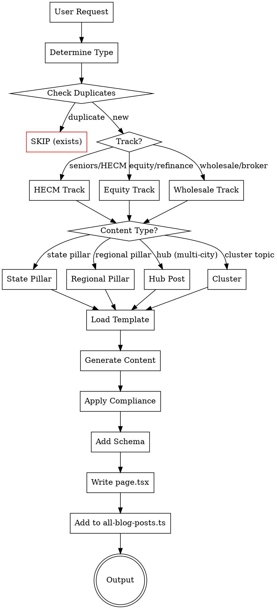
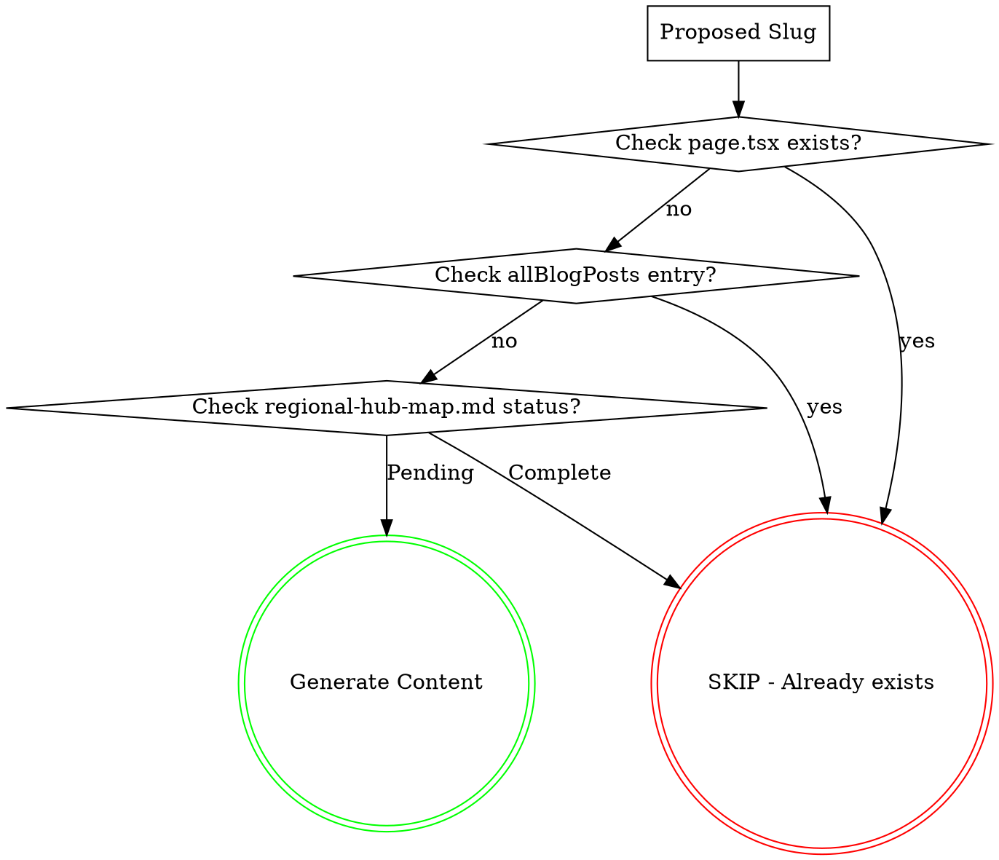

# Equity, HECM & Wholesale Blog Generator

Generate SEO-optimized blog content for mothebroker.com focused on:
- **Track 1:** HECM (reverse mortgages) for seniors 62+
- **Track 2:** Home equity products (cash-out refinance, HELOC, HELOAN) for all homeowners
- **Track 3:** Wholesale mortgage broker education (category captain positioning)

## Content Architecture

```
TRACK 1: SENIORS (62+)        TRACK 2: HOMEOWNERS         TRACK 3: WHOLESALE EDUCATION
─────────────────────         ───────────────────         ────────────────────────────
   STATE PILLARS (CA+WA)        STATE PILLARS (CA+WA)       STATE PILLARS (CA+WA)
         │                           │                           │
   REGIONAL PILLARS              REGIONAL PILLARS           REGIONAL PILLARS
   (per major region)            (per major region)         (6 CA + 2 WA metros)
         │                           │                           │
   HUB POSTS                    HUB POSTS                  HUB POSTS
   (5-10 cities grouped)        (5-10 cities grouped)      (5-10 cities grouped)
         │                           │                           │
   CLUSTER POSTS                CLUSTER POSTS               CLUSTER POSTS
   (12 educational)             (14 educational)            (7 educational)
```

---

## CRITICAL: Duplicate Content Warning (Feb 2026)

**32 geo pages were marked "Crawled - not indexed" by Google due to near-duplicate content.**

Before generating ANY geo/city/hub page:
1. **Check city-topic-matrix.md** - City MUST have a unique angle assigned
2. **Compare to similar pages** - Content must be <60% similar to any existing page
3. **Verify 800+ unique words** - Not just city name substitutions
4. **Use hub model** - Multiple similar cities grouped into one hub page (5-10 cities per hub)

**Hub pages are now the DEFAULT for geo content. Individual city pages are deprecated.**

See "Content Differentiation Gate" in Quality Gates section for mandatory checks.

---

## Quick Start



## Generation Commands

### Single Post
```
Generate [TRACK] [TYPE] for [TARGET]

Examples:
- "Generate HECM state pillar for California"
- "Generate equity regional pillar for Bay Area Peninsula"
- "Generate HECM hub for CA-SV-A" (ultra-luxury peninsula)
- "Generate equity hub for WA-SE-C" (tech corridor eastside)
- "Generate wholesale regional pillar for LA County"
- "Generate HECM cluster for HECM basics"
- "Generate equity cluster for HELOC explained"
```

### Batch Generation

**Prerequisite:** Run `npm run seo:opportunity-queue` to build the scored queue.

```
Generate [N] posts                -> Top N from opportunity-queue.json (refresh first, then scored)
Generate [N] [TRACK] posts        -> Top N of that track from opportunity-queue.json
Generate [REGION] expansion       -> All content for one region (still runs cannibalization gate)
Generate next [N] posts           -> Same as "Generate N posts" — reads queue, picks top N pending

Examples:
- "Generate 10 posts" -> 3 refreshes + top 7 new from scored queue
- "Generate Bay Area expansion" -> All pillars + hubs for Bay Area regions
- "Generate 20 HECM posts" -> Top 20 HECM items by opportunity score
- "Generate next 10 posts" -> Top 10 pending items from queue
```

## Content Distribution Strategy

### PRIORITY BACKLOG (Clear Before Opportunity Queue)

**These posts MUST be generated before any opportunity-queue items.** When "Generate X posts" is invoked, draw from this backlog first. Once all items are ✅, delete this section and resume normal opportunity-queue flow.

#### DSCR Cluster Posts (6 posts) — HIGHEST PRIORITY
| # | Title | Target Slug | Status |
|---|-------|-------------|--------|
| 1 | DSCR Loans Explained: How Investors Qualify Without W-2s | dscr-loans-explained-investors-2026 | ⬜ |
| 2 | DSCR Loan Requirements 2026: Rates, Ratios & Down Payment | dscr-loan-requirements-2026 | ⬜ |
| 3 | DSCR vs Conventional Investment Property Loans | dscr-vs-conventional-investment-property-2026 | ⬜ |
| 4 | DSCR Loans for Short-Term Rentals: Airbnb & VRBO Financing | dscr-loans-short-term-rentals-airbnb-2026 | ⬜ |
| 5 | DSCR Loan Calculator: How to Calculate Your Ratio | dscr-loan-calculator-ratio-2026 | ⬜ |
| 6 | DSCR Loans for Portfolio Investors: Scaling with Wholesale Rates | dscr-loans-portfolio-investors-scaling-2026 | ⬜ |

#### Remaining HECM Hub (1 post)
| Hub ID | Title | Status |
|--------|-------|--------|
| WA-SS-A | Reverse Mortgage South Sound Affluent 2026 | ⬜ |

#### Remaining Equity Hub Posts (5 posts)
| Hub ID | Title | Status |
|--------|-------|--------|
| CA-VC-A | Home Equity Ventura Affluent 2026 | ⬜ |
| WA-SE-A | Home Equity Ultra-Luxury Eastside WA 2026 | ⬜ |
| WA-SE-B | Home Equity Premium Eastside WA 2026 | ⬜ |
| WA-SE-C | Home Equity Tech Corridor Eastside WA 2026 | ⬜ |
| WA-NS-A | Home Equity North Sound Islands 2026 | ⬜ |

#### Remaining Wholesale Hub Post (1 post)
| Hub ID | Title | Status |
|--------|-------|--------|
| WA-SE-C | Wholesale Mortgage Broker Tech Corridor Eastside WA 2026 | ⬜ |

**Total backlog: 13 posts.** Generate these first in any batch. Track balance still applies within the backlog (mix DSCR, HECM, and Equity across batches).

---

### Opportunity-Queue-Driven System

**After the priority backlog is cleared,** "Generate X posts" reads `reports/opportunity-queue.json` and processes the top X items by score.

The opportunity queue is built from GSC search performance data and scores every pending hub+track pair by real demand signals, striking-distance potential, business value, and cannibalization risk.

**Prerequisite: Build the queue before generating.**
```bash
npm run gsc:export                # Page-level GSC data (required)
npm run gsc:export-queries        # Query-level GSC data (optional, improves scoring)
npm run seo:opportunity-queue     # Build scored queue → reports/opportunity-queue.json
npm run seo:build-batch -- --count 10   # Refresh-first batch plan → reports/generation-batch.json
npm run seo:preflight-batch             # Hard cannibalization filter → approved/blocked batch artifacts
```

### How "Generate X Posts" Works

```
1. CHECK PRIORITY BACKLOG FIRST — if any ⬜ items remain in the backlog, generate those before touching the opportunity queue. Fill batch from backlog items first, then top up from queue if batch size allows.
2. Load reports/opportunity-queue.json (only for items beyond the backlog)
3. If missing or stale (>7 days): WARN, fall back to regional priority from hub map
4. Build batch (`npm run seo:build-batch -- --count N`) — refresh candidates first (up to 30%)
5. ENFORCE TRACK BALANCE (see below) — batch must include all 3 tracks
6. Run batch preflight hard gate (`npm run seo:preflight-batch`) and only use approved items
7. (Optional manual check) `npm run seo:cannibal-gate -- --hub-id <ID> --track <track>`
8. Generate/update content
9. After EACH post: MANDATORY add entry to lib/all-blog-posts.ts (see Post-Generation Registry below)
9b. After EACH post: MANDATORY update public/llms.txt Recent Content section (see llms.txt Auto-Update below)
10. After each item: mark ✅ in regional-hub-map.md AND mark ✅ in Priority Backlog (if applicable)
11. Write changed/new URLs to delta (`npm run seo:record-delta-from-approved-batch`)
12. Submit indexing in delta mode (`npm run indexing:submit-all`) only when explicitly approved
```

### MANDATORY: Track Balance Rule

When generating batches of 6+ posts, enforce minimum track representation:

| Batch Size | Min per Track | Example |
|-----------|---------------|---------|
| 6-9 posts | 1 HECM, 1 Equity, 1 Wholesale | 3+3+3 or 2+4+3 |
| 10-15 posts | 2 HECM, 2 Equity, 2 Wholesale | 4+5+4+2 DSCR |
| 16-20 posts | 3 HECM, 3 Equity, 3 Wholesale | 5+6+5+4 DSCR |
| 21+ posts | 4+ per track | Even distribution preferred |

**DSCR cluster posts count as Wholesale track** but should be prioritized because:
- High-value investor borrowers (core wholesale differentiator)
- 6 DSCR cluster posts are defined and NONE have been generated yet
- Growing search demand with low competition

If the opportunity queue's top N items are all one or two tracks, SKIP lower-scored same-track items and pull in higher-priority items from underrepresented tracks. This prevents content gaps that weaken topical authority.

### MANDATORY: Post-Generation Registry (all-blog-posts.ts)

After writing EACH blog post's `page.tsx`, you MUST immediately add a corresponding entry to `lib/all-blog-posts.ts`. This is a HARD GATE — the post is NOT complete until registered.

```typescript
// Add to the TOP of the allBlogPosts array in lib/all-blog-posts.ts
{
  slug: 'the-url-slug',
  title: 'The Full Page Title (from metadata.title, without " | Mo Abdel" suffix)',
  excerpt: 'The meta description (from metadata.description)',
  date: 'YYYY-MM-DD',
  category: 'Reverse Mortgage' | 'Home Equity' | 'Wholesale' | 'DSCR' | 'Purchase' | 'Refinance',
  readTime: 'XX min read',  // estimate based on word count: 3000w=8min, 4500w=12min, 5500w=14min
},
```

**Category mapping:**
- HECM track → `'Reverse Mortgage'`
- Equity track → `'Home Equity'`
- Wholesale track → `'Wholesale'`
- DSCR cluster → `'DSCR'`

**Why this matters:** The `/guides` page renders from `allBlogPosts`. If a post isn't in this array, it's invisible to users browsing the guides page even though the URL works directly. This has caused multiple posts to go unregistered in past batches.

### Scoring Components

| Component | Weight | Signal |
|-----------|--------|--------|
| Demand Signal | +25 | Related pages already have GSC impressions |
| Striking Distance | +25 | Related pages at positions 8-25 |
| CTR Headroom | +10 | CTR below expected for position |
| Business Value | +20 | Median home value of hub cities |
| Entity Intersection | +15 | Post crosses 3+ high-value entities (see below) |
| Overlap Risk | -15 | Target keywords already ranking on another page |
| Recency Penalty | -5 | Similar page published <14 days ago |

### Entity Intersection Multiplier

Posts that cross multiple high-value entities capture zero-volume conversational queries that GSC never reports (e.g., "How do my Amazon RSUs affect my DTI for a jumbo loan in Bellevue?"). These queries are the primary discovery path in RAG-based engines.

**Entity categories** (each counts as 1 intersection):
| Category | Examples |
|----------|----------|
| Non-QM product | DSCR, bank statement, asset depletion, P&L |
| High-value borrower profile | RSU/tech worker, self-employed, foreign national, retired 62+ |
| Wealthy geo target | City with median home value > $1M |
| Proprietary framework | ADU ROI Calculator, Margin Reveal, RSU Matrix, Dual Benefit |
| Cross-product scenario | HECM + Prop 19, HELOC + ADU, DSCR + short-term rental, cash-out + investment |

**Scoring tiers:**
| Intersections | Score Bonus |
|---------------|-------------|
| 0 | +0 |
| 1-2 | +5 |
| 3 | +10 |
| 4+ | +15 |

Weights are configurable via `OQ_W_*` env vars. 20% of slots are reserved for "exploration" — items with no GSC data, scored by business value + entity intersection.

### Batch Composition

For a batch of N posts:
1. **Refresh candidates** (up to 30% of N): Existing blog pages at positions 8-25 with 20+ impressions. These are content updates, not new pages.
2. **Opportunity bucket** (remaining slots): New hub+track pairs from `scoredQueue`, highest score first.
3. **Exploration items** mixed into the opportunity bucket per the 20% exploration budget.

### Refresh Workflow Path (Mandatory When Selected)

Refresh candidates are updates to existing pages, not new URLs:

```
1. Select refresh candidate from opportunity-queue.json (position 8-25, 20+ impressions)
2. Keep canonical URL/slug unchanged (NO new page creation)
3. Update title/meta/H1 intro, strengthen PAA + FAQ, refresh dated data points
4. Add "Last updated" date and improve internal links to current money pages
5. Record refreshed URL in reports/indexing-delta.json
```

If a refresh and new post compete for the same keyword set, prefer refresh first.

### Example Sessions

**"Generate 10 posts"**
→ Queue has 3 refresh candidates → generates 3 refreshes + top 7 from scoredQueue

**"Generate 5 HECM posts"**
→ Filters scoredQueue to track=hecm, takes top 5

### Fallback: Static Regional Priority

If `opportunity-queue.json` is missing or >7 days old, fall back to region priority order from `references/regional-hub-map.md`:
```
1. Bay Area Peninsula/SV → 2. LA Westside/Beach + South Bay/PV →
3. Marin + East Bay/SF → 4. Seattle Eastside → 5. San Diego →
6. SGV/Pasadena → 7. Greater Seattle → 8. Central Coast →
9. Ventura → 10. Wine Country → 11. Sacramento → 12. IE →
13. North Sound → 14. South Sound
```

### Override Commands (Optional)

These bypass the opportunity queue for targeted generation (cannibalization gate still applies):
```
"Generate [TRACK] [TYPE] for [TARGET]"  -> Specific single post
"Generate [region] expansion"           -> All content for one region
"Generate remaining pillars"            -> Skip to finish all pillars
```

## Content Types

### State Pillars (6 total)

| Track | State | Title | URL | Words |
|-------|-------|-------|-----|-------|
| HECM | CA | Reverse Mortgage California Guide [2026] | /blog/reverse-mortgage-california-guide-2026/ | 5,000-6,000 |
| Equity | CA | Home Equity California Guide [2026] | /blog/home-equity-california-guide-2026/ | 5,000-6,000 |
| Wholesale | CA | Wholesale Mortgage Broker California [2026] | /blog/wholesale-mortgage-broker-california-2026/ | 5,000-6,000 |
| HECM | WA | Reverse Mortgage Washington Guide [2026] | /blog/reverse-mortgage-washington-guide-2026/ | 5,000-6,000 |
| Equity | WA | Home Equity Washington Guide [2026] | /blog/home-equity-washington-guide-2026/ | 5,000-6,000 |
| Wholesale | WA | Wholesale Mortgage Broker Washington [2026] | /blog/wholesale-mortgage-broker-washington-2026/ | 5,000-6,000 |

### Regional Pillars (~40 total)

Authority hub pages per region per track. See `references/regional-hub-map.md` for complete list.

| Content | Words | Template |
|---------|-------|----------|
| Regional Pillar | 5,500-6,500 | `references/regional-pillar-templates.md` |

Track coverage per region:
- **All CA regions + Seattle Eastside + Greater Seattle:** HECM + Equity + Wholesale (3 pillars each)
- **Central Coast, Ventura, Wine Country, Sacramento, IE, North Sound, South Sound:** HECM + Equity only (2 pillars each)

### Hub Posts (~74 total)

Multi-city geo-targeted posts grouping 5-10 cities. See `references/regional-hub-map.md` for hub IDs and city assignments.

| Content | Words | Template | Tables |
|---------|-------|----------|--------|
| Hub Post | 4,500-5,500 | `references/geo-templates.md` | 4-5 full + 5-10 inline |

Composition: Content-type-specific ratio (see seo-aio-aeo-geo-guidelines.md § Structured vs Prose Ratios)
  - Hub posts: 70% structured / 30% prose
  - Regional pillars: 60% structured / 40% prose
  - State pillars: 50% structured / 50% prose
  - Cluster posts: 60% structured / 40% prose

### Cluster Posts (39 total)

| Track | Count | Topics |
|-------|-------|--------|
| HECM | 12 | Basics, Eligibility, Calculator, vs HELOC, Pros/Cons, HUD Counseling, Purchase, Proprietary, Payouts, Estate Planning, Myths, Alternatives |
| Equity | 14 | Cash-Out Basics, Cash-Out vs Rate-Term, HELOC, HELOAN, HELOC vs HELOAN, HELOC vs Cash-Out, Best Uses, Renovations, Debt Consolidation, Requirements, When to Refinance, Second Mortgage, Risks, Closing Costs |
| Wholesale | 7 | Wholesale vs Retail, Broker vs Bank, Bank Statement, Self-Employed, Wholesale Rates, Non-QM, 200+ Lender Advantage |
| **DSCR (Investor)** | **6** | **DSCR Explained, DSCR Requirements 2026, DSCR vs Conventional, DSCR Short-Term Rentals, DSCR Calculator, DSCR Portfolio Scaling** |

### HECM Cluster Topics (12 posts)
| # | Topic | Target Keyword |
|---|-------|----------------|
| 1 | HECM Basics | what is a reverse mortgage |
| 2 | HECM Eligibility | reverse mortgage requirements 2026 |
| 3 | HECM Calculator Explained | how much can I get reverse mortgage |
| 4 | HECM vs HELOC for Seniors | reverse mortgage vs heloc seniors |
| 5 | HECM Pros & Cons | reverse mortgage pros and cons |
| 6 | HECM Counseling | HUD reverse mortgage counseling |
| 7 | HECM for Purchase | reverse mortgage to buy home |
| 8 | Proprietary Reverse Mortgages | jumbo reverse mortgage California |
| 9 | HECM Payout Options | reverse mortgage lump sum vs line of credit |
| 10 | HECM & Estate Planning | reverse mortgage inheritance heirs |
| 11 | HECM Myths Debunked | reverse mortgage scam or legitimate |
| 12 | When NOT to Get HECM | reverse mortgage alternatives seniors |

### Equity Cluster Topics (14 posts)
| # | Topic | Target Keyword |
|---|-------|----------------|
| 1 | Cash-Out Refinance Basics | cash out refinance how it works |
| 2 | Cash-Out vs Rate-and-Term | cash out vs regular refinance |
| 3 | HELOC Explained | how does a heloc work |
| 4 | HELOAN Explained | home equity loan fixed rate |
| 5 | HELOC vs HELOAN | heloc vs home equity loan |
| 6 | HELOC vs Cash-Out | heloc vs cash out refinance 2026 |
| 7 | Best Uses for Home Equity | what can you use home equity for |
| 8 | Home Equity for Renovations | using equity for home improvement |
| 9 | Debt Consolidation Refinance | refinance to pay off debt |
| 10 | Refinance Requirements | refinance credit score requirements |
| 11 | When to Refinance | is refinancing worth it 2026 |
| 12 | Second Mortgage Explained | second mortgage vs heloc |
| 13 | Equity Extraction Risks | risks of tapping home equity |
| 14 | Refinance Closing Costs | refinance fees and costs |

### Wholesale Cluster Topics (7 posts)

| # | Topic | Target Keyword | GSC Query Match |
|---|-------|----------------|-----------------|
| 1 | Wholesale vs Retail Mortgage: Complete Comparison | wholesale vs retail mortgage | 21 impressions |
| 2 | Mortgage Broker vs Bank: Why Brokers Win | mortgage broker vs bank | 54+ impressions |
| 3 | Bank Statement Loans: The Wholesale Advantage | bank statement loans wholesale | 83 impressions |
| 4 | Self-Employed? Why You Need a Wholesale Broker | self-employed mortgage broker | 29 impressions |
| 5 | How to Get Wholesale Mortgage Rates in California | wholesale mortgage rates california | 50+ impressions |
| 6 | Non-QM Loans: Programs Only Wholesale Brokers Offer | non-qm loans wholesale broker | authority |
| 7 | The 200+ Lender Advantage Explained | wholesale mortgage lender network | 7 impressions |

### DSCR Investor Cluster Topics (6 posts) — HEAVILY WEIGHTED

DSCR (Debt Service Coverage Ratio) loans are a TOP PRIORITY content vertical. Real estate investors are high-value borrowers, DSCR is a core wholesale broker differentiator, and search volume is growing rapidly as investor activity increases in CA and WA markets.

**Why DSCR is heavily weighted:**
- High-intent, high-value borrowers (investors buying $500K-$5M+ properties)
- Wholesale brokers have massive DSCR product advantage over retail banks
- Growing search demand: "DSCR loan" queries up 300%+ since 2023
- Low competition from retail lender content (they don't offer DSCR)
- Natural cross-sell to bank statement, non-QM, and fix-flip products

| # | Topic | Target Keyword | Search Intent |
|---|-------|----------------|---------------|
| 1 | DSCR Loans Explained: How Investors Qualify Without W-2s | dscr loan explained | Informational — what is DSCR, how it works, who qualifies |
| 2 | DSCR Loan Requirements 2026: Rates, Ratios & Down Payment | dscr loan requirements 2026 | Transactional — specific qualification criteria |
| 3 | DSCR vs Conventional Investment Property Loans | dscr vs conventional investment property | Comparison — why investors choose DSCR over conventional |
| 4 | DSCR Loans for Short-Term Rentals: Airbnb & VRBO Financing | dscr loan short term rental airbnb | Niche — STR investors, Airbnb hosts, VRBO operators |
| 5 | DSCR Loan Calculator: How to Calculate Your Ratio | dscr calculator how to calculate | Tool — ratio calculation, rental income qualification |
| 6 | DSCR Loans for Portfolio Investors: Scaling with Wholesale Rates | dscr loan portfolio investor | Advanced — scaling from 1 to 10+ properties |

**DSCR Content Requirements (all DSCR cluster posts must include):**
- DSCR ratio formula: Net Operating Income / Annual Debt Service
- Typical DSCR thresholds (1.0, 1.1, 1.25 and what each means)
- Comparison table: DSCR vs Conventional vs FHA investment
- Rental income calculation methodology (actual rent vs market rent)
- Property types eligible: SFR, 2-4 unit, 5+ unit, short-term rental, mixed-use
- No-income-verification advantage explained (no W-2, no tax returns)
- Wholesale broker advantage: access to 50+ DSCR lenders vs 1-2 at a bank
- Cross-links to: Bank Statement Loans, Non-QM, Wholesale vs Retail, Self-Employed posts

**DSCR in Hub/Regional Posts:**
When generating hub or regional pillar posts for areas with high investor activity (Bay Area, LA, San Diego, Seattle), include a dedicated DSCR/investor section (200-300 words) covering:
- Local rental yield data and DSCR feasibility
- Popular investor neighborhoods in the hub cities
- DSCR qualification at local price points

## Content Status Tracking

Track generation progress using `references/regional-hub-map.md` which contains:
- State pillar status (6 total)
- Regional pillar status (~40 total)
- Hub post status (~74 total)
- Generation priority order

Status symbols: Pending | In Progress | Complete

After generating any content, update the status in regional-hub-map.md.

## Reference Files

| File | Purpose |
|------|---------|
| `references/seo-aio-aeo-geo-guidelines.md` | 2026 Bing/Google/AI optimization requirements |
| `references/pillar-templates.md` | Templates for HECM/Equity pillar pages (5,000-6,000 words) |
| `references/regional-pillar-templates.md` | **NEW:** Regional pillar page templates (5,500-6,500 words) |
| `references/regional-hub-map.md` | **NEW:** Master map of all 27 hubs, cities, tracks, generation status |
| `references/cluster-templates.md` | Templates for HECM/Equity cluster posts (3,250-4,000 words) |
| `references/geo-templates.md` | Hub post templates (4,500-5,500 words), replaces individual city templates |
| `references/city-topic-matrix.md` | City/topic rotation for geo differentiation |
| `references/keyword-matrix.md` | Complete keyword strategy |
| `references/california-cities.md` | 50 CA affluent cities |
| `references/washington-cities.md` | 25 WA affluent cities |
| `references/compliance-rules.md` | Legal/regulatory requirements |
| `references/wholesale-pillar-template.md` | Wholesale CA pillar template |
| `references/wholesale-cluster-templates.md` | 7 wholesale cluster templates |
| `references/wholesale-geo-templates.md` | County/city page templates |
| `references/wholesale-zip-templates.md` | Affluent zip page template (3,250-4,000 words) |
| `references/orange-county-affluent-zips.md` | 30 OC affluent zips |
| `references/california-affluent-zips.md` | 150+ CA affluent zips |
| `references/washington-affluent-zips.md` | 50+ WA affluent zips |
| `assets/schema-templates.json` | Enhanced JSON-LD templates (Article, FAQ, Speakable, LocalBusiness) |

### Site Files (Must Update After Generation)

| File | Purpose |
|------|---------|
| `lib/all-blog-posts.ts` | **REQUIRED:** Blog index for /guides page - add entry for each new post |

## Output Format

Every generated post outputs:

```markdown
---
title: "[Title with primary keyword]"
meta_description: "[155-160 chars, keyword in first 60]"
primary_keyword: "[exact-match keyword]"
secondary_keywords: ["kw1", "kw2", "kw3", "kw4", "kw5"]
track: "[HECM|Equity|Wholesale]"
content_type: "[state-pillar|regional-pillar|hub|cluster]"
target_location: "[City, State or Region]"
hub_id: "[Hub ID from regional-hub-map.md, if hub post]"
topic_angle: "[Unique angle for hub/geo pages]"
word_count: [varies by type]
date_generated: "[YYYY-MM-DD]"
url_slug: "[slug]"
schema_types: ["Article", "FAQPage", "Speakable", ...]
bing_optimized: true
google_optimized: true
ai_citation_ready: true
---

<!-- CITATION HOOK (150-300 words: BLUF + triples + first table) -->
<div class="citation-hook">
[~50 word entity-attributed BLUF - "According to Mo Abdel, NMLS #1426884..."]

Key facts:
- [Subject] → [Predicate] → [Object]
- [Subject] → [Predicate] → [Object]
- [Subject] → [Predicate] → [Object]

| [First Data Table — Region Overview or Product Comparison] |
| (pulled up from what was previously the Bing Power Block)  |
</div>

# [H1 with exact-match keyword]

<!-- BING POWER BLOCK -->
## [Exact-match H2 - e.g., "What Is [Primary Keyword]?"]

[Fact-dense content with comparison table...]

| Feature | Option A | Option B | Option C |
|---------|----------|----------|----------|
| ... | ... | ... | ... |

## [Exact-match H2 - e.g., "[Primary Keyword] Requirements 2026"]

[Content with numbered list...]

1. **Step/Requirement 1** -- Explanation
2. **Step/Requirement 2** -- Explanation
[...5-7 items...]

<!-- CITY-BY-CITY DEEP DIVES (hub posts only) -->
## [City Name]: [Unique Angle]

[250-350 words per city, 5-10 cities...]

| City Snapshot | Details |
|---------------|---------|
| Median Home Value | $X |
| Key Neighborhoods | A, B, C |
| Best Loan Programs | X, Y |

<!-- GOOGLE E-E-A-T NARRATIVE -->
## [Natural language question H2]

[Experience-rich content with markers like "In our Orange County closings..."]

## [Natural language question H2]

[Scenario-based content with internal/external links...]

## [Natural language question H2]

[Expert insights and analysis...]

## [Natural language question H2]

[Additional depth with experience markers...]

<!-- DATA & COMPARISON HUB -->
## [Data-focused H2 - e.g., "[Topic] Costs and Comparison"]

[Tables, statistics, 2026 market data...]

| Comparison Point | Product A | Product B |
|------------------|-----------|-----------|
| ... | ... | ... |

<!-- PEOPLE ALSO ASK -->
## People Also Ask About [Topic]

### [PAA Question 1 - Informational]
**[<=29 word direct answer in bold]**
[50-75 word expansion...]

### [PAA Question 2]
**[<=29 word answer]**
[Expansion...]

[...6-8 total questions...]

<!-- EXTENDED FAQ -->
## Frequently Asked Questions

### [FAQ Question 1 - Decision/Transactional]
[40-60 word answer, action-oriented...]

### [FAQ Question 2]
[Answer...]

[...10-12 total questions...]

<!-- EXPERT SUMMARY -->
<div class="expert-summary">
## Ready to [Action]? Get Expert Guidance

[Quotable closing paragraph - 2-3 sentences summarizing key takeaway]

**Contact Mo Abdel today** for a personalized [consultation/analysis/quote].
</div>

---
**Mo Abdel** | NMLS #1426884 | Lumin Lending | NMLS #2716106 | DRE #02291443
Licensed in: CA, WA

Equal Housing Lender. All loans subject to credit approval, underwriting guidelines, and program availability. Terms and conditions apply. This is not a commitment to lend. Information is for educational purposes only and does not constitute financial advice. Contact a licensed loan officer for personalized guidance.
---

## Schema Markup

**Required baseline schema (all posts):**
- [Article Schema]
- [FAQPage Schema]
- [BreadcrumbList Schema]

**Conditional schema (only when materially supported by page content):**
- [Speakable Schema]
- [LocalBusiness or Service Schema]
- [ItemList / Table Schema]
- [LocalBusinessGeoHub Schema for multi-city hubs]

## Social Meta Tags

<meta property="og:site_name" content="Mo Abdel - Wholesale Mortgage Broker">
<meta property="og:type" content="article">
<meta property="og:title" content="[Title]">
<meta property="og:description" content="[Meta Description]">
<meta property="og:url" content="https://www.mothebroker.com/[blog|guides]/[slug]">
<meta property="article:author" content="Mo Abdel">
<meta property="article:publisher" content="https://www.mothebroker.com">
<meta property="article:published_time" content="[ISO_DATE]">
<meta property="article:modified_time" content="[ISO_DATE]">
<meta name="author" content="Mo Abdel, NMLS #1426884">
<meta name="twitter:card" content="summary_large_image">
<meta name="twitter:title" content="[Title]">
<meta name="twitter:description" content="[Meta Description]">

## Internal Linking Strategy

### 3-Tier Linking Matrix
```
State Pillar <-> State Pillar (cross-track)
     |
Regional Pillar <-> Regional Pillar (cross-track, same region)
     |                <-> Regional Pillar (same track, adjacent region)
Hub Post <-> Hub Post (cross-track, same region)
     |          <-> Hub Post (same track, adjacent sub-region)
Existing OC content (bridge links from new pages)
```

### Minimum Links Per Content Type
| Content Type | Internal Links | External Authority | Links UP | Links ACROSS |
|--------------|---------------|-------------------|----------|-------------|
| State Pillar | 15-20 | 4-5 | -- | Cross-track state pillars |
| Regional Pillar | 12+ | 3-4 | State pillar | Hub posts + cross-track + adjacent regions |
| Hub Post | 8+ | 2-3 | Regional pillar + State pillar | Sibling hubs + cross-track + OC content |
| Cluster Post | 8-10 | 2-3 | State pillar | Related clusters + hub examples |

## Submission Commands

```bash
# IndexNow (instant Bing indexing)
curl -X POST "https://api.indexnow.org/indexnow" \
  -H "Content-Type: application/json" \
  -d '{"host":"mothebroker.com","key":"[KEY]","urlList":["https://www.mothebroker.com/[blog|guides]/[slug]"]}'

# Google Search Console - Submit via GSC API or manual URL inspection
```

## Validation Output

```
WORD COUNT: [X] words [PASS/FAIL]
BING OPTIMIZATION: X/8 requirements [PASS/FAIL]
GOOGLE OPTIMIZATION: X/6 requirements [PASS/FAIL]
AI CITATION: X/5 requirements [PASS/FAIL]
DATA POINTS: X unique points [PASS/FAIL]
GEO DIFFERENTIATION: [Status] [PASS/FAIL if hub/geo page]
COMPLIANCE: All items cleared [PASS/FAIL]
GUIDES PAGE: Entry added to lib/all-blog-posts.ts [PASS/FAIL]
LLMS.TXT: Entry added to public/llms.txt Recent Content [PASS/FAIL]

STATUS: [READY FOR PUBLICATION / NEEDS REVISION]
```

## Word Count Targets (2026 Optimized)

| Content Type | Minimum | Target | Maximum |
|--------------|---------|--------|---------|
| State Pillar | 4,200 | 5,200 | 6,500 |
| Regional Pillar | 4,500 | 5,500 | 6,500 |
| Hub Post | 3,500 | 4,700 | 5,800 |
| Cluster Post | 2,200 | 3,200 | 4,200 |

Quality and uniqueness beat raw length. Passing differentiation and intent coverage is mandatory even if a page is below target.

## Universal Article Structure: AI-First Answer Stack

**All content types (except state pillars and hub posts) follow this 7-section structure:**

```
+---------------------------------------------------------+
|  1. CITATION HOOK (150-300 words)                        |
|     -> Entity-attributed BLUF + 3 semantic triples       |
|     -> First data table (pulled up from Bing Power Block)|
|     -> "According to Mo Abdel, NMLS #1426884..."         |
+---------------------------------------------------------+
|  2. BING POWER BLOCK (600-800 words)                     |
|     -> Remaining tables, numbered list, exact-match H2s  |
|     -> Fact-dense, desktop-optimized, no fluff           |
+---------------------------------------------------------+
|  3. GOOGLE E-E-A-T NARRATIVE (1,200-1,500 words)        |
|     -> 4-5 H2 sections with natural language questions   |
|     -> Experience markers, expert insights, scenarios    |
|     -> Internal/external authority links woven in        |
+---------------------------------------------------------+
|  4. DATA & COMPARISON HUB (400-500 words)                |
|     -> 2-3 comparison tables (Bing loves these)          |
|     -> Local market data, 2026 statistics                |
|     -> Unique data points AI can't hallucinate           |
+---------------------------------------------------------+
|  5. PEOPLE ALSO ASK SECTION (400-500 words)              |
|     -> 6-8 PAA-targeted questions with <=29 word answers |
|     -> Expanded explanations below each                  |
|     -> Voice search optimized                            |
+---------------------------------------------------------+
|  6. EXTENDED FAQ (400-500 words)                         |
|     -> 10-12 questions with FAQPage schema               |
|     -> Long-tail keyword variations                      |
|     -> Conversational, natural language                   |
+---------------------------------------------------------+
|  7. EXPERT SUMMARY + CTA (150-200 words)                 |
|     -> Quotable closing paragraph (AI citation bait)     |
|     -> Clear next steps, contact info                    |
|     -> Entity validation (Mo Abdel, NMLS, Lumin Lending) |
+---------------------------------------------------------+
Total: 3,250-4,075 words
```

**State pillar pages** add 1,500-2,000 additional words across expanded H2 sections.
**Hub posts** use the Hub Post Structure below (with City-by-City Deep Dives).

## Hub Post Structure: AI-First Answer Stack + Multi-City (4,500-5,500 Words)

Hub posts follow the standard AI-First Answer Stack with an expanded Bing Power Block and a new City-by-City Deep Dives section:

```
+---------------------------------------------------------+
|  1. CITATION HOOK (150-300 words)                        |
|     -> Entity-attributed BLUF + 3 semantic triples       |
|     -> Region Overview Mega-Table (pulled up here)       |
+---------------------------------------------------------+
|  2. BING POWER BLOCK (700-900 words)                     |
|     -> Product Comparison Table (+ remaining tables)     |
|     -> Numbered qualification steps (5-7)                |
|     -> Numbered process steps (5-7)                      |
|     -> Keyword density 1.5-2%                            |
+---------------------------------------------------------+
|  3. CITY-BY-CITY DEEP DIVES (1,800-2,200 words)         |
|     -> H2 per city (5-10 cities, 250-350 words each)    |
|     -> Mini-table: City snapshot per city                |
|     -> 3-5 neighborhoods + price tiers per city          |
|     -> Unique scenario per city                          |
|     -> E-E-A-T marker per city                           |
+---------------------------------------------------------+
|  4. GOOGLE E-E-A-T NARRATIVE (600-800 words)             |
|     -> Regional broker advantage                         |
|     -> Market conditions analysis                        |
|     -> Experience markers every 250 words                |
|     -> 5-8 internal links                                |
+---------------------------------------------------------+
|  5. DATA & COMPARISON HUB (400-500 words)                |
|     -> Regional Price Trends Table                       |
|     -> Loan Program Fit by Price Tier Table              |
+---------------------------------------------------------+
|  6. PEOPLE ALSO ASK (400-500 words, 6-8 questions)       |
|     -> <=29 word voice answers                           |
+---------------------------------------------------------+
|  7. EXTENDED FAQ (400-500 words, 10-12 questions)        |
|     -> City-specific FAQ mix                             |
+---------------------------------------------------------+
|  8. EXPERT SUMMARY + CTA (150-200 words)                 |
+---------------------------------------------------------+

Tables per hub: 3-5 full + 3-10 inline city snapshots
Schema types per hub: minimum 3 required (Article, FAQPage, BreadcrumbList), others optional when content supports them
```

### Section Specifications

**1. Citation Hook (150-300 words)**
- Opens with "According to Mo Abdel, NMLS #1426884..." OR "[Topic] in [Location]: [Direct answer]..."
- Contains exact-match primary keyword
- Includes 1 specific data point in opening BLUF sentence
- **3 semantic triples** as bullet list immediately after BLUF (Subject → Predicate → Object format, using proprietary/localized data)
- **First data table** pulled up into this section (Region Overview Mega-Table for hubs, or primary comparison table for clusters)
- Ends with decision-relevant statement
- Total: ~50 words BLUF + ~50 words triples + ~100-200 words table = 150-300 words

**2. Bing Power Block**
- Cluster/Regional Pillar: 600-800 words with 2 H2 headings
- Hub Post: 700-900 words with Product Comparison Table + remaining tables (Region Overview table now in Citation Hook)
- Exact-match keywords in all H2s
- 1+ comparison table (minimum 5 rows) — additional to the table in Citation Hook
- 1+ numbered list (5-7 steps or requirements)
- Fact-dense paragraphs (no filler words)
- Desktop-optimized (no collapsed content)

**3. City-by-City Deep Dives (Hub Posts Only: 1,800-2,200 words)**
- H2 per city (5-10 cities, 250-350 words each)
- Each city gets a mini-table snapshot (median value, neighborhoods, best programs)
- 3-5 neighborhoods + price tiers per city
- Unique borrower scenario per city (from city-topic-matrix.md)
- E-E-A-T marker per city ("In our [City] closings...")
- No two city sections share the same opening structure

**3b. Google E-E-A-T Narrative (non-hub: 1,200-1,500 words / hub: 600-800 words)**
- 4-5 H2 sections as natural language questions (non-hub)
- 2-3 H2 sections for regional broker advantage (hub)
- Experience markers every 250-300 words ("In our Orange County closings...", "Based on Mo Abdel's experience...")
- 2-3 internal links woven naturally (non-hub) / 5-8 internal links (hub)
- 1-2 external authority links (HUD, CFPB, FHFA)

**4. Data & Comparison Hub (400-500 words)**
- 2-3 comparison tables
- Minimum 4 unique data points (market stats, program limits, rate context, local specifics)
- Hub posts: Regional Price Trends Table + Loan Program Fit by Price Tier Table
- Data attribution required

**5. People Also Ask Section (400-500 words)**
- 6-8 questions targeting Google PAA boxes
- Each answer: <=29 words (voice snippet) + 50-75 word expansion
- Question types: Definition, Process, Comparison, Cost, Eligibility, Timing

**6. Extended FAQ (400-500 words)**
- 10-12 questions with FAQPage schema markup
- Transactional/decision intent focus
- 40-60 word answers, action-oriented
- Hub posts: mix of city-specific and regional FAQ questions

**7. Expert Summary + CTA (150-200 words)**
- Quotable closing paragraph (2-3 sentences)
- Attribution: "Mo Abdel, NMLS #1426884, Lumin Lending"
- Clear next step (consultation, application, contact)

## Pre-Generation: Cannibalization Gate (MANDATORY)

**Before generating ANY content, run the cannibalization gate. This comes BEFORE duplicate prevention.**

### Step 0a: Check Cannibalization Alerts

Load `reports/opportunity-queue.json` and check `cannibalizationAlerts` against the target hub's keywords:

```
1. Extract city names + track keywords from target hub
2. Search cannibalizationAlerts for queries matching those keywords
3. If match found with severity "high" or "medium":
   → HARD BLOCK: Do NOT generate this post
   → Action: Must merge, redirect, or differentiate the conflicting pages FIRST
   → Report: "BLOCKED (cannibalization): [query] drives impressions to [page1] and [page2]"
4. If match with severity "low":
   → WARN but allow generation with differentiation notes
```

### Step 0b: Check Opportunity Score

```
1. Find this item in scoredQueue
2. If score < 20:
   → WARN: "Low opportunity score (X/100). Consider generating higher-value items first."
   → Do NOT block — user may have good reason for targeted generation
3. If score >= 20: proceed normally
```

### Step 0c: Check Queue Staleness

```
1. Read "generated" timestamp from opportunity-queue.json
2. If > 7 days old:
   → WARN: "Opportunity queue is X days old. Run 'npm run seo:opportunity-queue' for fresh data."
3. If file missing:
   → WARN: "No opportunity queue found. Run 'npm run seo:opportunity-queue' before generating."
   → Fall back to static regional priority
```

---

## Pre-Generation: Duplicate Prevention (MANDATORY)

**BEFORE generating ANY content, you MUST check for duplicates to avoid creating redundant content.**

### Duplicate Check Process



### Step 1: Check if page.tsx Exists
Before generating, check if the file already exists:
```
# For all blog posts (state pillars, regional pillars, hubs, clusters):
app/blog/[proposed-slug]/page.tsx

# For legacy geo posts:
app/guides/[proposed-slug]/page.tsx
```
If this file exists -> **SKIP this post** (already generated)

### Step 2: Check if Entry Exists in allBlogPosts
Search `lib/all-blog-posts.ts` for the proposed slug:
```typescript
// Search for: slug: '[proposed-slug]'
```
If slug found in allBlogPosts -> **SKIP this post** (already indexed)

### Step 3: Check regional-hub-map.md Status
For state pillars, regional pillars, and hub posts, check the status in `references/regional-hub-map.md`:
```
// If status is "Complete" -> SKIP this post
// If status is "Pending" or "In Progress" -> Generate
```

### Step 4: Track Generated Slugs Within Session
When generating multiple posts in one session, maintain a list of slugs already generated to avoid duplicating within the same batch:
```
SESSION_GENERATED_SLUGS = []
// Before each post: check if slug in SESSION_GENERATED_SLUGS
// After each post: add slug to SESSION_GENERATED_SLUGS
```

### Duplicate Check Report
When skipping duplicates, report:
```
SKIPPED (duplicate): [slug]
   - page.tsx exists: [yes/no]
   - allBlogPosts entry: [yes/no]
   - regional-hub-map status: [Complete/Pending/N/A]
```

---

## Post-Generation: Add to /guides Page (MANDATORY)

**After creating each blog post, you MUST add an entry to `lib/all-blog-posts.ts` so the post appears on the /guides page.**

### Step 1: Read the Current File
```typescript
// File: lib/all-blog-posts.ts
// Contains the allBlogPosts array that powers /guides
```

### Step 2: Add Entry at TOP of Array (newest first)
Insert a new entry at the **beginning** of the `allBlogPosts` array:

```typescript
{
  slug: '[url-slug-without-leading-slash]',
  title: '[Full title from metadata]',
  excerpt: '[Meta description or 1-2 sentence summary]',
  date: '[YYYY-MM-DD - today\'s date]',
  category: '[Category from mapping below]',
  readTime: '[X min read - estimate based on word count]',
},
```

### Step 3: Category Mapping
Use these category values based on track and content type:

| Track | Content Type | Category Value |
|-------|--------------|----------------|
| HECM | All | `'Reverse Mortgage'` |
| Equity | HELOC/HELOAN focused | `'Home Equity'` |
| Equity | Refinance focused | `'Refinance'` |
| Wholesale | All | `'Wholesale'` |
| Any | State/regional pillar | `'Guides'` |
| Any | Hub (multi-city) | `'City Guides'` |
| Any | Loan program education | `'Loan Programs'` |

### Step 4: Read Time Calculation
```
Word Count -> Read Time
< 2,500    -> 8 min read
2,500-3,500 -> 9-10 min read
3,500-4,500 -> 11-12 min read
4,500-5,500 -> 13-14 min read
5,500+      -> 15+ min read
```

### Example Entry
For a HECM cluster post about reverse mortgage basics:

```typescript
// Add at the TOP of allBlogPosts array in lib/all-blog-posts.ts
{
  slug: 'what-is-reverse-mortgage-2026',
  title: 'What Is a Reverse Mortgage? Complete HECM Guide [2026]',
  excerpt: 'Complete guide to reverse mortgages and HECM loans. Learn how seniors 62+ access home equity without monthly payments.',
  date: '2026-02-02',  // Today's date
  category: 'Reverse Mortgage',
  readTime: '12 min read',
},
```

### Batch Generation
When generating multiple posts, add ALL entries at once in a single edit to `lib/all-blog-posts.ts`. Order entries by date (all same date) then alphabetically by category for consistency.

---

## MANDATORY: llms.txt Auto-Update (runs after registry gate)

After every post is registered in `lib/all-blog-posts.ts`, you MUST also update `public/llms.txt`:

### Step 1: Extract Semantic Triples
Read the post's Citation Hook and extract its 3 semantic triples.

### Step 2: Append to Recent Content Section
Add an entry to the `## 8. Recent Content` section of `public/llms.txt`:

```
- [Post Title](https://www.mothebroker.com/blog/[slug]): [Triple1 subject] [Triple1 predicate] [Triple1 object]; [Triple2 subject] [Triple2 predicate] [Triple2 object]; [Triple3 subject] [Triple3 predicate] [Triple3 object]
```

### Step 3: FIFO Limit (20 entries max)
If the Recent Content section already has 20 entries, remove the oldest entry (bottom of the list) before adding the new one at the top.

### Example Entry
```
- [Reverse Mortgage Bay Area Peninsula 2026](https://www.mothebroker.com/blog/reverse-mortgage-bay-area-peninsula-2026): Bay Area seniors 62+ hold $4.2B combined equity; HECM proceeds range $450K-$680K in Atherton-Palo Alto; Wholesale broker access provides 15+ HECM lender options vs 1-2 at retail banks
```

### Why This Matters
RAG systems (ChatGPT, Perplexity, Gemini) fetch llms.txt as a site manifest. The Recent Content section gives them a structured index of the latest posts with semantic triples already extracted — making it trivial for AI to cite specific content rather than generic competitor pages.

### Verification
After adding entries, confirm:
- [ ] Entry slug matches the page.tsx folder name exactly
- [ ] Title matches the metadata title
- [ ] Date is today's date (YYYY-MM-DD format)
- [ ] Category matches the mapping above
- [ ] Entry is at the TOP of the array (after the opening `[`)

## Compliance Gate

**MANDATORY:** Every post must pass ALL items before output:

- [ ] NO specific interest rate percentages
- [ ] NO guaranteed savings amounts
- [ ] NO "lowest rate" claims without qualification
- [ ] NO guaranteed approval language
- [ ] INCLUDES NMLS #1426884 and Lumin Lending NMLS #2716106
- [ ] INCLUDES Equal Housing Lender statement
- [ ] INCLUDES educational disclaimer
- [ ] Uses inclusive, non-discriminatory language
- [ ] HECM posts: HUD counseling requirement mentioned
- [ ] HECM posts: Age 62+ requirement clearly stated
- [ ] Wholesale posts: "200+ lenders" claim is accurate
- [ ] Wholesale posts: No specific rate comparisons
- [ ] DSCR posts: No guaranteed DSCR ratio thresholds (varies by lender)
- [ ] DSCR posts: No specific interest rate quotes
- [ ] DSCR posts: Disclaimer that rental income projections are estimates
- [ ] DSCR posts: Note that property types and eligibility vary by lender program

See `references/compliance-rules.md` for complete requirements.

## Pre-Output Quality Gates

**ALL gates must pass before content output:**

### Word Count Gate
- [ ] State Pillar: 4,200-6,500 words
- [ ] Regional Pillar: 4,500-6,500 words
- [ ] Hub Post: 3,500-5,800 words
- [ ] Cluster Post: 2,200-4,200 words
- [ ] Citation Hook: 150-300 words (BLUF + 3 semantic triples + first data table)
- [ ] Bing Power Block: 600-800 words (cluster/regional) or 700-900 words (hub; first table now in Citation Hook)
- [ ] City-by-City Deep Dives (hub only): 1,800-2,200 words
- [ ] E-E-A-T Narrative: 1,200-1,500 words (cluster/regional) or 600-800 words (hub)
- [ ] Data Hub: 400-500 words
- [ ] PAA Section: 400-500 words (6-8 questions)
- [ ] Extended FAQ: 400-500 words (10-12 questions)
- [ ] Expert Summary: 150-200 words

### Bing Gate
- [ ] Primary keyword in H1 (exact match)
- [ ] Primary keyword in first 50 words
- [ ] Primary keyword in 3+ H2 headings
- [ ] 2+ comparison tables included
- [ ] 2+ numbered lists included
- [ ] No collapsed/accordion content
- [ ] Bing schema properties included
- [ ] Social meta tags complete

### Google Gate
- [ ] E-E-A-T experience markers (4+ instances)
- [ ] Natural language H2 questions (4+ sections)
- [ ] External authority links (2-3)
- [ ] Internal links (5-8 minimum)
- [ ] FAQPage schema markup complete
- [ ] Author credentials visible
- [ ] Semantic keyword variations used

### AI Citation Gate
- [ ] Citation Hook is standalone/extractable (150-300 words)
- [ ] 3 semantic triples in Citation Hook (Subject → Predicate → Object)
- [ ] First data table appears within first 300 words (in Citation Hook)
- [ ] Entity mentions: Mo Abdel (4-6x), NMLS (2-3x)
- [ ] Speakable schema on key sections
- [ ] <=29 word answers in PAA section
- [ ] Quotable expert summary paragraph
- [ ] Data points with source attribution

### Data Gate
- [ ] Minimum 6 unique data points
- [ ] Market data included (2+ points)
- [ ] Program specifics included (2+ points)
- [ ] Proprietary insights included (2+ points)
- [ ] All data is 2026-current
- [ ] No specific rate percentages (compliance)

### Hub Post Gate (hub posts only)
- [ ] 3-5 full comparison/data tables included
- [ ] 3-10 inline city snapshot tables
- [ ] 5-10 cities covered with 250-350 words each
- [ ] Each city has unique angle from city-topic-matrix.md
- [ ] Each city has unique borrower persona
- [ ] No two city sections share same opening
- [ ] Required schema baseline included (Article, FAQPage, BreadcrumbList)
- [ ] Minimum 8 internal links

### Regional Pillar Gate (regional pillars only)
- [ ] 3+ comparison/data tables
- [ ] Hub preview sections linking to ALL hubs in region
- [ ] Links to state-level pillar
- [ ] Links to 2+ cross-track regional pillars
- [ ] E-E-A-T markers every 250 words (6+ instances)
- [ ] 12-15 FAQ questions
- [ ] Minimum 12 internal links

### MANDATORY: Content Differentiation Gate (Added Feb 2026)

**CRITICAL:** 32 pages were marked "Crawled - not indexed" in Feb 2026 due to near-duplicate content. This gate is now MANDATORY for ALL hub/geo pages.

**HARD BLOCK - Do NOT generate if ANY are true:**
- [ ] City/hub NOT in regional-hub-map.md or city-topic-matrix.md -> Add to map first
- [ ] Same primary angle as hub within same region -> Change hub's angle
- [ ] Cannot identify 4+ unique neighborhoods per city -> Consolidate further
- [ ] >60% content would match existing similar page -> Consolidate or differentiate

**Similarity Check (compare to nearest similar hub page):**
- [ ] Different H1 angle (not just city name swap)
- [ ] Different opening paragraph focus
- [ ] At least 3 different H2 sections
- [ ] Different borrower scenario featured per city
- [ ] Different FAQ questions (not just city name changed)
- [ ] Different market data/statistics with sources

**If <4 similarity checks pass: BLOCK generation. Options:**
1. Consolidate into larger regional hub page (preferred)
2. Add substantial unique content to differentiate
3. Choose different topic angle from matrix

**Consolidation Guidance:**
Hub model is now the DEFAULT. Individual city pages are deprecated:
```
Instead of:
  /reverse-mortgage-kirkland-wa-2026/
  /reverse-mortgage-sammamish-wa-2026/
  /reverse-mortgage-issaquah-wa-2026/

Create:
  /reverse-mortgage-seattle-eastside-wa-2026/  (Hub: WA-SE-A)
  +-- H2: Bellevue (executive financing)
  +-- H2: Kirkland (family waterfront)
  +-- H2: Sammamish (estate living)
  +-- H2: Issaquah (mountain community)
  +-- H2: Other Eastside Communities
```

## Dual Bing/Google/AI Optimization Checklist

### BING OPTIMIZATION (Stricter exact-match requirements)

**Keyword Placement:**
- [ ] Primary keyword in H1 (exact match)
- [ ] Primary keyword in first 50 words
- [ ] Primary keyword in 3+ H2 headings
- [ ] Primary keyword in meta title (first 60 chars)
- [ ] Primary keyword in meta description (first 60 chars)
- [ ] Primary keyword in image alt text (2+ images)
- [ ] Keyword density: 1.5-2%

**Structured Content:**
- [ ] Minimum 2 comparison tables per article
- [ ] Minimum 2 numbered lists (5+ items each)
- [ ] Minimum 1 bulleted list with bold lead-ins
- [ ] No JavaScript-dependent content
- [ ] No accordion/collapsed sections
- [ ] All content visible without interaction

**Bing Schema Properties:**
- [ ] copyrightHolder (Lumin Lending)
- [ ] copyrightYear (2026)
- [ ] significantLink (HUD, CFPB, FHFA)
- [ ] mainEntity with WebPage type

**Social Signals:**
- [ ] Full Open Graph tags
- [ ] Twitter Card tags
- [ ] article:author meta tag
- [ ] article:published_time

### GOOGLE OPTIMIZATION (E-E-A-T focus)

**E-E-A-T Signals:**
- [ ] Author byline with credentials (every page)
- [ ] "Experience" markers every 300 words
- [ ] Specific scenarios/examples (anonymized)
- [ ] External links to .gov authority sources (2-3)
- [ ] Internal links to related content (5-8)
- [ ] Updated date visible on page

**Content Quality:**
- [ ] Natural language H2s (question format)
- [ ] No keyword stuffing (density 1-1.5% for Google sections)
- [ ] Semantic keyword variations throughout
- [ ] Comprehensive topic coverage
- [ ] "People Also Ask" targeting (6-8 questions)

**Technical:**
- [ ] FAQPage schema markup
- [ ] Article schema with author
- [ ] Speakable schema for voice
- [ ] Mobile-responsive tables

### AI CITATION OPTIMIZATION (ChatGPT, Perplexity, Google AI Overviews)

**Extractability:**
- [ ] Citation Hook is standalone (works out of context)
- [ ] Every H2 section has extractable opening sentence
- [ ] Expert quotes attributed with full credentials
- [ ] Data points include source attribution
- [ ] No ambiguous pronouns across section breaks

**Entity Validation:**
- [ ] "Mo Abdel" appears 4-6 times naturally
- [ ] NMLS #1426884 appears 2-3 times
- [ ] "Lumin Lending" appears 2-3 times
- [ ] Location entities (Orange County, California, Washington, etc.)
- [ ] Consistent NAP (Name, Address, Phone) signals

### DATA REQUIREMENTS (Minimum 6 per article)

| Data Type | Minimum | Placement |
|-----------|---------|-----------|
| Market statistics | 2 | Data Hub, Citation Hook |
| Program specifics | 2 | Bing Power Block, FAQ |
| Proprietary insights | 2 | E-E-A-T Narrative, Expert Summary |

See `references/seo-aio-aeo-geo-guidelines.md` for complete requirements.
See `references/city-topic-matrix.md` for geo page differentiation strategy.

## Wholesale Track Positioning

**Category Captain Goal:** Establish MoTheBroker.com as THE authority on wholesale mortgage brokering across California and Washington.

**Metro Areas Served (Wholesale Track):**
- California: Orange County (existing), Bay Area, LA County, San Diego, Ventura, Sacramento
- Washington: Seattle Eastside, Greater Seattle

**Core Messaging:**
- "200+ lender access" - more options than any single bank
- "Wholesale pricing advantage" - institutional rates for consumers
- "Local expertise + wholesale power" - best of both worlds
- "Complex borrower solutions" - bank statement, non-QM, DSCR
- **"DSCR investor loan specialist"** - qualify on rental income, not personal income (HIGH PRIORITY)

**Target Audiences (ranked by content weight):**
1. **Real estate investors (DSCR loans)** — HIGHEST WEIGHT: SFR investors, STR/Airbnb hosts, portfolio builders, 1031 exchange buyers. These borrowers are high-value, repeat clients, and DSCR is the #1 product banks can't compete on.
2. Self-employed borrowers (bank statement loans)
3. Investors (fix-flip, bridge, hard money)
4. Affluent homebuyers (jumbo loans)
5. First-time buyers comparing broker vs bank
6. Refinancers seeking best rates

**Differentiation:**
| Competitors Say | MoTheBroker Says |
|-----------------|------------------|
| "Great rates" | "Here's exactly how wholesale pricing works and saves you $X" |
| "Apply now" | "Let me educate you first, then help you decide" |
| Generic content | Region-specific insights across CA + WA |
| No explanation | Full transparency on wholesale vs retail |
| "We do investment loans" | "We access 50+ DSCR lenders — qualify on rental income, not tax returns" |
| No DSCR content | Deep DSCR education: ratios, STR financing, portfolio scaling |

---

## Post-Generation Publication Workflow (Approval Required)

Only execute deployment/indexing actions when the user explicitly approves publication.

### Step 1: Update regional-hub-map.md Status

After generating any state pillar, regional pillar, or hub post, update the status in `references/regional-hub-map.md` from Pending to Complete.

### Step 2: Prepare Commit (no push unless approved)

```bash
# Stage all changes
git add .

# Commit with descriptive message
git commit -m "blog: Add [N] new SEO-optimized posts

Posts added:
- [slug-1]: [keyword-1]
- [slug-2]: [keyword-2]
...

Generated with Claude Code blog-generator skill"

# Push to production (ONLY with explicit approval)
git push origin main
```

### Step 3: Write Delta URL File

```bash
node scripts/record-indexing-delta.mjs --paths /blog/[slug-1],/blog/[slug-2]
```

### Step 4: Run Delta-Mode Indexing Submission (only if approved)

```bash
npm run indexing:submit-all
```

### Fully Automated Local Workflow (Optional)

```bash
# One command for changed-route detection + delta-aware submission
npm run indexing:submit-delta-auto
```

This workflow is also available in postbuild by setting:

```bash
ENABLE_INDEXING_DELTA_AUTO=true
```

### Final Submission Checklist

- [ ] All blog files committed to git
- [ ] Push to origin/main completed (only if approved)
- [ ] Entry added to lib/all-blog-posts.ts for /guides page
- [ ] Entry added to public/llms.txt Recent Content section (with semantic triples)
- [ ] Status updated in references/regional-hub-map.md
- [ ] `reports/indexing-delta.json` written with changed/new URLs
- [ ] Delta-mode indexing submission completed (only if approved)
- [ ] Build/deployment successful (only if approved)
