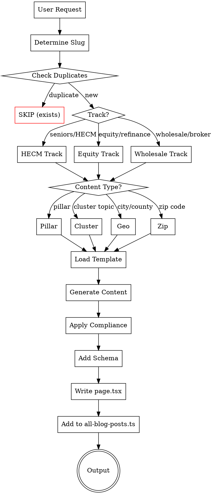
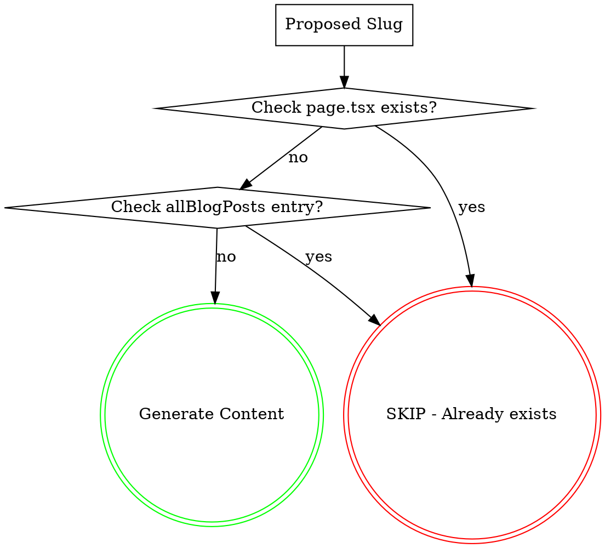

# Equity, HECM & Wholesale Blog Generator

Generate SEO-optimized blog content for mothebroker.com focused on:
- **Track 1:** HECM (reverse mortgages) for seniors 62+
- **Track 2:** Home equity products (cash-out refinance, HELOC, HELOAN) for all homeowners
- **Track 3:** Wholesale mortgage broker education (category captain positioning)

## Content Architecture

```
TRACK 1: SENIORS (62+)        TRACK 2: HOMEOWNERS         TRACK 3: WHOLESALE EDUCATION
─────────────────────         ───────────────────         ────────────────────────────
      HECM PILLAR              HOME EQUITY PILLAR           WHOLESALE CA PILLAR
           │                          │                            │
  ┌────────┼────────┐        ┌────────┼────────┐          ┌────────┼────────┐
  │        │        │        │        │        │          │        │        │
HECM    HECM     HECM     Cash-Out  HELOC  HELOAN      Broker  Bank    Non-QM
Basics  Elig.    vs Alt   Cluster  Cluster Cluster    vs Bank  Stmt   Programs
  │        │        │        │        │        │          │        │        │
  └────────┴────────┘        └────────┴────────┘          └────────┴────────┘
           │                          │                            │
    GEO-TARGETED              GEO-TARGETED                  GEO-TARGETED
   City Guides (62+)         City Guides (Equity)         County → City → Zip
                                                          (Affluent Focus)
```

## Quick Start



## Generation Commands

### Single Post
```
Generate [TRACK] [TYPE] for [TOPIC/CITY/ZIP]

Examples:
- "Generate HECM cluster for HECM basics"
- "Generate equity cluster for HELOC explained"
- "Generate HECM geo for Newport Beach"
- "Generate equity geo for Bellevue"
- "Generate HECM pillar"
- "Generate equity pillar"

WHOLESALE TRACK:
- "Generate wholesale pillar"                    → California wholesale pillar
- "Generate wholesale cluster for broker vs bank" → Cluster post
- "Generate wholesale county for Orange County"   → County-level page
- "Generate wholesale city for Anaheim"          → City wholesale page
- "Generate wholesale zip for 92657"             → Affluent zip page
```

### Batch Generation
```
Generate [N] [TRACK] posts

Examples:
- "Generate 10 HECM posts" → 5 cluster + 5 geo (next cities in rotation)
- "Generate 10 equity posts" → 5 cluster + 5 geo (next cities in rotation)
- "Generate 20 mixed posts" → 10 HECM + 10 equity (balanced)

WHOLESALE TRACK:
- "Generate 10 wholesale posts"       → Mix of clusters + city + zip
- "Generate OC wholesale expansion"   → All 30 OC affluent zips
- "Generate CA wholesale expansion"   → Next 20 CA affluent zips
- "Generate WA wholesale expansion"   → Next 10 WA affluent zips

BALANCED GENERATION:
- "Generate 10 posts"                 → Balanced across all tracks
- "Generate 20 posts"                 → Even distribution + priority overflow
- "Generate 50 posts"                 → Full balanced distribution
```

## Content Distribution Strategy

### Balanced Distribution Rules

When generating multiple posts, distribute EVENLY across all content types. Use this priority order when posts requested < content types available:

```
PRIORITY ORDER (highest to lowest):
1. PILLARS (3 total) - Foundation pages, generate first
2. CLUSTERS (33 total) - Educational authority
3. COUNTY PAGES (1 OC) - Regional hub
4. CITY PAGES (8 priority) - GSC query coverage
5. ZIP PAGES (214 total) - Affluent targeting
6. GEO CITY POSTS (HECM/Equity tracks) - Existing rotation
```

### Distribution Algorithm

**For N posts requested:**

```
Step 1: Check if pillars needed
  - If any pillar not created → allocate 1 post per missing pillar
  - Max 3 posts for pillars (Wholesale, HECM, Equity)

Step 2: Distribute remaining to clusters (round-robin across tracks)
  - Wholesale clusters: 7 topics
  - HECM clusters: 12 topics
  - Equity clusters: 14 topics
  - Rotate: Wholesale → HECM → Equity → repeat

Step 3: If clusters complete, add county/city pages
  - OC County page first
  - Then priority cities (Anaheim, Costa Mesa, Yorba Linda, etc.)

Step 4: If cities complete, add zip pages
  - Tier 1 (OC) first → Tier 2 (CA) → Tier 3 (WA)

Step 5: Any remaining → HECM/Equity geo city rotation
```

### Example Distributions

**"Generate 5 posts"**
```
1. Wholesale Pillar (priority 1)
2. HECM Pillar (priority 1)
3. Equity Pillar (priority 1)
4. Wholesale Cluster #1: Wholesale vs Retail (priority 2)
5. HECM Cluster #1: HECM Basics (priority 2)
```

**"Generate 10 posts"**
```
1-3. All 3 Pillars
4. Wholesale Cluster #1: Wholesale vs Retail
5. HECM Cluster #1: HECM Basics
6. Equity Cluster #1: Cash-Out Basics
7. Wholesale Cluster #2: Broker vs Bank
8. HECM Cluster #2: HECM Eligibility
9. Equity Cluster #2: Cash-Out vs Rate-and-Term
10. Wholesale Cluster #3: Bank Statement Loans
```

**"Generate 20 posts"**
```
1-3. All 3 Pillars
4-10. 7 Wholesale Clusters (all)
11-13. 3 HECM Clusters
14-16. 3 Equity Clusters
17. OC County Page
18-20. 3 Priority City Pages (Anaheim, Costa Mesa, Yorba Linda)
```

**"Generate 50 posts"**
```
1-3. All 3 Pillars (3)
4-10. All 7 Wholesale Clusters (7)
11-22. All 12 HECM Clusters (12)
23-36. All 14 Equity Clusters (14)
37. OC County Page (1)
38-45. All 8 Priority Cities (8)
46-50. First 5 OC Affluent Zips (5)
```

### Content Status Tracking

Track what's been generated to avoid duplicates:

```
CONTENT_STATUS = {
  pillars: {
    wholesale_ca: false,
    hecm: false,
    equity: false
  },
  clusters: {
    wholesale: [false, false, false, false, false, false, false],  // 7
    hecm: [false × 12],
    equity: [false × 14]
  },
  county: {
    orange_county: false
  },
  cities: {
    anaheim: false,
    costa_mesa: false,
    yorba_linda: false,
    huntington_beach: false,
    garden_grove: false,
    dana_point: false,
    santa_ana: false,
    tustin: false
  },
  zips: {
    oc: [false × 30],
    ca: [false × 129],
    wa: [false × 55]
  }
}
```

### Smart Batch Commands

```
"Generate next 10 posts"      → Continues from where we left off
"Generate remaining pillars"  → Only missing pillars
"Generate all clusters"       → All 33 cluster posts
"Generate OC coverage"        → County + cities + zips for OC
"Generate complete wholesale" → Pillar + 7 clusters + OC county + cities + zips
```

## Content Types

### Pillar Pages (3 total)

| Track | Title | URL | Word Count |
|-------|-------|-----|------------|
| HECM | Complete Guide to Reverse Mortgages in California & Washington [2026] | /reverse-mortgages/ | 4,000-5,000 |
| Equity | Home Equity & Refinancing Guide: Cash-Out, HELOC & HELOAN [2026] | /home-equity-guide/ | 4,000-5,000 |
| **Wholesale** | The Complete Guide to Wholesale Mortgage Brokers in California [2026] | /wholesale-mortgage-broker-california/ | 4,500-5,500 |

### HECM Cluster Topics (12 posts)
| # | Topic | Target Keyword |
|---|-------|----------------|
| 1 | HECM Basics | what is a reverse mortgage |
| 2 | HECM Eligibility | reverse mortgage requirements 2026 |
| 3 | HECM Calculator Explained | how much can I get reverse mortgage |
| 4 | HECM vs HELOC for Seniors | reverse mortgage vs heloc seniors |
| 5 | HECM Pros & Cons | reverse mortgage pros and cons |
| 6 | HECM Counseling | HUD reverse mortgage counseling |
| 7 | HECM for Purchase | reverse mortgage to buy home |
| 8 | Proprietary Reverse Mortgages | jumbo reverse mortgage California |
| 9 | HECM Payout Options | reverse mortgage lump sum vs line of credit |
| 10 | HECM & Estate Planning | reverse mortgage inheritance heirs |
| 11 | HECM Myths Debunked | reverse mortgage scam or legitimate |
| 12 | When NOT to Get HECM | reverse mortgage alternatives seniors |

### Equity Cluster Topics (14 posts)
| # | Topic | Target Keyword |
|---|-------|----------------|
| 1 | Cash-Out Refinance Basics | cash out refinance how it works |
| 2 | Cash-Out vs Rate-and-Term | cash out vs regular refinance |
| 3 | HELOC Explained | how does a heloc work |
| 4 | HELOAN Explained | home equity loan fixed rate |
| 5 | HELOC vs HELOAN | heloc vs home equity loan |
| 6 | HELOC vs Cash-Out | heloc vs cash out refinance 2026 |
| 7 | Best Uses for Home Equity | what can you use home equity for |
| 8 | Home Equity for Renovations | using equity for home improvement |
| 9 | Debt Consolidation Refinance | refinance to pay off debt |
| 10 | Refinance Requirements | refinance credit score requirements |
| 11 | When to Refinance | is refinancing worth it 2026 |
| 12 | Second Mortgage Explained | second mortgage vs heloc |
| 13 | Equity Extraction Risks | risks of tapping home equity |
| 14 | Refinance Closing Costs | refinance fees and costs |

### Wholesale Cluster Topics (7 posts) - NEW

| # | Topic | Target Keyword | GSC Query Match |
|---|-------|----------------|-----------------|
| 1 | Wholesale vs Retail Mortgage: Complete Comparison | wholesale vs retail mortgage | 21 impressions |
| 2 | Mortgage Broker vs Bank: Why Brokers Win | mortgage broker vs bank | 54+ impressions |
| 3 | Bank Statement Loans: The Wholesale Advantage | bank statement loans wholesale | 83 impressions |
| 4 | Self-Employed? Why You Need a Wholesale Broker | self-employed mortgage broker | 29 impressions |
| 5 | How to Get Wholesale Mortgage Rates in California | wholesale mortgage rates california | 50+ impressions |
| 6 | Non-QM Loans: Programs Only Wholesale Brokers Offer | non-qm loans wholesale broker | authority |
| 7 | The 200+ Lender Advantage Explained | wholesale mortgage lender network | 7 impressions |

### Geo-Targeted Posts

**HECM & Equity Tracks:**
- **California:** 50 cities × 2 tracks = 100 posts
- **Washington:** 25 cities × 2 tracks = 50 posts

**Wholesale Track (Affluent Focus):**
- **County Level:** Orange County wholesale pillar (1 page)
- **City Level:** Priority cities from GSC data (8-15 pages)
- **Zip Level:**
  - Orange County: 30 affluent zips (Tier 1)
  - California: 150+ affluent zips (Tier 2)
  - Washington: 50+ affluent zips (Tier 3)

See reference files for complete lists:
- `references/california-cities.md` - 50 CA cities (HECM/Equity)
- `references/washington-cities.md` - 25 WA cities (HECM/Equity)
- `references/orange-county-affluent-zips.md` - 30 OC affluent zips (Wholesale)
- `references/california-affluent-zips.md` - 150+ CA affluent zips (Wholesale)
- `references/washington-affluent-zips.md` - 50+ WA affluent zips (Wholesale)

## Wholesale Track Rotation Tracking

Track position separately for wholesale geo content:
```
WHOLESALE_CITY_INDEX = [1-8]     # Priority cities
WHOLESALE_OC_ZIP_INDEX = [1-30]  # Orange County zips
WHOLESALE_CA_ZIP_INDEX = [1-150] # California zips
WHOLESALE_WA_ZIP_INDEX = [1-50]  # Washington zips
```

### Priority Cities (Wholesale)
Based on GSC query data:
1. Anaheim (16 impressions)
2. Costa Mesa (12 impressions)
3. Yorba Linda (36 impressions)
4. Huntington Beach (10 impressions)
5. Garden Grove (2 impressions)
6. Dana Point (2 impressions)
7. Santa Ana (2 impressions)
8. Tustin (1 impression)

## Reference Files

| File | Purpose |
|------|---------|
| `references/seo-aio-aeo-geo-guidelines.md` | 2026 Bing/Google/AI optimization requirements |
| `references/pillar-templates.md` | Templates for HECM/Equity pillar pages (5,000-6,000 words) |
| `references/cluster-templates.md` | Templates for HECM/Equity cluster posts (3,250-4,000 words) |
| `references/geo-templates.md` | Templates for city-specific posts (3,250-4,000 words) |
| `references/city-topic-matrix.md` | **NEW:** City/topic rotation for geo differentiation |
| `references/keyword-matrix.md` | Complete keyword strategy |
| `references/california-cities.md` | 50 CA affluent cities |
| `references/washington-cities.md` | 25 WA affluent cities |
| `references/compliance-rules.md` | Legal/regulatory requirements |
| `references/wholesale-pillar-template.md` | Wholesale CA pillar template |
| `references/wholesale-cluster-templates.md` | 7 wholesale cluster templates |
| `references/wholesale-geo-templates.md` | County/city page templates |
| `references/wholesale-zip-templates.md` | Affluent zip page template (3,250-4,000 words) |
| `references/orange-county-affluent-zips.md` | 30 OC affluent zips |
| `references/california-affluent-zips.md` | 150+ CA affluent zips |
| `references/washington-affluent-zips.md` | 50+ WA affluent zips |
| `assets/schema-templates.json` | Enhanced JSON-LD templates (Article, FAQ, Speakable, LocalBusiness) |

### Site Files (Must Update After Generation)

| File | Purpose |
|------|---------|
| `lib/all-blog-posts.ts` | **REQUIRED:** Blog index for /guides page - add entry for each new post |

## Output Format

Every generated post outputs:

```markdown
---
title: "[Title with primary keyword]"
meta_description: "[155-160 chars, keyword in first 60]"
primary_keyword: "[exact-match keyword]"
secondary_keywords: ["kw1", "kw2", "kw3", "kw4", "kw5"]
track: "[HECM|Equity|Wholesale]"
content_type: "[pillar|cluster|geo|county|city|zip]"
target_location: "[City, State or Zip]"
topic_angle: "[Unique angle for geo pages]"
word_count: [3250-4000]
date_generated: "[YYYY-MM-DD]"
url_slug: "[slug]"
schema_types: ["Article", "FAQPage", "Speakable", ...]
bing_optimized: true
google_optimized: true
ai_citation_ready: true
---

<!-- CITATION HOOK -->
<div class="citation-hook">
[50-75 word attributed opening - "According to Mo Abdel, NMLS #1426884..."]
</div>

# [H1 with exact-match keyword]

<!-- BING POWER BLOCK -->
## [Exact-match H2 - e.g., "What Is [Primary Keyword]?"]

[Fact-dense content with comparison table...]

| Feature | Option A | Option B | Option C |
|---------|----------|----------|----------|
| ... | ... | ... | ... |

## [Exact-match H2 - e.g., "[Primary Keyword] Requirements 2026"]

[Content with numbered list...]

1. **Step/Requirement 1** — Explanation
2. **Step/Requirement 2** — Explanation
[...5-7 items...]

<!-- GOOGLE E-E-A-T NARRATIVE -->
## [Natural language question H2]

[Experience-rich content with markers like "In our Orange County closings..."]

## [Natural language question H2]

[Scenario-based content with internal/external links...]

## [Natural language question H2]

[Expert insights and analysis...]

## [Natural language question H2]

[Additional depth with experience markers...]

<!-- DATA & COMPARISON HUB -->
## [Data-focused H2 - e.g., "[Topic] Costs and Comparison"]

[Tables, statistics, 2026 market data...]

| Comparison Point | Product A | Product B |
|------------------|-----------|-----------|
| ... | ... | ... |

<!-- PEOPLE ALSO ASK -->
## People Also Ask About [Topic]

### [PAA Question 1 - Informational]
**[≤29 word direct answer in bold]**
[50-75 word expansion...]

### [PAA Question 2]
**[≤29 word answer]**
[Expansion...]

[...6-8 total questions...]

<!-- EXTENDED FAQ -->
## Frequently Asked Questions

### [FAQ Question 1 - Decision/Transactional]
[40-60 word answer, action-oriented...]

### [FAQ Question 2]
[Answer...]

[...10-12 total questions...]

<!-- EXPERT SUMMARY -->
<div class="expert-summary">
## Ready to [Action]? Get Expert Guidance

[Quotable closing paragraph - 2-3 sentences summarizing key takeaway]

**Contact Mo Abdel today** for a personalized [consultation/analysis/quote].
</div>

---
**Mo Abdel** | NMLS #1426884 | Lumin Lending | NMLS #2716106 | DRE #02291443
Licensed in: CA, WA

Equal Housing Lender. All loans subject to credit approval, underwriting guidelines, and program availability. Terms and conditions apply. This is not a commitment to lend. Information is for educational purposes only and does not constitute financial advice. Contact a licensed loan officer for personalized guidance.
---

## Schema Markup

[Article Schema - Enhanced for Bing]
[FAQPage Schema - 10-12 questions]
[Speakable Schema - citation-hook, paa-answers, expert-summary]
[LocalBusiness Schema - for geo pages only]

## Social Meta Tags

<meta property="og:site_name" content="Mo Abdel - Wholesale Mortgage Broker">
<meta property="og:type" content="article">
<meta property="og:title" content="[Title]">
<meta property="og:description" content="[Meta Description]">
<meta property="og:url" content="https://mothebroker.com/blog/[slug]">
<meta property="article:author" content="Mo Abdel">
<meta property="article:publisher" content="https://mothebroker.com">
<meta property="article:published_time" content="[ISO_DATE]">
<meta property="article:modified_time" content="[ISO_DATE]">
<meta name="author" content="Mo Abdel, NMLS #1426884">
<meta name="twitter:card" content="summary_large_image">
<meta name="twitter:title" content="[Title]">
<meta name="twitter:description" content="[Meta Description]">

## Internal Links

[8-10 suggested internal links with anchor text]

## Submission Commands

```bash
# IndexNow (instant Bing indexing)
curl -X POST "https://api.indexnow.org/indexnow" \
  -H "Content-Type: application/json" \
  -d '{"host":"mothebroker.com","key":"[KEY]","urlList":["https://mothebroker.com/blog/[slug]"]}'

# Google Search Console - Submit via GSC API or manual URL inspection
```

## Validation Output

✓ WORD COUNT: [X] words [PASS/FAIL]
✓ BING OPTIMIZATION: X/8 requirements [PASS/FAIL]
✓ GOOGLE OPTIMIZATION: X/6 requirements [PASS/FAIL]
✓ AI CITATION: X/5 requirements [PASS/FAIL]
✓ DATA POINTS: X unique points [PASS/FAIL]
✓ GEO DIFFERENTIATION: [Status] [PASS/FAIL if geo page]
✓ COMPLIANCE: All items cleared [PASS/FAIL]
✓ GUIDES PAGE: Entry added to lib/all-blog-posts.ts [PASS/FAIL]

STATUS: [READY FOR PUBLICATION / NEEDS REVISION]
```

## Pre-Generation: Duplicate Prevention (MANDATORY)

**BEFORE generating ANY content, you MUST check for duplicates to avoid creating redundant content.**

### Duplicate Check Process



### Step 1: Check if page.tsx Exists
Before generating, check if the file already exists:
```
app/blog/[proposed-slug]/page.tsx
```
If this file exists → **SKIP this post** (already generated)

### Step 2: Check if Entry Exists in allBlogPosts
Search `lib/all-blog-posts.ts` for the proposed slug:
```typescript
// Search for: slug: '[proposed-slug]'
```
If slug found in allBlogPosts → **SKIP this post** (already indexed)

### Step 3: Track Generated Slugs Within Session
When generating multiple posts in one session, maintain a list of slugs already generated to avoid duplicating within the same batch:
```
SESSION_GENERATED_SLUGS = []
// Before each post: check if slug in SESSION_GENERATED_SLUGS
// After each post: add slug to SESSION_GENERATED_SLUGS
```

### Duplicate Check Report
When skipping duplicates, report:
```
⚠️ SKIPPED (duplicate): [slug]
   - page.tsx exists: [yes/no]
   - allBlogPosts entry: [yes/no]
```

---

## Post-Generation: Add to /guides Page (MANDATORY)

**After creating each blog post, you MUST add an entry to `lib/all-blog-posts.ts` so the post appears on the /guides page.**

### Step 1: Read the Current File
```typescript
// File: lib/all-blog-posts.ts
// Contains the allBlogPosts array that powers /guides
```

### Step 2: Add Entry at TOP of Array (newest first)
Insert a new entry at the **beginning** of the `allBlogPosts` array:

```typescript
{
  slug: '[url-slug-without-leading-slash]',
  title: '[Full title from metadata]',
  excerpt: '[Meta description or 1-2 sentence summary]',
  date: '[YYYY-MM-DD - today\'s date]',
  category: '[Category from mapping below]',
  readTime: '[X min read - estimate based on word count]',
},
```

### Step 3: Category Mapping
Use these category values based on track and content type:

| Track | Content Type | Category Value |
|-------|--------------|----------------|
| HECM | All | `'Reverse Mortgage'` |
| Equity | HELOC/HELOAN focused | `'Home Equity'` |
| Equity | Refinance focused | `'Refinance'` |
| Wholesale | All | `'Wholesale'` |
| Any | City-specific guides | `'City Guides'` |
| Any | Loan program education | `'Loan Programs'` |

### Step 4: Read Time Calculation
```
Word Count → Read Time
< 2,500    → 8 min read
2,500-3,500 → 9-10 min read
3,500-4,500 → 11-12 min read
4,500-5,500 → 13-14 min read
5,500+      → 15+ min read
```

### Example Entry
For a HECM cluster post about reverse mortgage basics:

```typescript
// Add at the TOP of allBlogPosts array in lib/all-blog-posts.ts
{
  slug: 'what-is-reverse-mortgage-2026',
  title: 'What Is a Reverse Mortgage? Complete HECM Guide [2026]',
  excerpt: 'Complete guide to reverse mortgages and HECM loans. Learn how seniors 62+ access home equity without monthly payments.',
  date: '2026-02-02',  // Today's date
  category: 'Reverse Mortgage',
  readTime: '12 min read',
},
```

### Batch Generation
When generating multiple posts, add ALL entries at once in a single edit to `lib/all-blog-posts.ts`. Order entries by date (all same date) then alphabetically by category for consistency.

### Verification
After adding entries, confirm:
- [ ] Entry slug matches the page.tsx folder name exactly
- [ ] Title matches the metadata title
- [ ] Date is today's date (YYYY-MM-DD format)
- [ ] Category matches the mapping above
- [ ] Entry is at the TOP of the array (after the opening `[`)

## Compliance Gate

**MANDATORY:** Every post must pass ALL items before output:

- [ ] NO specific interest rate percentages
- [ ] NO guaranteed savings amounts
- [ ] NO "lowest rate" claims without qualification
- [ ] NO guaranteed approval language
- [ ] INCLUDES NMLS #1426884 and Lumin Lending NMLS #2716106
- [ ] INCLUDES Equal Housing Lender statement
- [ ] INCLUDES educational disclaimer
- [ ] Uses inclusive, non-discriminatory language
- [ ] HECM posts: HUD counseling requirement mentioned
- [ ] HECM posts: Age 62+ requirement clearly stated
- [ ] Wholesale posts: "200+ lenders" claim is accurate
- [ ] Wholesale posts: No specific rate comparisons

See `references/compliance-rules.md` for complete requirements.

## Pre-Output Quality Gates

**ALL gates must pass before content output:**

### Word Count Gate
- [ ] Total word count: 3,250-4,000 (clusters/geo/city/zip)
- [ ] Total word count: 5,000-6,000 (pillars)
- [ ] Citation Hook: 50-75 words
- [ ] Bing Power Block: 600-800 words
- [ ] E-E-A-T Narrative: 1,200-1,500 words
- [ ] Data Hub: 400-500 words
- [ ] PAA Section: 400-500 words (6-8 questions)
- [ ] Extended FAQ: 400-500 words (10-12 questions)
- [ ] Expert Summary: 150-200 words

### Bing Gate
- [ ] Primary keyword in H1 (exact match)
- [ ] Primary keyword in first 50 words
- [ ] Primary keyword in 3+ H2 headings
- [ ] 2+ comparison tables included
- [ ] 2+ numbered lists included
- [ ] No collapsed/accordion content
- [ ] Bing schema properties included
- [ ] Social meta tags complete

### Google Gate
- [ ] E-E-A-T experience markers (4+ instances)
- [ ] Natural language H2 questions (4+ sections)
- [ ] External authority links (2-3)
- [ ] Internal links (5-8 minimum)
- [ ] FAQPage schema markup complete
- [ ] Author credentials visible
- [ ] Semantic keyword variations used

### AI Citation Gate
- [ ] Citation Hook is standalone/extractable
- [ ] Entity mentions: Mo Abdel (4-6x), NMLS (2-3x)
- [ ] Speakable schema on key sections
- [ ] ≤29 word answers in PAA section
- [ ] Quotable expert summary paragraph
- [ ] Data points with source attribution

### Data Gate
- [ ] Minimum 6 unique data points
- [ ] Market data included (2+ points)
- [ ] Program specifics included (2+ points)
- [ ] Proprietary insights included (2+ points)
- [ ] All data is 2026-current
- [ ] No specific rate percentages (compliance)

### Geo Page Gate (city/zip only)
- [ ] Unique topic angle applied (per city-topic-matrix.md)
- [ ] City-specific median home value included
- [ ] 3-5 neighborhoods mentioned
- [ ] Local borrower profile described
- [ ] 800+ words of unique local content
- [ ] LocalBusiness schema included

## Dual Bing/Google/AI Optimization Checklist

### BING OPTIMIZATION (Stricter exact-match requirements)

**Keyword Placement:**
- [ ] Primary keyword in H1 (exact match)
- [ ] Primary keyword in first 50 words
- [ ] Primary keyword in 3+ H2 headings
- [ ] Primary keyword in meta title (first 60 chars)
- [ ] Primary keyword in meta description (first 60 chars)
- [ ] Primary keyword in image alt text (2+ images)
- [ ] Keyword density: 1.5-2%

**Structured Content:**
- [ ] Minimum 2 comparison tables per article
- [ ] Minimum 2 numbered lists (5+ items each)
- [ ] Minimum 1 bulleted list with bold lead-ins
- [ ] No JavaScript-dependent content
- [ ] No accordion/collapsed sections
- [ ] All content visible without interaction

**Bing Schema Properties:**
- [ ] copyrightHolder (Lumin Lending)
- [ ] copyrightYear (2026)
- [ ] significantLink (HUD, CFPB, FHFA)
- [ ] mainEntity with WebPage type

**Social Signals:**
- [ ] Full Open Graph tags
- [ ] Twitter Card tags
- [ ] article:author meta tag
- [ ] article:published_time

### GOOGLE OPTIMIZATION (E-E-A-T focus)

**E-E-A-T Signals:**
- [ ] Author byline with credentials (every page)
- [ ] "Experience" markers every 300 words
- [ ] Specific scenarios/examples (anonymized)
- [ ] External links to .gov authority sources (2-3)
- [ ] Internal links to related content (5-8)
- [ ] Updated date visible on page

**Content Quality:**
- [ ] Natural language H2s (question format)
- [ ] No keyword stuffing (density 1-1.5% for Google sections)
- [ ] Semantic keyword variations throughout
- [ ] Comprehensive topic coverage
- [ ] "People Also Ask" targeting (6-8 questions)

**Technical:**
- [ ] FAQPage schema markup
- [ ] Article schema with author
- [ ] Speakable schema for voice
- [ ] Mobile-responsive tables

### AI CITATION OPTIMIZATION (ChatGPT, Perplexity, Google AI Overviews)

**Extractability:**
- [ ] Citation Hook is standalone (works out of context)
- [ ] Every H2 section has extractable opening sentence
- [ ] Expert quotes attributed with full credentials
- [ ] Data points include source attribution
- [ ] No ambiguous pronouns across section breaks

**Entity Validation:**
- [ ] "Mo Abdel" appears 4-6 times naturally
- [ ] NMLS #1426884 appears 2-3 times
- [ ] "Lumin Lending" appears 2-3 times
- [ ] Location entities (Orange County, California, etc.)
- [ ] Consistent NAP (Name, Address, Phone) signals

### DATA REQUIREMENTS (Minimum 6 per article)

| Data Type | Minimum | Placement |
|-----------|---------|-----------|
| Market statistics | 2 | Data Hub, Citation Hook |
| Program specifics | 2 | Bing Power Block, FAQ |
| Proprietary insights | 2 | E-E-A-T Narrative, Expert Summary |

See `references/seo-aio-aeo-geo-guidelines.md` for complete requirements.
See `references/city-topic-matrix.md` for geo page differentiation strategy.

## Internal Linking Strategy

### From Pillar Pages
- Link to ALL cluster posts in that track
- Link to 10-15 geo posts as examples
- Cross-link to other pillars (HECM ↔ Equity ↔ Wholesale)

### From Cluster Posts
- Link back to pillar page
- Link to 2-3 related cluster posts
- Link to 1-2 geo posts as examples

### From Geo/City/Zip Posts
- Link back to pillar page
- Link to 2-3 relevant cluster posts
- Link to 1-2 nearby city/zip posts

### Wholesale-Specific Linking
```
                    WHOLESALE CA PILLAR
                           │
          ┌────────────────┼────────────────┐
          │                │                │
          ▼                ▼                ▼
    ┌──────────┐    ┌──────────┐    ┌──────────┐
    │Cluster 1 │◄──►│Cluster 2 │◄──►│Cluster 3 │
    │Wholesale │    │Broker vs │    │Bank Stmt │
    │vs Retail │    │  Bank    │    │  Loans   │
    └────┬─────┘    └────┬─────┘    └────┬─────┘
         │               │               │
         └───────────────┼───────────────┘
                         ▼
              ┌──────────────────────┐
              │  OC COUNTY PILLAR    │
              └──────────┬───────────┘
                         │
         ┌───────────────┼───────────────┐
         ▼               ▼               ▼
    ┌─────────┐    ┌─────────┐    ┌─────────┐
    │ CITY    │    │ CITY    │    │ CITY    │
    │ Anaheim │    │ Irvine  │    │ Newport │
    └────┬────┘    └────┬────┘    └────┬────┘
         │               │               │
         ▼               ▼               ▼
    ┌─────────┐    ┌─────────┐    ┌─────────┐
    │ ZIP     │    │ ZIP     │    │ ZIP     │
    │ 92801   │    │ 92603   │    │ 92657   │
    └─────────┘    └─────────┘    └─────────┘
```

## Word Count Targets (2026 Optimized)

| Content Type | Minimum | Target | Maximum |
|--------------|---------|--------|---------|
| Pillar (All tracks) | 5,000 | 5,500 | 6,000 |
| County (Wholesale OC) | 3,500 | 4,000 | 4,500 |
| Cluster (All tracks) | 3,250 | 3,500 | 4,000 |
| City Geo (All tracks) | 3,250 | 3,500 | 4,000 |
| Zip (Wholesale) | 3,250 | 3,500 | 4,000 |

## Universal Article Structure: AI-First Answer Stack

**All content types (except pillars) follow this 7-section structure:**

```
┌─────────────────────────────────────────────────────────────┐
│  1. CITATION HOOK (50-75 words)                             │
│     → Direct answer, entity-attributed, AI-extractable      │
│     → "According to Mo Abdel, NMLS #1426884..."            │
├─────────────────────────────────────────────────────────────┤
│  2. BING POWER BLOCK (600-800 words)                        │
│     → Exact-match H2s, comparison table, numbered list      │
│     → Fact-dense, desktop-optimized, no fluff               │
├─────────────────────────────────────────────────────────────┤
│  3. GOOGLE E-E-A-T NARRATIVE (1,200-1,500 words)           │
│     → 4-5 H2 sections with natural language questions       │
│     → Experience markers, expert insights, scenarios        │
│     → Internal/external authority links woven in            │
├─────────────────────────────────────────────────────────────┤
│  4. DATA & COMPARISON HUB (400-500 words)                   │
│     → 2-3 comparison tables (Bing loves these)              │
│     → Local market data, 2026 statistics                    │
│     → Unique data points AI can't hallucinate               │
├─────────────────────────────────────────────────────────────┤
│  5. PEOPLE ALSO ASK SECTION (400-500 words)                 │
│     → 6-8 PAA-targeted questions with ≤29 word answers      │
│     → Expanded explanations below each                      │
│     → Voice search optimized                                │
├─────────────────────────────────────────────────────────────┤
│  6. EXTENDED FAQ (400-500 words)                            │
│     → 10-12 questions with FAQPage schema                   │
│     → Long-tail keyword variations                          │
│     → Conversational, natural language                      │
├─────────────────────────────────────────────────────────────┤
│  7. EXPERT SUMMARY + CTA (150-200 words)                    │
│     → Quotable closing paragraph (AI citation bait)         │
│     → Clear next steps, contact info                        │
│     → Entity validation (Mo Abdel, NMLS, Lumin Lending)     │
└─────────────────────────────────────────────────────────────┘
Total: 3,250-4,075 words
```

**Pillar pages** add 1,500-2,000 additional words across expanded H2 sections.

### Section Specifications

**1. Citation Hook (50-75 words)**
- Opens with "According to Mo Abdel, NMLS #1426884..." OR "[Topic] in [Location]: [Direct answer]..."
- Contains exact-match primary keyword
- Includes 1 specific data point (number, requirement, or limit)
- Ends with decision-relevant statement

**2. Bing Power Block (600-800 words)**
- 2 H2 headings with exact-match keywords
- 1 comparison table (minimum 5 rows)
- 1 numbered list (5-7 steps or requirements)
- Fact-dense paragraphs (no filler words)
- Desktop-optimized (no collapsed content)

**3. Google E-E-A-T Narrative (1,200-1,500 words)**
- 4-5 H2 sections as natural language questions
- Experience markers every 300 words ("In our Orange County closings...", "Based on Mo Abdel's experience...")
- 2-3 internal links woven naturally
- 1-2 external authority links (HUD, CFPB, FHFA)

**4. Data & Comparison Hub (400-500 words)**
- 2-3 comparison tables
- Minimum 4 unique data points (market stats, program limits, rate context, local specifics)
- Data attribution required

**5. People Also Ask Section (400-500 words)**
- 6-8 questions targeting Google PAA boxes
- Each answer: ≤29 words (voice snippet) + 50-75 word expansion
- Question types: Definition, Process, Comparison, Cost, Eligibility, Timing

**6. Extended FAQ (400-500 words)**
- 10-12 questions with FAQPage schema markup
- Transactional/decision intent focus
- 40-60 word answers, action-oriented

**7. Expert Summary + CTA (150-200 words)**
- Quotable closing paragraph (2-3 sentences)
- Attribution: "Mo Abdel, NMLS #1426884, Lumin Lending"
- Clear next step (consultation, application, contact)

## Wholesale Track Positioning

**Category Captain Goal:** Establish MoTheBroker.com as THE authority on wholesale mortgage brokering in California.

**Core Messaging:**
- "200+ lender access" - more options than any single bank
- "Wholesale pricing advantage" - institutional rates for consumers
- "Local expertise + wholesale power" - best of both worlds
- "Complex borrower solutions" - bank statement, non-QM, DSCR

**Target Audiences:**
1. Self-employed borrowers (bank statement loans)
2. Investors (DSCR, fix-flip)
3. Affluent homebuyers (jumbo loans)
4. First-time buyers comparing broker vs bank
5. Refinancers seeking best rates

**Differentiation:**
| Competitors Say | MoTheBroker Says |
|-----------------|------------------|
| "Great rates" | "Here's exactly how wholesale pricing works and saves you $X" |
| "Apply now" | "Let me educate you first, then help you decide" |
| Generic content | Affluent zip-specific insights |
| No explanation | Full transparency on wholesale vs retail |

---

## MANDATORY: Post-Generation Final Submission (REQUIRED)

**After ALL blog generation is complete, you MUST execute these final steps in order:**

### Step 1: Git Commit & Push

```bash
# Stage all changes
git add .

# Commit with descriptive message
git commit -m "blog: Add [N] new SEO-optimized posts

Posts added:
- [slug-1]: [keyword-1]
- [slug-2]: [keyword-2]
...

🤖 Generated with Claude Code blog-generator skill"

# Push to production
git push origin main
```

### Step 2: Submit URLs to IndexNow

```bash
# Navigate to root Projects folder and run IndexNow submission
cd C:/Users/bigbi/Projects
python seo_submit.py indexnow --site mothebroker.com
```

### Step 3: Submit Sitemap to GSC + Bing

```bash
# Submit sitemap to Google Search Console and Bing
cd C:/Users/bigbi/Projects
python seo_submit.py sitemap --site mothebroker.com
```

### Step 4: Submit Recent URLs for GSC Indexing

```bash
# Submit most recent 200 URLs for indexing on Google Search Console
cd C:/Users/bigbi/Projects
python gsc_index_urls.py --site mothebroker.com --limit 200
```

### Final Submission Checklist

- [ ] All blog files committed to git
- [ ] Changes pushed to origin/main
- [ ] Entry added to lib/all-blog-posts.ts for /guides page
- [ ] IndexNow submission completed
- [ ] Sitemap submitted to GSC + Bing
- [ ] Recent 200 URLs submitted for GSC indexing
- [ ] Build/deployment successful (Vercel auto-deploys from main)

### ⚠️ CRITICAL: The skill is NOT complete until ALL submission steps are executed successfully.
