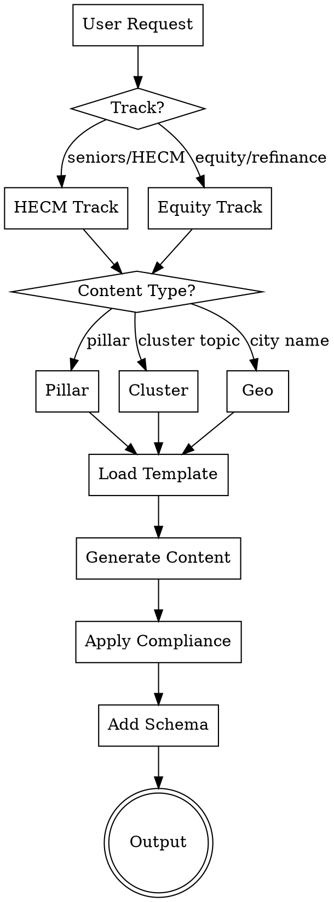

# Equity & HECM Blog Generator

Generate SEO-optimized blog content for mothebroker.com focused on:
- **Track 1:** HECM (reverse mortgages) for seniors 62+
- **Track 2:** Home equity products (cash-out refinance, HELOC, HELOAN) for all homeowners

## Content Architecture

```
TRACK 1: SENIORS (62+)                    TRACK 2: HOMEOWNERS (ALL AGES)
─────────────────────────                 ─────────────────────────────
         HECM PILLAR                           HOME EQUITY PILLAR
              │                                       │
    ┌─────────┼─────────┐                 ┌───────────┼───────────┐
    │         │         │                 │           │           │
 HECM      HECM      HECM              Cash-Out   HELOC      HELOAN
 Basics   Eligibility  vs              Refinance  Cluster    Cluster
 Cluster   Cluster   Alternatives         │           │           │
    │         │         │                 │           │           │
    └─────────┴─────────┘                 └───────────┴───────────┘
              │                                       │
       GEO-TARGETED                           GEO-TARGETED
    City Guides (62+)                      City Guides (Equity)
```

## Quick Start



## Generation Commands

### Single Post
```
Generate [TRACK] [TYPE] for [TOPIC/CITY]

Examples:
- "Generate HECM cluster for HECM basics"
- "Generate equity cluster for HELOC explained"
- "Generate HECM geo for Newport Beach"
- "Generate equity geo for Bellevue"
- "Generate HECM pillar"
- "Generate equity pillar"
```

### Batch Generation
```
Generate [N] [TRACK] posts

Examples:
- "Generate 10 HECM posts" → 5 cluster + 5 geo (next cities in rotation)
- "Generate 10 equity posts" → 5 cluster + 5 geo (next cities in rotation)
- "Generate 20 mixed posts" → 10 HECM + 10 equity (balanced)
```

## Content Types

### Pillar Pages (2 total)
| Track | Title | URL | Word Count |
|-------|-------|-----|------------|
| HECM | Complete Guide to Reverse Mortgages in California & Washington [2026] | /reverse-mortgages/ | 4,000-5,000 |
| Equity | Home Equity & Refinancing Guide: Cash-Out, HELOC & HELOAN [2026] | /home-equity-guide/ | 4,000-5,000 |

### HECM Cluster Topics (12 posts)
| # | Topic | Target Keyword |
|---|-------|----------------|
| 1 | HECM Basics | what is a reverse mortgage |
| 2 | HECM Eligibility | reverse mortgage requirements 2026 |
| 3 | HECM Calculator Explained | how much can I get reverse mortgage |
| 4 | HECM vs HELOC for Seniors | reverse mortgage vs heloc seniors |
| 5 | HECM Pros & Cons | reverse mortgage pros and cons |
| 6 | HECM Counseling | HUD reverse mortgage counseling |
| 7 | HECM for Purchase | reverse mortgage to buy home |
| 8 | Proprietary Reverse Mortgages | jumbo reverse mortgage California |
| 9 | HECM Payout Options | reverse mortgage lump sum vs line of credit |
| 10 | HECM & Estate Planning | reverse mortgage inheritance heirs |
| 11 | HECM Myths Debunked | reverse mortgage scam or legitimate |
| 12 | When NOT to Get HECM | reverse mortgage alternatives seniors |

### Equity Cluster Topics (14 posts)
| # | Topic | Target Keyword |
|---|-------|----------------|
| 1 | Cash-Out Refinance Basics | cash out refinance how it works |
| 2 | Cash-Out vs Rate-and-Term | cash out vs regular refinance |
| 3 | HELOC Explained | how does a heloc work |
| 4 | HELOAN Explained | home equity loan fixed rate |
| 5 | HELOC vs HELOAN | heloc vs home equity loan |
| 6 | HELOC vs Cash-Out | heloc vs cash out refinance 2026 |
| 7 | Best Uses for Home Equity | what can you use home equity for |
| 8 | Home Equity for Renovations | using equity for home improvement |
| 9 | Debt Consolidation Refinance | refinance to pay off debt |
| 10 | Refinance Requirements | refinance credit score requirements |
| 11 | When to Refinance | is refinancing worth it 2026 |
| 12 | Second Mortgage Explained | second mortgage vs heloc |
| 13 | Equity Extraction Risks | risks of tapping home equity |
| 14 | Refinance Closing Costs | refinance fees and costs |

### Geo-Targeted Posts (150 total)
- **California:** 50 cities × 2 tracks = 100 posts
- **Washington:** 25 cities × 2 tracks = 50 posts

See `references/california-cities.md` and `references/washington-cities.md` for complete lists.

## City Rotation Tracking

Track position separately for each track:
```
HECM_CITY_INDEX = [1-75]
EQUITY_CITY_INDEX = [1-75]
```

Cities 1-50: California
Cities 51-75: Washington

After city 75, cycle back to 1.

## Reference Files

| File | Purpose |
|------|---------|
| `references/seo-aio-aeo-geo-guidelines.md` | 2026 optimization requirements |
| `references/pillar-templates.md` | Templates for pillar pages |
| `references/cluster-templates.md` | Templates for cluster posts |
| `references/geo-templates.md` | Templates for city-specific posts |
| `references/keyword-matrix.md` | Complete keyword strategy |
| `references/california-cities.md` | 50 CA affluent cities |
| `references/washington-cities.md` | 25 WA affluent cities |
| `references/compliance-rules.md` | Legal/regulatory requirements |
| `assets/schema-templates.json` | JSON-LD templates |

## Output Format

Every generated post outputs:

```markdown
---
title: "[Title]"
meta_description: "[150-160 chars, keyword in first 60]"
primary_keyword: "[keyword]"
secondary_keywords: ["kw1", "kw2", "kw3"]
track: "[HECM|Equity]"
content_type: "[pillar|cluster|geo]"
target_city: "[City or null]"
target_state: "[CA|WA or null]"
word_count: [number]
date_generated: "[YYYY-MM-DD]"
url_slug: "[slug]"
---

# [H1 with exact-match keyword]

[Direct answer first paragraph - 2-4 sentences, fact-dense, extractable]

[Content sections with H2/H3 as questions...]

## Frequently Asked Questions

[FAQ section with 5-7 questions...]

---
**Mo Abdel** | NMLS #1426884 | Lumin Lending | NMLS #2716106 | DRE #02291443
Licensed in: CA, WA

Equal Housing Lender. All loans subject to credit approval...
---

## Schema Markup
[JSON-LD block]

## Social Meta Tags
[OG tags block]

## Internal Links
[3-5 suggested internal links]

## Submission Commands
[Bing/IndexNow submission commands]
```

## Compliance Gate

**MANDATORY:** Every post must pass ALL items before output:

- [ ] NO specific interest rate percentages
- [ ] NO guaranteed savings amounts
- [ ] NO "lowest rate" claims without qualification
- [ ] NO guaranteed approval language
- [ ] INCLUDES NMLS #1426884 and Lumin Lending NMLS #2716106
- [ ] INCLUDES Equal Housing Lender statement
- [ ] INCLUDES educational disclaimer
- [ ] Uses inclusive, non-discriminatory language
- [ ] HECM posts: HUD counseling requirement mentioned
- [ ] HECM posts: Age 62+ requirement clearly stated

See `references/compliance-rules.md` for complete requirements.

## SEO/GEO/AIO/AEO Checklist

Every post must include:

**SEO:**
- [ ] Primary keyword in H1
- [ ] Primary keyword in first 100 words
- [ ] Exact-match keyword in 2+ H2s
- [ ] Meta description with keyword in first 60 chars
- [ ] 3-5 internal links minimum

**AIO/AEO:**
- [ ] Direct answer in first paragraph
- [ ] FAQ section with schema markup
- [ ] Natural language H2/H3 headings (questions)
- [ ] Tables/lists for comparison content

**GEO:**
- [ ] Entity-rich content (Mo Abdel, Lumin Lending, NMLS)
- [ ] Citation patterns ("According to Mo Abdel...")
- [ ] First 150 chars fact-dense and extractable
- [ ] Numbered lists for procedural content

**Bing/ChatGPT:**
- [ ] Desktop-first content (no collapsed sections)
- [ ] Social meta tags included
- [ ] Bing schema properties (copyrightHolder, significantLink)

See `references/seo-aio-aeo-geo-guidelines.md` for complete requirements.

## Internal Linking Strategy

### From Pillar Pages
- Link to ALL cluster posts in that track
- Link to 10-15 geo posts as examples
- Cross-link to other pillar (HECM ↔ Equity)

### From Cluster Posts
- Link back to pillar page
- Link to 2-3 related cluster posts
- Link to 1-2 geo posts as examples

### From Geo Posts
- Link back to pillar page
- Link to 2-3 relevant cluster posts
- Link to 1-2 nearby city geo posts

## Word Count Targets

| Content Type | Minimum | Target | Maximum |
|--------------|---------|--------|---------|
| Pillar | 4,000 | 4,500 | 5,500 |
| Cluster | 1,800 | 2,200 | 2,800 |
| Geo | 1,500 | 1,800 | 2,200 |
