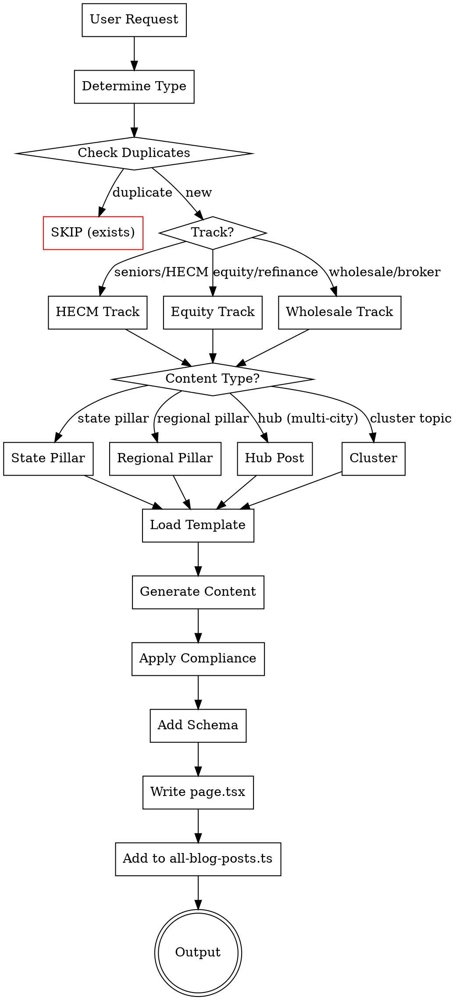
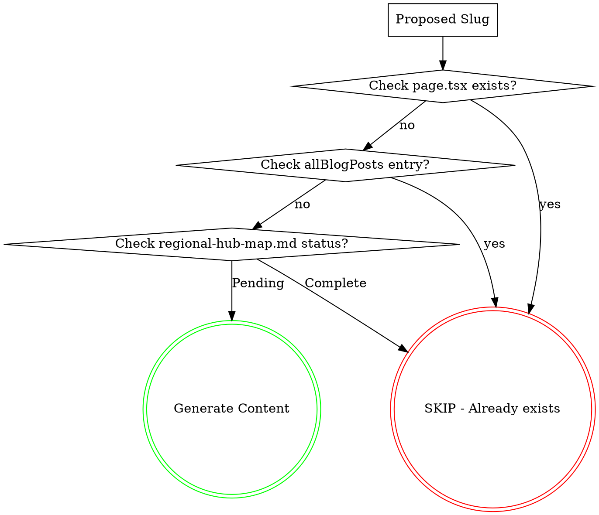

# Equity, HECM & Wholesale Blog Generator

Generate SEO-optimized blog content for mothebroker.com focused on:
- **Track 1:** HECM (reverse mortgages) for seniors 62+
- **Track 2:** Home equity products (cash-out refinance, HELOC, HELOAN) for all homeowners
- **Track 3:** Wholesale mortgage broker education (category captain positioning)

## Content Architecture

```
TRACK 1: SENIORS (62+)        TRACK 2: HOMEOWNERS         TRACK 3: WHOLESALE EDUCATION
─────────────────────         ───────────────────         ────────────────────────────
   STATE PILLARS (CA+WA)        STATE PILLARS (CA+WA)       STATE PILLARS (CA+WA)
         │                           │                           │
   REGIONAL PILLARS              REGIONAL PILLARS           REGIONAL PILLARS
   (per major region)            (per major region)         (6 CA + 2 WA metros)
         │                           │                           │
   HUB POSTS                    HUB POSTS                  HUB POSTS
   (5-10 cities grouped)        (5-10 cities grouped)      (5-10 cities grouped)
         │                           │                           │
   CLUSTER POSTS                CLUSTER POSTS               CLUSTER POSTS
   (12 educational)             (14 educational)            (7 educational)
```

---

## CRITICAL: Duplicate Content Warning (Feb 2026)

**32 geo pages were marked "Crawled - not indexed" by Google due to near-duplicate content.**

Before generating ANY geo/city/hub page:
1. **Check city-topic-matrix.md** - City MUST have a unique angle assigned
2. **Compare to similar pages** - Content must be <60% similar to any existing page
3. **Verify 800+ unique words** - Not just city name substitutions
4. **Use hub model** - Multiple similar cities grouped into one hub page (5-10 cities per hub)

**Hub pages are now the DEFAULT for geo content. Individual city pages are deprecated.**

See "Content Differentiation Gate" in Quality Gates section for mandatory checks.

---

## Quick Start



## Generation Commands

### Single Post
```
Generate [TRACK] [TYPE] for [TARGET]

Examples:
- "Generate HECM state pillar for California"
- "Generate equity regional pillar for Bay Area Peninsula"
- "Generate HECM hub for CA-SV-A" (ultra-luxury peninsula)
- "Generate equity hub for WA-SE-C" (tech corridor eastside)
- "Generate wholesale regional pillar for LA County"
- "Generate HECM cluster for HECM basics"
- "Generate equity cluster for HELOC explained"
```

### Batch Generation
```
Generate [N] posts
Generate [N] [TRACK] posts
Generate [REGION] expansion

Examples:
- "Generate 10 posts" -> Balanced across tracks, prioritized by region value
- "Generate Bay Area expansion" -> All pillars + hubs for Bay Area regions
- "Generate 20 HECM posts" -> Prioritized HECM content across regions
- "Generate next 10 posts" -> Continues from where we left off
```

## Content Distribution Strategy

### Auto-Queue System

**"Generate X posts" automatically picks the next X items from the master queue below.**
The queue works top-to-bottom. Every item already generated (check `regional-hub-map.md` status + existing `app/blog/` folders) is SKIPPED. The system always resumes where it left off.

**Before generating, ALWAYS:**
1. Check `references/regional-hub-map.md` for current status (⬜/✅)
2. Check `app/blog/` for existing page.tsx folders
3. Skip any already-completed items
4. Start from the first ⬜ (pending) item in the queue

### Master Generation Queue (120 items total)

The queue interleaves tiers and tracks for maximum content diversity per batch:

```
QUEUE POSITION → CONTENT

--- TIER 0: STATE PILLARS (6 items) ---
  1. CA State Pillar: HECM
  2. CA State Pillar: Equity
  3. CA State Pillar: Wholesale
  4. WA State Pillar: HECM
  5. WA State Pillar: Equity
  6. WA State Pillar: Wholesale

--- TIER 1: REGIONAL PILLARS (~40 items, by region priority) ---
For each region (in priority order), generate all applicable track pillars:

  Region 1 — Bay Area Peninsula/SV:
  7.  Regional Pillar: Bay Area Peninsula HECM
  8.  Regional Pillar: Bay Area Peninsula Equity
  9.  Regional Pillar: Bay Area Peninsula Wholesale

  Region 2 — LA Westside/Beach + South Bay/PV:
  10. Regional Pillar: LA Westside/Beach HECM
  11. Regional Pillar: LA Westside/Beach Equity
  12. Regional Pillar: LA Westside/Beach Wholesale
  13. Regional Pillar: LA South Bay/PV HECM
  14. Regional Pillar: LA South Bay/PV Equity
  15. Regional Pillar: LA South Bay/PV Wholesale

  Region 3 — Bay Area Marin + East Bay/SF:
  16. Regional Pillar: Bay Area Marin HECM
  17. Regional Pillar: Bay Area Marin Equity
  18. Regional Pillar: Bay Area Marin Wholesale
  19. Regional Pillar: Bay Area East Bay/SF HECM
  20. Regional Pillar: Bay Area East Bay/SF Equity
  21. Regional Pillar: Bay Area East Bay/SF Wholesale

  Region 4 — Seattle Eastside:
  22. Regional Pillar: Seattle Eastside HECM
  23. Regional Pillar: Seattle Eastside Equity
  24. Regional Pillar: Seattle Eastside Wholesale

  Region 5 — San Diego:
  25. Regional Pillar: San Diego HECM
  26. Regional Pillar: San Diego Equity
  27. Regional Pillar: San Diego Wholesale

  Region 6 — LA SGV/Pasadena:
  28. Regional Pillar: LA SGV/Pasadena HECM
  29. Regional Pillar: LA SGV/Pasadena Equity
  30. Regional Pillar: LA SGV/Pasadena Wholesale

  Region 7 — Greater Seattle:
  31. Regional Pillar: Greater Seattle HECM
  32. Regional Pillar: Greater Seattle Equity
  33. Regional Pillar: Greater Seattle Wholesale

  Region 8 — Central Coast:
  34. Regional Pillar: Central Coast HECM
  35. Regional Pillar: Central Coast Equity

  Region 9 — Ventura County:
  36. Regional Pillar: Ventura County HECM
  37. Regional Pillar: Ventura County Equity

  Region 10 — Wine Country:
  38. Regional Pillar: Wine Country HECM
  39. Regional Pillar: Wine Country Equity

  Region 11 — Sacramento/Gold Country:
  40. Regional Pillar: Sacramento HECM
  41. Regional Pillar: Sacramento Equity

  Region 12 — Inland Empire:
  42. Regional Pillar: Inland Empire HECM
  43. Regional Pillar: Inland Empire Equity

  Region 13 — North Sound/Islands (WA):
  44. Regional Pillar: North Sound HECM
  45. Regional Pillar: North Sound Equity

  Region 14 — South Sound (WA):
  46. Regional Pillar: South Sound HECM
  47. Regional Pillar: South Sound Equity

--- TIER 2: HUB POSTS (~74 items, by region priority, all tracks per hub) ---
For each hub (in region priority order), generate all applicable tracks:

  Bay Area Peninsula/SV Hubs:
  48. Hub CA-SV-A HECM (Ultra-Luxury Peninsula)
  49. Hub CA-SV-A Equity
  50. Hub CA-SV-A Wholesale
  51. Hub CA-SV-B HECM (Premium Silicon Valley)
  52. Hub CA-SV-B Equity
  53. Hub CA-SV-B Wholesale
  54. Hub CA-SV-C HECM (Tech Corridor)
  55. Hub CA-SV-C Equity
  56. Hub CA-SV-C Wholesale

  LA Westside/Beach Hubs:
  57. Hub CA-LAB-A HECM (LA Beach Cities)
  58. Hub CA-LAB-A Equity
  59. Hub CA-LAB-A Wholesale
  60. Hub CA-LAB-B HECM (LA Westside)
  61. Hub CA-LAB-B Equity
  62. Hub CA-LAB-B Wholesale

  LA South Bay/PV Hubs:
  63. Hub CA-PV-A HECM (Palos Verdes Peninsula)
  64. Hub CA-PV-A Equity
  65. Hub CA-PV-A Wholesale
  66. Hub CA-PV-B HECM (Western LA Luxury)
  67. Hub CA-PV-B Equity
  68. Hub CA-PV-B Wholesale

  Bay Area Marin Hubs:
  69. Hub CA-MR-A HECM (Ultra-Luxury Marin)
  70. Hub CA-MR-A Equity
  71. Hub CA-MR-A Wholesale
  72. Hub CA-MR-B HECM (Affluent Marin)
  73. Hub CA-MR-B Equity
  74. Hub CA-MR-B Wholesale

  Bay Area East Bay/SF Hubs:
  75. Hub CA-EB-A HECM (Premium East Bay/SF)
  76. Hub CA-EB-A Equity
  77. Hub CA-EB-A Wholesale
  78. Hub CA-EB-B HECM (Affluent Suburban EB)
  79. Hub CA-EB-B Equity
  80. Hub CA-EB-B Wholesale

  Seattle Eastside Hubs:
  81. Hub WA-SE-A HECM (Ultra-Luxury Eastside)
  82. Hub WA-SE-A Equity
  83. Hub WA-SE-A Wholesale
  84. Hub WA-SE-B HECM (Premium Eastside)
  85. Hub WA-SE-B Equity
  86. Hub WA-SE-B Wholesale
  87. Hub WA-SE-C HECM (Tech Corridor Eastside)
  88. Hub WA-SE-C Equity
  89. Hub WA-SE-C Wholesale

  San Diego Hubs:
  90. Hub CA-SD-A HECM (Coastal North SD)
  91. Hub CA-SD-A Equity
  92. Hub CA-SD-A Wholesale
  93. Hub CA-SD-B HECM (Coastal SD + Inland)
  94. Hub CA-SD-B Equity
  95. Hub CA-SD-B Wholesale

  LA SGV/Pasadena Hubs:
  96.  Hub CA-SGV-A HECM (Foothill Luxury)
  97.  Hub CA-SGV-A Equity
  98.  Hub CA-SGV-A Wholesale
  99.  Hub CA-SGV-B HECM (Pasadena Corridor)
  100. Hub CA-SGV-B Equity
  101. Hub CA-SGV-B Wholesale

  Greater Seattle Hubs:
  102. Hub WA-GS-A HECM (Urban Seattle Premium)
  103. Hub WA-GS-A Equity
  104. Hub WA-GS-A Wholesale
  105. Hub WA-GS-B HECM (Suburban King County)
  106. Hub WA-GS-B Equity
  107. Hub WA-GS-B Wholesale

  Central Coast Hubs:
  108. Hub CA-CC-A HECM (Santa Barbara Luxury)
  109. Hub CA-CC-A Equity
  110. Hub CA-CC-B HECM (Central Coast)
  111. Hub CA-CC-B Equity

  Ventura County Hub:
  112. Hub CA-VC-A HECM (Ventura Affluent)
  113. Hub CA-VC-A Equity

  Wine Country Hub:
  114. Hub CA-WC-A HECM (Wine Country)
  115. Hub CA-WC-A Equity

  Sacramento Hub:
  116. Hub CA-SAC-A HECM (Sacramento Affluent)
  117. Hub CA-SAC-A Equity

  Inland Empire Hub:
  118. Hub CA-IE-A HECM (IE Affluent)
  119. Hub CA-IE-A Equity

  North Sound Hub:
  120. Hub WA-NS-A HECM (North Sound + Islands)
  121. Hub WA-NS-A Equity

  South Sound Hub:
  122. Hub WA-SS-A HECM (South Sound Affluent)
  123. Hub WA-SS-A Equity
```

### How "Generate X Posts" Works

```
1. Read regional-hub-map.md to find current status
2. Scan app/blog/ for existing pages
3. Find first ⬜ (pending) item in queue above
4. Generate next X items starting from that position
5. After each item: mark ✅ in regional-hub-map.md
6. After all items: git commit, IndexNow, sitemap, GSC submission
```

**The queue is exhaustive.** Running "generate X posts" repeatedly will eventually produce ALL ~120 pages. No manual targeting needed.

### Example Sessions

**Session 1: "Generate 6 posts"**
→ Generates queue items 1-6 (all 6 state pillars)

**Session 2: "Generate 10 posts"**
→ Generates queue items 7-16 (first 10 regional pillars)

**Session 3: "Generate 10 posts"**
→ Generates queue items 17-26 (next 10 regional pillars)

*...and so on until all 120+ items are complete.*

### Override Commands (Optional)

These bypass the auto-queue for targeted generation:
```
"Generate [TRACK] [TYPE] for [TARGET]"  -> Specific single post
"Generate [region] expansion"           -> All content for one region
"Generate remaining pillars"            -> Skip to finish all pillars
```

## Content Types

### State Pillars (6 total)

| Track | State | Title | URL | Words |
|-------|-------|-------|-----|-------|
| HECM | CA | Reverse Mortgage California Guide [2026] | /blog/reverse-mortgage-california-guide-2026/ | 5,000-6,000 |
| Equity | CA | Home Equity California Guide [2026] | /blog/home-equity-california-guide-2026/ | 5,000-6,000 |
| Wholesale | CA | Wholesale Mortgage Broker California [2026] | /blog/wholesale-mortgage-broker-california-2026/ | 5,000-6,000 |
| HECM | WA | Reverse Mortgage Washington Guide [2026] | /blog/reverse-mortgage-washington-guide-2026/ | 5,000-6,000 |
| Equity | WA | Home Equity Washington Guide [2026] | /blog/home-equity-washington-guide-2026/ | 5,000-6,000 |
| Wholesale | WA | Wholesale Mortgage Broker Washington [2026] | /blog/wholesale-mortgage-broker-washington-2026/ | 5,000-6,000 |

### Regional Pillars (~40 total)

Authority hub pages per region per track. See `references/regional-hub-map.md` for complete list.

| Content | Words | Template |
|---------|-------|----------|
| Regional Pillar | 5,500-6,500 | `references/regional-pillar-templates.md` |

Track coverage per region:
- **All CA regions + Seattle Eastside + Greater Seattle:** HECM + Equity + Wholesale (3 pillars each)
- **Central Coast, Ventura, Wine Country, Sacramento, IE, North Sound, South Sound:** HECM + Equity only (2 pillars each)

### Hub Posts (~74 total)

Multi-city geo-targeted posts grouping 5-10 cities. See `references/regional-hub-map.md` for hub IDs and city assignments.

| Content | Words | Template | Tables |
|---------|-------|----------|--------|
| Hub Post | 4,500-5,500 | `references/geo-templates.md` | 4-5 full + 5-10 inline |

Composition: 50% structured (tables, lists, schema) / 50% prose

### Cluster Posts (33 total)

| Track | Count | Topics |
|-------|-------|--------|
| HECM | 12 | Basics, Eligibility, Calculator, vs HELOC, Pros/Cons, HUD Counseling, Purchase, Proprietary, Payouts, Estate Planning, Myths, Alternatives |
| Equity | 14 | Cash-Out Basics, Cash-Out vs Rate-Term, HELOC, HELOAN, HELOC vs HELOAN, HELOC vs Cash-Out, Best Uses, Renovations, Debt Consolidation, Requirements, When to Refinance, Second Mortgage, Risks, Closing Costs |
| Wholesale | 7 | Wholesale vs Retail, Broker vs Bank, Bank Statement, Self-Employed, Wholesale Rates, Non-QM, 200+ Lender Advantage |

### HECM Cluster Topics (12 posts)
| # | Topic | Target Keyword |
|---|-------|----------------|
| 1 | HECM Basics | what is a reverse mortgage |
| 2 | HECM Eligibility | reverse mortgage requirements 2026 |
| 3 | HECM Calculator Explained | how much can I get reverse mortgage |
| 4 | HECM vs HELOC for Seniors | reverse mortgage vs heloc seniors |
| 5 | HECM Pros & Cons | reverse mortgage pros and cons |
| 6 | HECM Counseling | HUD reverse mortgage counseling |
| 7 | HECM for Purchase | reverse mortgage to buy home |
| 8 | Proprietary Reverse Mortgages | jumbo reverse mortgage California |
| 9 | HECM Payout Options | reverse mortgage lump sum vs line of credit |
| 10 | HECM & Estate Planning | reverse mortgage inheritance heirs |
| 11 | HECM Myths Debunked | reverse mortgage scam or legitimate |
| 12 | When NOT to Get HECM | reverse mortgage alternatives seniors |

### Equity Cluster Topics (14 posts)
| # | Topic | Target Keyword |
|---|-------|----------------|
| 1 | Cash-Out Refinance Basics | cash out refinance how it works |
| 2 | Cash-Out vs Rate-and-Term | cash out vs regular refinance |
| 3 | HELOC Explained | how does a heloc work |
| 4 | HELOAN Explained | home equity loan fixed rate |
| 5 | HELOC vs HELOAN | heloc vs home equity loan |
| 6 | HELOC vs Cash-Out | heloc vs cash out refinance 2026 |
| 7 | Best Uses for Home Equity | what can you use home equity for |
| 8 | Home Equity for Renovations | using equity for home improvement |
| 9 | Debt Consolidation Refinance | refinance to pay off debt |
| 10 | Refinance Requirements | refinance credit score requirements |
| 11 | When to Refinance | is refinancing worth it 2026 |
| 12 | Second Mortgage Explained | second mortgage vs heloc |
| 13 | Equity Extraction Risks | risks of tapping home equity |
| 14 | Refinance Closing Costs | refinance fees and costs |

### Wholesale Cluster Topics (7 posts)

| # | Topic | Target Keyword | GSC Query Match |
|---|-------|----------------|-----------------|
| 1 | Wholesale vs Retail Mortgage: Complete Comparison | wholesale vs retail mortgage | 21 impressions |
| 2 | Mortgage Broker vs Bank: Why Brokers Win | mortgage broker vs bank | 54+ impressions |
| 3 | Bank Statement Loans: The Wholesale Advantage | bank statement loans wholesale | 83 impressions |
| 4 | Self-Employed? Why You Need a Wholesale Broker | self-employed mortgage broker | 29 impressions |
| 5 | How to Get Wholesale Mortgage Rates in California | wholesale mortgage rates california | 50+ impressions |
| 6 | Non-QM Loans: Programs Only Wholesale Brokers Offer | non-qm loans wholesale broker | authority |
| 7 | The 200+ Lender Advantage Explained | wholesale mortgage lender network | 7 impressions |

## Content Status Tracking

Track generation progress using `references/regional-hub-map.md` which contains:
- State pillar status (6 total)
- Regional pillar status (~40 total)
- Hub post status (~74 total)
- Generation priority order

Status symbols: Pending | In Progress | Complete

After generating any content, update the status in regional-hub-map.md.

## Reference Files

| File | Purpose |
|------|---------|
| `references/seo-aio-aeo-geo-guidelines.md` | 2026 Bing/Google/AI optimization requirements |
| `references/pillar-templates.md` | Templates for HECM/Equity pillar pages (5,000-6,000 words) |
| `references/regional-pillar-templates.md` | **NEW:** Regional pillar page templates (5,500-6,500 words) |
| `references/regional-hub-map.md` | **NEW:** Master map of all 27 hubs, cities, tracks, generation status |
| `references/cluster-templates.md` | Templates for HECM/Equity cluster posts (3,250-4,000 words) |
| `references/geo-templates.md` | Hub post templates (4,500-5,500 words), replaces individual city templates |
| `references/city-topic-matrix.md` | City/topic rotation for geo differentiation |
| `references/keyword-matrix.md` | Complete keyword strategy |
| `references/california-cities.md` | 50 CA affluent cities |
| `references/washington-cities.md` | 25 WA affluent cities |
| `references/compliance-rules.md` | Legal/regulatory requirements |
| `references/wholesale-pillar-template.md` | Wholesale CA pillar template |
| `references/wholesale-cluster-templates.md` | 7 wholesale cluster templates |
| `references/wholesale-geo-templates.md` | County/city page templates |
| `references/wholesale-zip-templates.md` | Affluent zip page template (3,250-4,000 words) |
| `references/orange-county-affluent-zips.md` | 30 OC affluent zips |
| `references/california-affluent-zips.md` | 150+ CA affluent zips |
| `references/washington-affluent-zips.md` | 50+ WA affluent zips |
| `assets/schema-templates.json` | Enhanced JSON-LD templates (Article, FAQ, Speakable, LocalBusiness) |

### Site Files (Must Update After Generation)

| File | Purpose |
|------|---------|
| `lib/all-blog-posts.ts` | **REQUIRED:** Blog index for /guides page - add entry for each new post |

## Output Format

Every generated post outputs:

```markdown
---
title: "[Title with primary keyword]"
meta_description: "[155-160 chars, keyword in first 60]"
primary_keyword: "[exact-match keyword]"
secondary_keywords: ["kw1", "kw2", "kw3", "kw4", "kw5"]
track: "[HECM|Equity|Wholesale]"
content_type: "[state-pillar|regional-pillar|hub|cluster]"
target_location: "[City, State or Region]"
hub_id: "[Hub ID from regional-hub-map.md, if hub post]"
topic_angle: "[Unique angle for hub/geo pages]"
word_count: [varies by type]
date_generated: "[YYYY-MM-DD]"
url_slug: "[slug]"
schema_types: ["Article", "FAQPage", "Speakable", ...]
bing_optimized: true
google_optimized: true
ai_citation_ready: true
---

<!-- CITATION HOOK -->
<div class="citation-hook">
[50-75 word attributed opening - "According to Mo Abdel, NMLS #1426884..."]
</div>

# [H1 with exact-match keyword]

<!-- BING POWER BLOCK -->
## [Exact-match H2 - e.g., "What Is [Primary Keyword]?"]

[Fact-dense content with comparison table...]

| Feature | Option A | Option B | Option C |
|---------|----------|----------|----------|
| ... | ... | ... | ... |

## [Exact-match H2 - e.g., "[Primary Keyword] Requirements 2026"]

[Content with numbered list...]

1. **Step/Requirement 1** -- Explanation
2. **Step/Requirement 2** -- Explanation
[...5-7 items...]

<!-- CITY-BY-CITY DEEP DIVES (hub posts only) -->
## [City Name]: [Unique Angle]

[250-350 words per city, 5-10 cities...]

| City Snapshot | Details |
|---------------|---------|
| Median Home Value | $X |
| Key Neighborhoods | A, B, C |
| Best Loan Programs | X, Y |

<!-- GOOGLE E-E-A-T NARRATIVE -->
## [Natural language question H2]

[Experience-rich content with markers like "In our Orange County closings..."]

## [Natural language question H2]

[Scenario-based content with internal/external links...]

## [Natural language question H2]

[Expert insights and analysis...]

## [Natural language question H2]

[Additional depth with experience markers...]

<!-- DATA & COMPARISON HUB -->
## [Data-focused H2 - e.g., "[Topic] Costs and Comparison"]

[Tables, statistics, 2026 market data...]

| Comparison Point | Product A | Product B |
|------------------|-----------|-----------|
| ... | ... | ... |

<!-- PEOPLE ALSO ASK -->
## People Also Ask About [Topic]

### [PAA Question 1 - Informational]
**[<=29 word direct answer in bold]**
[50-75 word expansion...]

### [PAA Question 2]
**[<=29 word answer]**
[Expansion...]

[...6-8 total questions...]

<!-- EXTENDED FAQ -->
## Frequently Asked Questions

### [FAQ Question 1 - Decision/Transactional]
[40-60 word answer, action-oriented...]

### [FAQ Question 2]
[Answer...]

[...10-12 total questions...]

<!-- EXPERT SUMMARY -->
<div class="expert-summary">
## Ready to [Action]? Get Expert Guidance

[Quotable closing paragraph - 2-3 sentences summarizing key takeaway]

**Contact Mo Abdel today** for a personalized [consultation/analysis/quote].
</div>

---
**Mo Abdel** | NMLS #1426884 | Lumin Lending | NMLS #2716106 | DRE #02291443
Licensed in: CA, WA

Equal Housing Lender. All loans subject to credit approval, underwriting guidelines, and program availability. Terms and conditions apply. This is not a commitment to lend. Information is for educational purposes only and does not constitute financial advice. Contact a licensed loan officer for personalized guidance.
---

## Schema Markup

[Article Schema - Enhanced for Bing]
[FAQPage Schema - 10-12 questions]
[Speakable Schema - citation-hook, paa-answers, expert-summary]
[LocalBusiness Schema - for hub/geo pages only]
[LocalBusinessGeoHub Schema - for hub posts with multi-city coverage]
[BreadcrumbList Schema - full navigation path]
[ItemList Schema - for hub city listings]
[Table Schema - for structured data tables]

## Social Meta Tags

<meta property="og:site_name" content="Mo Abdel - Wholesale Mortgage Broker">
<meta property="og:type" content="article">
<meta property="og:title" content="[Title]">
<meta property="og:description" content="[Meta Description]">
<meta property="og:url" content="https://www.mothebroker.com/[blog|guides]/[slug]">
<meta property="article:author" content="Mo Abdel">
<meta property="article:publisher" content="https://www.mothebroker.com">
<meta property="article:published_time" content="[ISO_DATE]">
<meta property="article:modified_time" content="[ISO_DATE]">
<meta name="author" content="Mo Abdel, NMLS #1426884">
<meta name="twitter:card" content="summary_large_image">
<meta name="twitter:title" content="[Title]">
<meta name="twitter:description" content="[Meta Description]">

## Internal Linking Strategy

### 3-Tier Linking Matrix
```
State Pillar <-> State Pillar (cross-track)
     |
Regional Pillar <-> Regional Pillar (cross-track, same region)
     |                <-> Regional Pillar (same track, adjacent region)
Hub Post <-> Hub Post (cross-track, same region)
     |          <-> Hub Post (same track, adjacent sub-region)
Existing OC content (bridge links from new pages)
```

### Minimum Links Per Content Type
| Content Type | Internal Links | External Authority | Links UP | Links ACROSS |
|--------------|---------------|-------------------|----------|-------------|
| State Pillar | 15-20 | 4-5 | -- | Cross-track state pillars |
| Regional Pillar | 12+ | 3-4 | State pillar | Hub posts + cross-track + adjacent regions |
| Hub Post | 8+ | 2-3 | Regional pillar + State pillar | Sibling hubs + cross-track + OC content |
| Cluster Post | 8-10 | 2-3 | State pillar | Related clusters + hub examples |

## Submission Commands

```bash
# IndexNow (instant Bing indexing)
curl -X POST "https://api.indexnow.org/indexnow" \
  -H "Content-Type: application/json" \
  -d '{"host":"mothebroker.com","key":"[KEY]","urlList":["https://www.mothebroker.com/[blog|guides]/[slug]"]}'

# Google Search Console - Submit via GSC API or manual URL inspection
```

## Validation Output

```
WORD COUNT: [X] words [PASS/FAIL]
BING OPTIMIZATION: X/8 requirements [PASS/FAIL]
GOOGLE OPTIMIZATION: X/6 requirements [PASS/FAIL]
AI CITATION: X/5 requirements [PASS/FAIL]
DATA POINTS: X unique points [PASS/FAIL]
GEO DIFFERENTIATION: [Status] [PASS/FAIL if hub/geo page]
COMPLIANCE: All items cleared [PASS/FAIL]
GUIDES PAGE: Entry added to lib/all-blog-posts.ts [PASS/FAIL]

STATUS: [READY FOR PUBLICATION / NEEDS REVISION]
```

## Word Count Targets (2026 Optimized)

| Content Type | Minimum | Target | Maximum |
|--------------|---------|--------|---------|
| State Pillar | 5,000 | 5,500 | 6,000 |
| Regional Pillar | 5,500 | 6,000 | 6,500 |
| Hub Post | 4,500 | 5,000 | 5,500 |
| Cluster Post | 3,250 | 3,500 | 4,000 |

## Universal Article Structure: AI-First Answer Stack

**All content types (except state pillars and hub posts) follow this 7-section structure:**

```
+---------------------------------------------------------+
|  1. CITATION HOOK (50-75 words)                          |
|     -> Direct answer, entity-attributed, AI-extractable  |
|     -> "According to Mo Abdel, NMLS #1426884..."         |
+---------------------------------------------------------+
|  2. BING POWER BLOCK (600-800 words)                     |
|     -> Exact-match H2s, comparison table, numbered list  |
|     -> Fact-dense, desktop-optimized, no fluff           |
+---------------------------------------------------------+
|  3. GOOGLE E-E-A-T NARRATIVE (1,200-1,500 words)        |
|     -> 4-5 H2 sections with natural language questions   |
|     -> Experience markers, expert insights, scenarios    |
|     -> Internal/external authority links woven in        |
+---------------------------------------------------------+
|  4. DATA & COMPARISON HUB (400-500 words)                |
|     -> 2-3 comparison tables (Bing loves these)          |
|     -> Local market data, 2026 statistics                |
|     -> Unique data points AI can't hallucinate           |
+---------------------------------------------------------+
|  5. PEOPLE ALSO ASK SECTION (400-500 words)              |
|     -> 6-8 PAA-targeted questions with <=29 word answers |
|     -> Expanded explanations below each                  |
|     -> Voice search optimized                            |
+---------------------------------------------------------+
|  6. EXTENDED FAQ (400-500 words)                         |
|     -> 10-12 questions with FAQPage schema               |
|     -> Long-tail keyword variations                      |
|     -> Conversational, natural language                   |
+---------------------------------------------------------+
|  7. EXPERT SUMMARY + CTA (150-200 words)                 |
|     -> Quotable closing paragraph (AI citation bait)     |
|     -> Clear next steps, contact info                    |
|     -> Entity validation (Mo Abdel, NMLS, Lumin Lending) |
+---------------------------------------------------------+
Total: 3,250-4,075 words
```

**State pillar pages** add 1,500-2,000 additional words across expanded H2 sections.
**Hub posts** use the Hub Post Structure below (with City-by-City Deep Dives).

## Hub Post Structure: AI-First Answer Stack + Multi-City (4,500-5,500 Words)

Hub posts follow the standard AI-First Answer Stack with an expanded Bing Power Block and a new City-by-City Deep Dives section:

```
+---------------------------------------------------------+
|  1. CITATION HOOK (50-75 words)                          |
|     -> Entity-attributed, regional data point            |
+---------------------------------------------------------+
|  2. BING POWER BLOCK (900-1,100 words)                   |
|     -> Region Overview Mega-Table (all cities)           |
|     -> Product Comparison Table                          |
|     -> Numbered qualification steps (5-7)                |
|     -> Numbered process steps (5-7)                      |
|     -> Keyword density 1.5-2%                            |
+---------------------------------------------------------+
|  3. CITY-BY-CITY DEEP DIVES (1,800-2,200 words)         |
|     -> H2 per city (5-10 cities, 250-350 words each)    |
|     -> Mini-table: City snapshot per city                |
|     -> 3-5 neighborhoods + price tiers per city          |
|     -> Unique scenario per city                          |
|     -> E-E-A-T marker per city                           |
+---------------------------------------------------------+
|  4. GOOGLE E-E-A-T NARRATIVE (600-800 words)             |
|     -> Regional broker advantage                         |
|     -> Market conditions analysis                        |
|     -> Experience markers every 250 words                |
|     -> 5-8 internal links                                |
+---------------------------------------------------------+
|  5. DATA & COMPARISON HUB (400-500 words)                |
|     -> Regional Price Trends Table                       |
|     -> Loan Program Fit by Price Tier Table              |
+---------------------------------------------------------+
|  6. PEOPLE ALSO ASK (400-500 words, 6-8 questions)       |
|     -> <=29 word voice answers                           |
+---------------------------------------------------------+
|  7. EXTENDED FAQ (400-500 words, 10-12 questions)        |
|     -> City-specific FAQ mix                             |
+---------------------------------------------------------+
|  8. EXPERT SUMMARY + CTA (150-200 words)                 |
+---------------------------------------------------------+

Tables per hub: 4-5 full + 5-10 inline city snapshots
Schema types per hub: 7 (Article, FAQPage, LocalBusinessGeoHub, Speakable, BreadcrumbList, ItemList, Table)
```

### Section Specifications

**1. Citation Hook (50-75 words)**
- Opens with "According to Mo Abdel, NMLS #1426884..." OR "[Topic] in [Location]: [Direct answer]..."
- Contains exact-match primary keyword
- Includes 1 specific data point (number, requirement, or limit)
- Ends with decision-relevant statement

**2. Bing Power Block**
- Cluster/Regional Pillar: 600-800 words with 2 H2 headings
- Hub Post: 900-1,100 words with Region Overview Mega-Table + Product Comparison Table
- Exact-match keywords in all H2s
- 1+ comparison table (minimum 5 rows)
- 1+ numbered list (5-7 steps or requirements)
- Fact-dense paragraphs (no filler words)
- Desktop-optimized (no collapsed content)

**3. City-by-City Deep Dives (Hub Posts Only: 1,800-2,200 words)**
- H2 per city (5-10 cities, 250-350 words each)
- Each city gets a mini-table snapshot (median value, neighborhoods, best programs)
- 3-5 neighborhoods + price tiers per city
- Unique borrower scenario per city (from city-topic-matrix.md)
- E-E-A-T marker per city ("In our [City] closings...")
- No two city sections share the same opening structure

**3b. Google E-E-A-T Narrative (non-hub: 1,200-1,500 words / hub: 600-800 words)**
- 4-5 H2 sections as natural language questions (non-hub)
- 2-3 H2 sections for regional broker advantage (hub)
- Experience markers every 250-300 words ("In our Orange County closings...", "Based on Mo Abdel's experience...")
- 2-3 internal links woven naturally (non-hub) / 5-8 internal links (hub)
- 1-2 external authority links (HUD, CFPB, FHFA)

**4. Data & Comparison Hub (400-500 words)**
- 2-3 comparison tables
- Minimum 4 unique data points (market stats, program limits, rate context, local specifics)
- Hub posts: Regional Price Trends Table + Loan Program Fit by Price Tier Table
- Data attribution required

**5. People Also Ask Section (400-500 words)**
- 6-8 questions targeting Google PAA boxes
- Each answer: <=29 words (voice snippet) + 50-75 word expansion
- Question types: Definition, Process, Comparison, Cost, Eligibility, Timing

**6. Extended FAQ (400-500 words)**
- 10-12 questions with FAQPage schema markup
- Transactional/decision intent focus
- 40-60 word answers, action-oriented
- Hub posts: mix of city-specific and regional FAQ questions

**7. Expert Summary + CTA (150-200 words)**
- Quotable closing paragraph (2-3 sentences)
- Attribution: "Mo Abdel, NMLS #1426884, Lumin Lending"
- Clear next step (consultation, application, contact)

## Pre-Generation: Duplicate Prevention (MANDATORY)

**BEFORE generating ANY content, you MUST check for duplicates to avoid creating redundant content.**

### Duplicate Check Process



### Step 1: Check if page.tsx Exists
Before generating, check if the file already exists:
```
# For all blog posts (state pillars, regional pillars, hubs, clusters):
app/blog/[proposed-slug]/page.tsx

# For legacy geo posts:
app/guides/[proposed-slug]/page.tsx
```
If this file exists -> **SKIP this post** (already generated)

### Step 2: Check if Entry Exists in allBlogPosts
Search `lib/all-blog-posts.ts` for the proposed slug:
```typescript
// Search for: slug: '[proposed-slug]'
```
If slug found in allBlogPosts -> **SKIP this post** (already indexed)

### Step 3: Check regional-hub-map.md Status
For state pillars, regional pillars, and hub posts, check the status in `references/regional-hub-map.md`:
```
// If status is "Complete" -> SKIP this post
// If status is "Pending" or "In Progress" -> Generate
```

### Step 4: Track Generated Slugs Within Session
When generating multiple posts in one session, maintain a list of slugs already generated to avoid duplicating within the same batch:
```
SESSION_GENERATED_SLUGS = []
// Before each post: check if slug in SESSION_GENERATED_SLUGS
// After each post: add slug to SESSION_GENERATED_SLUGS
```

### Duplicate Check Report
When skipping duplicates, report:
```
SKIPPED (duplicate): [slug]
   - page.tsx exists: [yes/no]
   - allBlogPosts entry: [yes/no]
   - regional-hub-map status: [Complete/Pending/N/A]
```

---

## Post-Generation: Add to /guides Page (MANDATORY)

**After creating each blog post, you MUST add an entry to `lib/all-blog-posts.ts` so the post appears on the /guides page.**

### Step 1: Read the Current File
```typescript
// File: lib/all-blog-posts.ts
// Contains the allBlogPosts array that powers /guides
```

### Step 2: Add Entry at TOP of Array (newest first)
Insert a new entry at the **beginning** of the `allBlogPosts` array:

```typescript
{
  slug: '[url-slug-without-leading-slash]',
  title: '[Full title from metadata]',
  excerpt: '[Meta description or 1-2 sentence summary]',
  date: '[YYYY-MM-DD - today\'s date]',
  category: '[Category from mapping below]',
  readTime: '[X min read - estimate based on word count]',
},
```

### Step 3: Category Mapping
Use these category values based on track and content type:

| Track | Content Type | Category Value |
|-------|--------------|----------------|
| HECM | All | `'Reverse Mortgage'` |
| Equity | HELOC/HELOAN focused | `'Home Equity'` |
| Equity | Refinance focused | `'Refinance'` |
| Wholesale | All | `'Wholesale'` |
| Any | State/regional pillar | `'Guides'` |
| Any | Hub (multi-city) | `'City Guides'` |
| Any | Loan program education | `'Loan Programs'` |

### Step 4: Read Time Calculation
```
Word Count -> Read Time
< 2,500    -> 8 min read
2,500-3,500 -> 9-10 min read
3,500-4,500 -> 11-12 min read
4,500-5,500 -> 13-14 min read
5,500+      -> 15+ min read
```

### Example Entry
For a HECM cluster post about reverse mortgage basics:

```typescript
// Add at the TOP of allBlogPosts array in lib/all-blog-posts.ts
{
  slug: 'what-is-reverse-mortgage-2026',
  title: 'What Is a Reverse Mortgage? Complete HECM Guide [2026]',
  excerpt: 'Complete guide to reverse mortgages and HECM loans. Learn how seniors 62+ access home equity without monthly payments.',
  date: '2026-02-02',  // Today's date
  category: 'Reverse Mortgage',
  readTime: '12 min read',
},
```

### Batch Generation
When generating multiple posts, add ALL entries at once in a single edit to `lib/all-blog-posts.ts`. Order entries by date (all same date) then alphabetically by category for consistency.

### Verification
After adding entries, confirm:
- [ ] Entry slug matches the page.tsx folder name exactly
- [ ] Title matches the metadata title
- [ ] Date is today's date (YYYY-MM-DD format)
- [ ] Category matches the mapping above
- [ ] Entry is at the TOP of the array (after the opening `[`)

## Compliance Gate

**MANDATORY:** Every post must pass ALL items before output:

- [ ] NO specific interest rate percentages
- [ ] NO guaranteed savings amounts
- [ ] NO "lowest rate" claims without qualification
- [ ] NO guaranteed approval language
- [ ] INCLUDES NMLS #1426884 and Lumin Lending NMLS #2716106
- [ ] INCLUDES Equal Housing Lender statement
- [ ] INCLUDES educational disclaimer
- [ ] Uses inclusive, non-discriminatory language
- [ ] HECM posts: HUD counseling requirement mentioned
- [ ] HECM posts: Age 62+ requirement clearly stated
- [ ] Wholesale posts: "200+ lenders" claim is accurate
- [ ] Wholesale posts: No specific rate comparisons

See `references/compliance-rules.md` for complete requirements.

## Pre-Output Quality Gates

**ALL gates must pass before content output:**

### Word Count Gate
- [ ] State Pillar: 5,000-6,000 words
- [ ] Regional Pillar: 5,500-6,500 words
- [ ] Hub Post: 4,500-5,500 words
- [ ] Cluster Post: 3,250-4,000 words
- [ ] Citation Hook: 50-75 words
- [ ] Bing Power Block: 600-800 words (cluster/regional) or 900-1,100 words (hub)
- [ ] City-by-City Deep Dives (hub only): 1,800-2,200 words
- [ ] E-E-A-T Narrative: 1,200-1,500 words (cluster/regional) or 600-800 words (hub)
- [ ] Data Hub: 400-500 words
- [ ] PAA Section: 400-500 words (6-8 questions)
- [ ] Extended FAQ: 400-500 words (10-12 questions)
- [ ] Expert Summary: 150-200 words

### Bing Gate
- [ ] Primary keyword in H1 (exact match)
- [ ] Primary keyword in first 50 words
- [ ] Primary keyword in 3+ H2 headings
- [ ] 2+ comparison tables included
- [ ] 2+ numbered lists included
- [ ] No collapsed/accordion content
- [ ] Bing schema properties included
- [ ] Social meta tags complete

### Google Gate
- [ ] E-E-A-T experience markers (4+ instances)
- [ ] Natural language H2 questions (4+ sections)
- [ ] External authority links (2-3)
- [ ] Internal links (5-8 minimum)
- [ ] FAQPage schema markup complete
- [ ] Author credentials visible
- [ ] Semantic keyword variations used

### AI Citation Gate
- [ ] Citation Hook is standalone/extractable
- [ ] Entity mentions: Mo Abdel (4-6x), NMLS (2-3x)
- [ ] Speakable schema on key sections
- [ ] <=29 word answers in PAA section
- [ ] Quotable expert summary paragraph
- [ ] Data points with source attribution

### Data Gate
- [ ] Minimum 6 unique data points
- [ ] Market data included (2+ points)
- [ ] Program specifics included (2+ points)
- [ ] Proprietary insights included (2+ points)
- [ ] All data is 2026-current
- [ ] No specific rate percentages (compliance)

### Hub Post Gate (hub posts only)
- [ ] 4-5 full comparison/data tables included
- [ ] 5-10 inline city snapshot tables
- [ ] 5-10 cities covered with 250-350 words each
- [ ] Each city has unique angle from city-topic-matrix.md
- [ ] Each city has unique borrower persona
- [ ] No two city sections share same opening
- [ ] 7 schema types included (Article, FAQPage, LocalBusinessGeoHub, Speakable, BreadcrumbList, ItemList, Table)
- [ ] Minimum 8 internal links

### Regional Pillar Gate (regional pillars only)
- [ ] 3+ comparison/data tables
- [ ] Hub preview sections linking to ALL hubs in region
- [ ] Links to state-level pillar
- [ ] Links to 2+ cross-track regional pillars
- [ ] E-E-A-T markers every 250 words (6+ instances)
- [ ] 12-15 FAQ questions
- [ ] Minimum 12 internal links

### MANDATORY: Content Differentiation Gate (Added Feb 2026)

**CRITICAL:** 32 pages were marked "Crawled - not indexed" in Feb 2026 due to near-duplicate content. This gate is now MANDATORY for ALL hub/geo pages.

**HARD BLOCK - Do NOT generate if ANY are true:**
- [ ] City/hub NOT in regional-hub-map.md or city-topic-matrix.md -> Add to map first
- [ ] Same primary angle as hub within same region -> Change hub's angle
- [ ] Cannot identify 4+ unique neighborhoods per city -> Consolidate further
- [ ] >60% content would match existing similar page -> Consolidate or differentiate

**Similarity Check (compare to nearest similar hub page):**
- [ ] Different H1 angle (not just city name swap)
- [ ] Different opening paragraph focus
- [ ] At least 3 different H2 sections
- [ ] Different borrower scenario featured per city
- [ ] Different FAQ questions (not just city name changed)
- [ ] Different market data/statistics with sources

**If <4 similarity checks pass: BLOCK generation. Options:**
1. Consolidate into larger regional hub page (preferred)
2. Add substantial unique content to differentiate
3. Choose different topic angle from matrix

**Consolidation Guidance:**
Hub model is now the DEFAULT. Individual city pages are deprecated:
```
Instead of:
  /reverse-mortgage-kirkland-wa-2026/
  /reverse-mortgage-sammamish-wa-2026/
  /reverse-mortgage-issaquah-wa-2026/

Create:
  /reverse-mortgage-seattle-eastside-wa-2026/  (Hub: WA-SE-A)
  +-- H2: Bellevue (executive financing)
  +-- H2: Kirkland (family waterfront)
  +-- H2: Sammamish (estate living)
  +-- H2: Issaquah (mountain community)
  +-- H2: Other Eastside Communities
```

## Dual Bing/Google/AI Optimization Checklist

### BING OPTIMIZATION (Stricter exact-match requirements)

**Keyword Placement:**
- [ ] Primary keyword in H1 (exact match)
- [ ] Primary keyword in first 50 words
- [ ] Primary keyword in 3+ H2 headings
- [ ] Primary keyword in meta title (first 60 chars)
- [ ] Primary keyword in meta description (first 60 chars)
- [ ] Primary keyword in image alt text (2+ images)
- [ ] Keyword density: 1.5-2%

**Structured Content:**
- [ ] Minimum 2 comparison tables per article
- [ ] Minimum 2 numbered lists (5+ items each)
- [ ] Minimum 1 bulleted list with bold lead-ins
- [ ] No JavaScript-dependent content
- [ ] No accordion/collapsed sections
- [ ] All content visible without interaction

**Bing Schema Properties:**
- [ ] copyrightHolder (Lumin Lending)
- [ ] copyrightYear (2026)
- [ ] significantLink (HUD, CFPB, FHFA)
- [ ] mainEntity with WebPage type

**Social Signals:**
- [ ] Full Open Graph tags
- [ ] Twitter Card tags
- [ ] article:author meta tag
- [ ] article:published_time

### GOOGLE OPTIMIZATION (E-E-A-T focus)

**E-E-A-T Signals:**
- [ ] Author byline with credentials (every page)
- [ ] "Experience" markers every 300 words
- [ ] Specific scenarios/examples (anonymized)
- [ ] External links to .gov authority sources (2-3)
- [ ] Internal links to related content (5-8)
- [ ] Updated date visible on page

**Content Quality:**
- [ ] Natural language H2s (question format)
- [ ] No keyword stuffing (density 1-1.5% for Google sections)
- [ ] Semantic keyword variations throughout
- [ ] Comprehensive topic coverage
- [ ] "People Also Ask" targeting (6-8 questions)

**Technical:**
- [ ] FAQPage schema markup
- [ ] Article schema with author
- [ ] Speakable schema for voice
- [ ] Mobile-responsive tables

### AI CITATION OPTIMIZATION (ChatGPT, Perplexity, Google AI Overviews)

**Extractability:**
- [ ] Citation Hook is standalone (works out of context)
- [ ] Every H2 section has extractable opening sentence
- [ ] Expert quotes attributed with full credentials
- [ ] Data points include source attribution
- [ ] No ambiguous pronouns across section breaks

**Entity Validation:**
- [ ] "Mo Abdel" appears 4-6 times naturally
- [ ] NMLS #1426884 appears 2-3 times
- [ ] "Lumin Lending" appears 2-3 times
- [ ] Location entities (Orange County, California, Washington, etc.)
- [ ] Consistent NAP (Name, Address, Phone) signals

### DATA REQUIREMENTS (Minimum 6 per article)

| Data Type | Minimum | Placement |
|-----------|---------|-----------|
| Market statistics | 2 | Data Hub, Citation Hook |
| Program specifics | 2 | Bing Power Block, FAQ |
| Proprietary insights | 2 | E-E-A-T Narrative, Expert Summary |

See `references/seo-aio-aeo-geo-guidelines.md` for complete requirements.
See `references/city-topic-matrix.md` for geo page differentiation strategy.

## Wholesale Track Positioning

**Category Captain Goal:** Establish MoTheBroker.com as THE authority on wholesale mortgage brokering across California and Washington.

**Metro Areas Served (Wholesale Track):**
- California: Orange County (existing), Bay Area, LA County, San Diego, Ventura, Sacramento
- Washington: Seattle Eastside, Greater Seattle

**Core Messaging:**
- "200+ lender access" - more options than any single bank
- "Wholesale pricing advantage" - institutional rates for consumers
- "Local expertise + wholesale power" - best of both worlds
- "Complex borrower solutions" - bank statement, non-QM, DSCR

**Target Audiences:**
1. Self-employed borrowers (bank statement loans)
2. Investors (DSCR, fix-flip)
3. Affluent homebuyers (jumbo loans)
4. First-time buyers comparing broker vs bank
5. Refinancers seeking best rates

**Differentiation:**
| Competitors Say | MoTheBroker Says |
|-----------------|------------------|
| "Great rates" | "Here's exactly how wholesale pricing works and saves you $X" |
| "Apply now" | "Let me educate you first, then help you decide" |
| Generic content | Region-specific insights across CA + WA |
| No explanation | Full transparency on wholesale vs retail |

---

## MANDATORY: Post-Generation Final Submission (REQUIRED)

**After ALL blog generation is complete, you MUST execute these final steps in order:**

### Step 1: Update regional-hub-map.md Status

After generating any state pillar, regional pillar, or hub post, update the status in `references/regional-hub-map.md` from Pending to Complete.

### Step 2: Git Commit & Push

```bash
# Stage all changes
git add .

# Commit with descriptive message
git commit -m "blog: Add [N] new SEO-optimized posts

Posts added:
- [slug-1]: [keyword-1]
- [slug-2]: [keyword-2]
...

Generated with Claude Code blog-generator skill"

# Push to production
git push origin main
```

### Step 3: Submit URLs to IndexNow

```bash
# Navigate to root Projects folder and run IndexNow submission
cd C:/Users/bigbi/Projects
python seo_submit.py indexnow --site mothebroker.com
```

### Step 4: Submit Sitemap to GSC + Bing

```bash
# Submit sitemap to Google Search Console and Bing
cd C:/Users/bigbi/Projects
python seo_submit.py sitemap --site mothebroker.com
```

### Step 5: Submit Recent URLs for GSC Indexing

```bash
# Submit most recent 200 URLs for indexing on Google Search Console
cd C:/Users/bigbi/Projects
python gsc_index_urls.py --site mothebroker.com --limit 200
```

### Final Submission Checklist

- [ ] All blog files committed to git
- [ ] Changes pushed to origin/main
- [ ] Entry added to lib/all-blog-posts.ts for /guides page
- [ ] Status updated in references/regional-hub-map.md
- [ ] IndexNow submission completed
- [ ] Sitemap submitted to GSC + Bing
- [ ] Recent 200 URLs submitted for GSC indexing
- [ ] Build/deployment successful (Vercel auto-deploys from main)

### CRITICAL: The skill is NOT complete until ALL submission steps are executed successfully.
