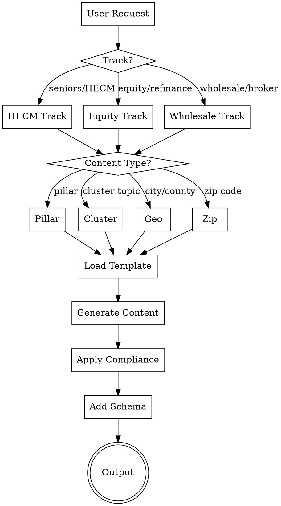

# Equity, HECM & Wholesale Blog Generator

Generate SEO-optimized blog content for mothebroker.com focused on:
- **Track 1:** HECM (reverse mortgages) for seniors 62+
- **Track 2:** Home equity products (cash-out refinance, HELOC, HELOAN) for all homeowners
- **Track 3:** Wholesale mortgage broker education (category captain positioning)

## Content Architecture

```
TRACK 1: SENIORS (62+)        TRACK 2: HOMEOWNERS         TRACK 3: WHOLESALE EDUCATION
─────────────────────         ───────────────────         ────────────────────────────
      HECM PILLAR              HOME EQUITY PILLAR           WHOLESALE CA PILLAR
           │                          │                            │
  ┌────────┼────────┐        ┌────────┼────────┐          ┌────────┼────────┐
  │        │        │        │        │        │          │        │        │
HECM    HECM     HECM     Cash-Out  HELOC  HELOAN      Broker  Bank    Non-QM
Basics  Elig.    vs Alt   Cluster  Cluster Cluster    vs Bank  Stmt   Programs
  │        │        │        │        │        │          │        │        │
  └────────┴────────┘        └────────┴────────┘          └────────┴────────┘
           │                          │                            │
    GEO-TARGETED              GEO-TARGETED                  GEO-TARGETED
   City Guides (62+)         City Guides (Equity)         County → City → Zip
                                                          (Affluent Focus)
```

## Quick Start



## Generation Commands

### Single Post
```
Generate [TRACK] [TYPE] for [TOPIC/CITY/ZIP]

Examples:
- "Generate HECM cluster for HECM basics"
- "Generate equity cluster for HELOC explained"
- "Generate HECM geo for Newport Beach"
- "Generate equity geo for Bellevue"
- "Generate HECM pillar"
- "Generate equity pillar"

WHOLESALE TRACK:
- "Generate wholesale pillar"                    → California wholesale pillar
- "Generate wholesale cluster for broker vs bank" → Cluster post
- "Generate wholesale county for Orange County"   → County-level page
- "Generate wholesale city for Anaheim"          → City wholesale page
- "Generate wholesale zip for 92657"             → Affluent zip page
```

### Batch Generation
```
Generate [N] [TRACK] posts

Examples:
- "Generate 10 HECM posts" → 5 cluster + 5 geo (next cities in rotation)
- "Generate 10 equity posts" → 5 cluster + 5 geo (next cities in rotation)
- "Generate 20 mixed posts" → 10 HECM + 10 equity (balanced)

WHOLESALE TRACK:
- "Generate 10 wholesale posts"       → Mix of clusters + city + zip
- "Generate OC wholesale expansion"   → All 30 OC affluent zips
- "Generate CA wholesale expansion"   → Next 20 CA affluent zips
- "Generate WA wholesale expansion"   → Next 10 WA affluent zips
```

## Content Types

### Pillar Pages (3 total)

| Track | Title | URL | Word Count |
|-------|-------|-----|------------|
| HECM | Complete Guide to Reverse Mortgages in California & Washington [2026] | /reverse-mortgages/ | 4,000-5,000 |
| Equity | Home Equity & Refinancing Guide: Cash-Out, HELOC & HELOAN [2026] | /home-equity-guide/ | 4,000-5,000 |
| **Wholesale** | The Complete Guide to Wholesale Mortgage Brokers in California [2026] | /wholesale-mortgage-broker-california/ | 4,500-5,500 |

### HECM Cluster Topics (12 posts)
| # | Topic | Target Keyword |
|---|-------|----------------|
| 1 | HECM Basics | what is a reverse mortgage |
| 2 | HECM Eligibility | reverse mortgage requirements 2026 |
| 3 | HECM Calculator Explained | how much can I get reverse mortgage |
| 4 | HECM vs HELOC for Seniors | reverse mortgage vs heloc seniors |
| 5 | HECM Pros & Cons | reverse mortgage pros and cons |
| 6 | HECM Counseling | HUD reverse mortgage counseling |
| 7 | HECM for Purchase | reverse mortgage to buy home |
| 8 | Proprietary Reverse Mortgages | jumbo reverse mortgage California |
| 9 | HECM Payout Options | reverse mortgage lump sum vs line of credit |
| 10 | HECM & Estate Planning | reverse mortgage inheritance heirs |
| 11 | HECM Myths Debunked | reverse mortgage scam or legitimate |
| 12 | When NOT to Get HECM | reverse mortgage alternatives seniors |

### Equity Cluster Topics (14 posts)
| # | Topic | Target Keyword |
|---|-------|----------------|
| 1 | Cash-Out Refinance Basics | cash out refinance how it works |
| 2 | Cash-Out vs Rate-and-Term | cash out vs regular refinance |
| 3 | HELOC Explained | how does a heloc work |
| 4 | HELOAN Explained | home equity loan fixed rate |
| 5 | HELOC vs HELOAN | heloc vs home equity loan |
| 6 | HELOC vs Cash-Out | heloc vs cash out refinance 2026 |
| 7 | Best Uses for Home Equity | what can you use home equity for |
| 8 | Home Equity for Renovations | using equity for home improvement |
| 9 | Debt Consolidation Refinance | refinance to pay off debt |
| 10 | Refinance Requirements | refinance credit score requirements |
| 11 | When to Refinance | is refinancing worth it 2026 |
| 12 | Second Mortgage Explained | second mortgage vs heloc |
| 13 | Equity Extraction Risks | risks of tapping home equity |
| 14 | Refinance Closing Costs | refinance fees and costs |

### Wholesale Cluster Topics (7 posts) - NEW

| # | Topic | Target Keyword | GSC Query Match |
|---|-------|----------------|-----------------|
| 1 | Wholesale vs Retail Mortgage: Complete Comparison | wholesale vs retail mortgage | 21 impressions |
| 2 | Mortgage Broker vs Bank: Why Brokers Win | mortgage broker vs bank | 54+ impressions |
| 3 | Bank Statement Loans: The Wholesale Advantage | bank statement loans wholesale | 83 impressions |
| 4 | Self-Employed? Why You Need a Wholesale Broker | self-employed mortgage broker | 29 impressions |
| 5 | How to Get Wholesale Mortgage Rates in California | wholesale mortgage rates california | 50+ impressions |
| 6 | Non-QM Loans: Programs Only Wholesale Brokers Offer | non-qm loans wholesale broker | authority |
| 7 | The 200+ Lender Advantage Explained | wholesale mortgage lender network | 7 impressions |

### Geo-Targeted Posts

**HECM & Equity Tracks:**
- **California:** 50 cities × 2 tracks = 100 posts
- **Washington:** 25 cities × 2 tracks = 50 posts

**Wholesale Track (Affluent Focus):**
- **County Level:** Orange County wholesale pillar (1 page)
- **City Level:** Priority cities from GSC data (8-15 pages)
- **Zip Level:**
  - Orange County: 30 affluent zips (Tier 1)
  - California: 150+ affluent zips (Tier 2)
  - Washington: 50+ affluent zips (Tier 3)

See reference files for complete lists:
- `references/california-cities.md` - 50 CA cities (HECM/Equity)
- `references/washington-cities.md` - 25 WA cities (HECM/Equity)
- `references/orange-county-affluent-zips.md` - 30 OC affluent zips (Wholesale)
- `references/california-affluent-zips.md` - 150+ CA affluent zips (Wholesale)
- `references/washington-affluent-zips.md` - 50+ WA affluent zips (Wholesale)

## Wholesale Track Rotation Tracking

Track position separately for wholesale geo content:
```
WHOLESALE_CITY_INDEX = [1-8]     # Priority cities
WHOLESALE_OC_ZIP_INDEX = [1-30]  # Orange County zips
WHOLESALE_CA_ZIP_INDEX = [1-150] # California zips
WHOLESALE_WA_ZIP_INDEX = [1-50]  # Washington zips
```

### Priority Cities (Wholesale)
Based on GSC query data:
1. Anaheim (16 impressions)
2. Costa Mesa (12 impressions)
3. Yorba Linda (36 impressions)
4. Huntington Beach (10 impressions)
5. Garden Grove (2 impressions)
6. Dana Point (2 impressions)
7. Santa Ana (2 impressions)
8. Tustin (1 impression)

## Reference Files

| File | Purpose |
|------|---------|
| `references/seo-aio-aeo-geo-guidelines.md` | 2026 optimization requirements |
| `references/pillar-templates.md` | Templates for HECM/Equity pillar pages |
| `references/cluster-templates.md` | Templates for HECM/Equity cluster posts |
| `references/geo-templates.md` | Templates for city-specific posts |
| `references/keyword-matrix.md` | Complete keyword strategy |
| `references/california-cities.md` | 50 CA affluent cities |
| `references/washington-cities.md` | 25 WA affluent cities |
| `references/compliance-rules.md` | Legal/regulatory requirements |
| `references/wholesale-pillar-template.md` | **NEW:** Wholesale CA pillar template |
| `references/wholesale-cluster-templates.md` | **NEW:** 7 wholesale cluster templates |
| `references/wholesale-geo-templates.md` | **NEW:** County/city page templates |
| `references/wholesale-zip-templates.md` | **NEW:** Affluent zip page template |
| `references/orange-county-affluent-zips.md` | **NEW:** 30 OC affluent zips |
| `references/california-affluent-zips.md` | **NEW:** 150+ CA affluent zips |
| `references/washington-affluent-zips.md` | **NEW:** 50+ WA affluent zips |
| `assets/schema-templates.json` | JSON-LD templates |

## Output Format

Every generated post outputs:

```markdown
---
title: "[Title]"
meta_description: "[150-160 chars, keyword in first 60]"
primary_keyword: "[keyword]"
secondary_keywords: ["kw1", "kw2", "kw3"]
track: "[HECM|Equity|Wholesale]"
content_type: "[pillar|cluster|geo|county|city|zip]"
target_city: "[City or null]"
target_zip: "[Zip or null]"
target_state: "[CA|WA or null]"
word_count: [number]
date_generated: "[YYYY-MM-DD]"
url_slug: "[slug]"
---

# [H1 with exact-match keyword]

[Direct answer first paragraph - 2-4 sentences, fact-dense, extractable]

[Content sections with H2/H3 as questions...]

## Frequently Asked Questions

[FAQ section with 5-7 questions...]

---
**Mo Abdel** | NMLS #1426884 | Lumin Lending | NMLS #2716106 | DRE #02291443
Licensed in: CA, WA

Equal Housing Lender. All loans subject to credit approval...
---

## Schema Markup
[JSON-LD block]

## Social Meta Tags
[OG tags block]

## Internal Links
[3-5 suggested internal links]

## Submission Commands
[Bing/IndexNow submission commands]
```

## Compliance Gate

**MANDATORY:** Every post must pass ALL items before output:

- [ ] NO specific interest rate percentages
- [ ] NO guaranteed savings amounts
- [ ] NO "lowest rate" claims without qualification
- [ ] NO guaranteed approval language
- [ ] INCLUDES NMLS #1426884 and Lumin Lending NMLS #2716106
- [ ] INCLUDES Equal Housing Lender statement
- [ ] INCLUDES educational disclaimer
- [ ] Uses inclusive, non-discriminatory language
- [ ] HECM posts: HUD counseling requirement mentioned
- [ ] HECM posts: Age 62+ requirement clearly stated
- [ ] Wholesale posts: "200+ lenders" claim is accurate
- [ ] Wholesale posts: No specific rate comparisons

See `references/compliance-rules.md` for complete requirements.

## SEO/GEO/AIO/AEO Checklist

Every post must include:

**SEO:**
- [ ] Primary keyword in H1
- [ ] Primary keyword in first 100 words
- [ ] Exact-match keyword in 2+ H2s
- [ ] Meta description with keyword in first 60 chars
- [ ] 3-5 internal links minimum

**AIO/AEO:**
- [ ] Direct answer in first paragraph
- [ ] FAQ section with schema markup
- [ ] Natural language H2/H3 headings (questions)
- [ ] Tables/lists for comparison content

**GEO:**
- [ ] Entity-rich content (Mo Abdel, Lumin Lending, NMLS)
- [ ] Citation patterns ("According to Mo Abdel...")
- [ ] First 150 chars fact-dense and extractable
- [ ] Numbered lists for procedural content

**Bing/ChatGPT:**
- [ ] Desktop-first content (no collapsed sections)
- [ ] Social meta tags included
- [ ] Bing schema properties (copyrightHolder, significantLink)

See `references/seo-aio-aeo-geo-guidelines.md` for complete requirements.

## Internal Linking Strategy

### From Pillar Pages
- Link to ALL cluster posts in that track
- Link to 10-15 geo posts as examples
- Cross-link to other pillars (HECM ↔ Equity ↔ Wholesale)

### From Cluster Posts
- Link back to pillar page
- Link to 2-3 related cluster posts
- Link to 1-2 geo posts as examples

### From Geo/City/Zip Posts
- Link back to pillar page
- Link to 2-3 relevant cluster posts
- Link to 1-2 nearby city/zip posts

### Wholesale-Specific Linking
```
                    WHOLESALE CA PILLAR
                           │
          ┌────────────────┼────────────────┐
          │                │                │
          ▼                ▼                ▼
    ┌──────────┐    ┌──────────┐    ┌──────────┐
    │Cluster 1 │◄──►│Cluster 2 │◄──►│Cluster 3 │
    │Wholesale │    │Broker vs │    │Bank Stmt │
    │vs Retail │    │  Bank    │    │  Loans   │
    └────┬─────┘    └────┬─────┘    └────┬─────┘
         │               │               │
         └───────────────┼───────────────┘
                         ▼
              ┌──────────────────────┐
              │  OC COUNTY PILLAR    │
              └──────────┬───────────┘
                         │
         ┌───────────────┼───────────────┐
         ▼               ▼               ▼
    ┌─────────┐    ┌─────────┐    ┌─────────┐
    │ CITY    │    │ CITY    │    │ CITY    │
    │ Anaheim │    │ Irvine  │    │ Newport │
    └────┬────┘    └────┬────┘    └────┬────┘
         │               │               │
         ▼               ▼               ▼
    ┌─────────┐    ┌─────────┐    ┌─────────┐
    │ ZIP     │    │ ZIP     │    │ ZIP     │
    │ 92801   │    │ 92603   │    │ 92657   │
    └─────────┘    └─────────┘    └─────────┘
```

## Word Count Targets

| Content Type | Minimum | Target | Maximum |
|--------------|---------|--------|---------|
| Pillar (HECM/Equity) | 4,000 | 4,500 | 5,500 |
| Pillar (Wholesale CA) | 4,500 | 5,000 | 5,500 |
| County (Wholesale OC) | 3,500 | 4,000 | 4,500 |
| Cluster (All tracks) | 1,800 | 2,200 | 2,800 |
| City Geo (All tracks) | 1,500 | 1,800 | 2,200 |
| Zip (Wholesale) | 1,200 | 1,500 | 1,800 |

## Wholesale Track Positioning

**Category Captain Goal:** Establish MoTheBroker.com as THE authority on wholesale mortgage brokering in California.

**Core Messaging:**
- "200+ lender access" - more options than any single bank
- "Wholesale pricing advantage" - institutional rates for consumers
- "Local expertise + wholesale power" - best of both worlds
- "Complex borrower solutions" - bank statement, non-QM, DSCR

**Target Audiences:**
1. Self-employed borrowers (bank statement loans)
2. Investors (DSCR, fix-flip)
3. Affluent homebuyers (jumbo loans)
4. First-time buyers comparing broker vs bank
5. Refinancers seeking best rates

**Differentiation:**
| Competitors Say | MoTheBroker Says |
|-----------------|------------------|
| "Great rates" | "Here's exactly how wholesale pricing works and saves you $X" |
| "Apply now" | "Let me educate you first, then help you decide" |
| Generic content | Affluent zip-specific insights |
| No explanation | Full transparency on wholesale vs retail |
